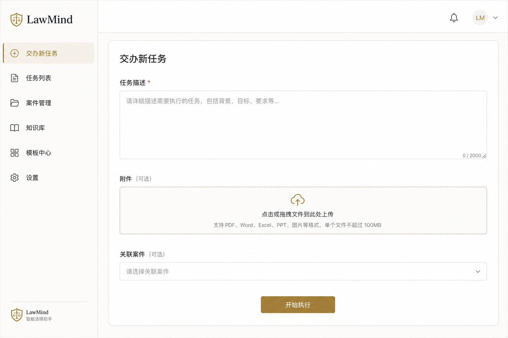
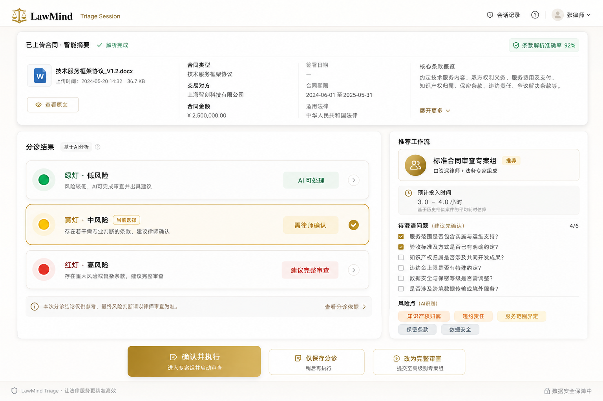
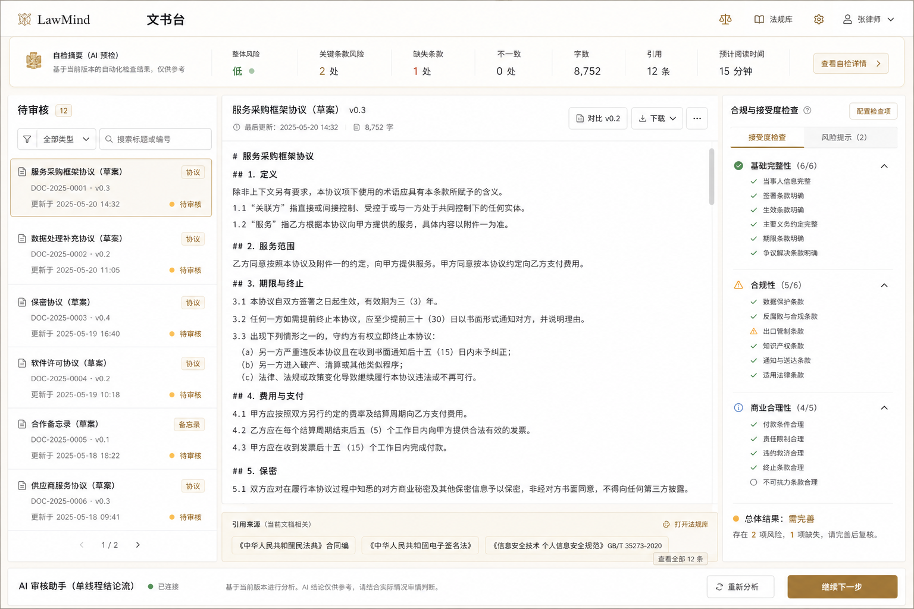
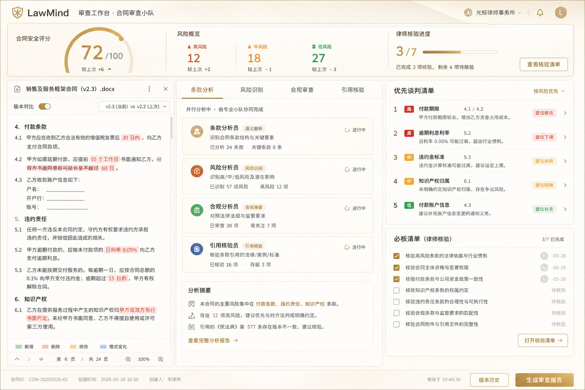
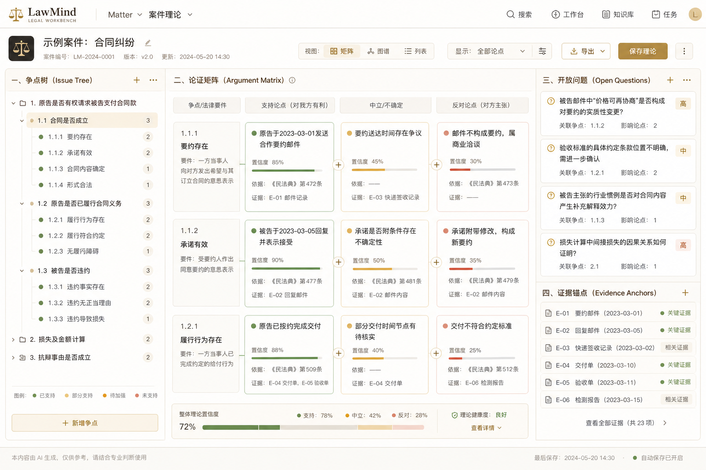
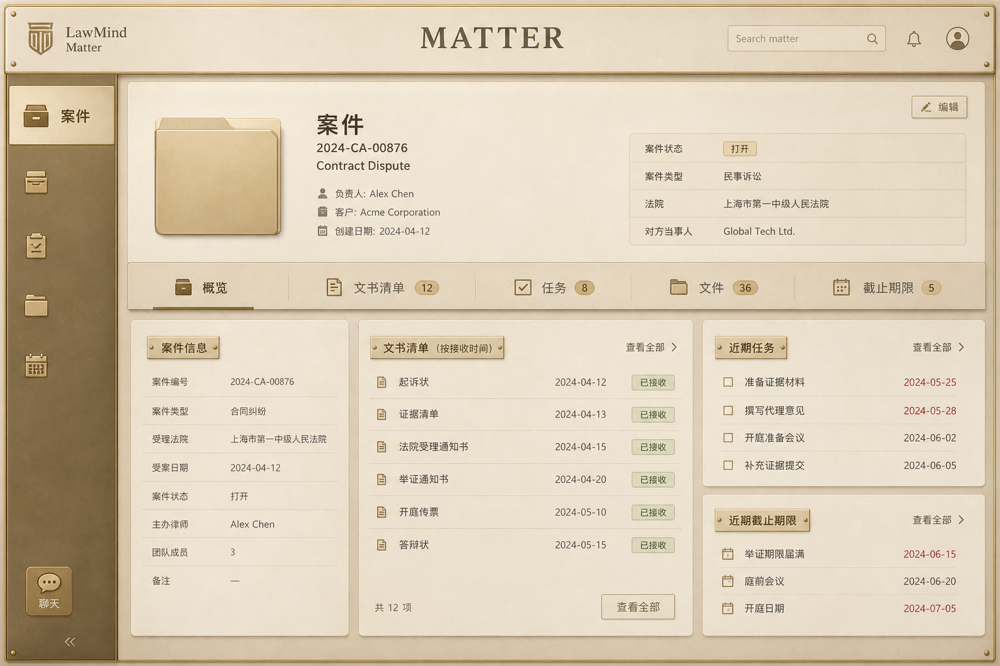
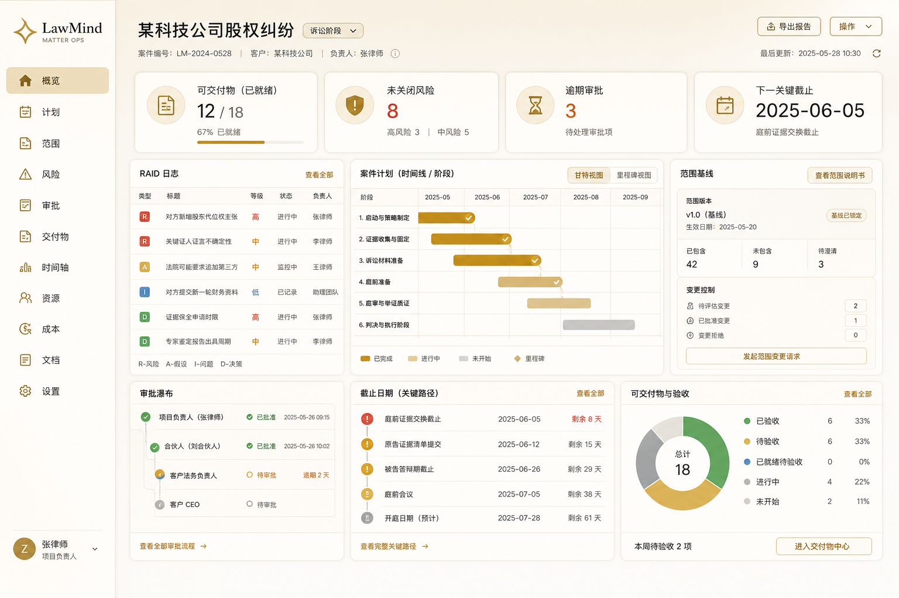
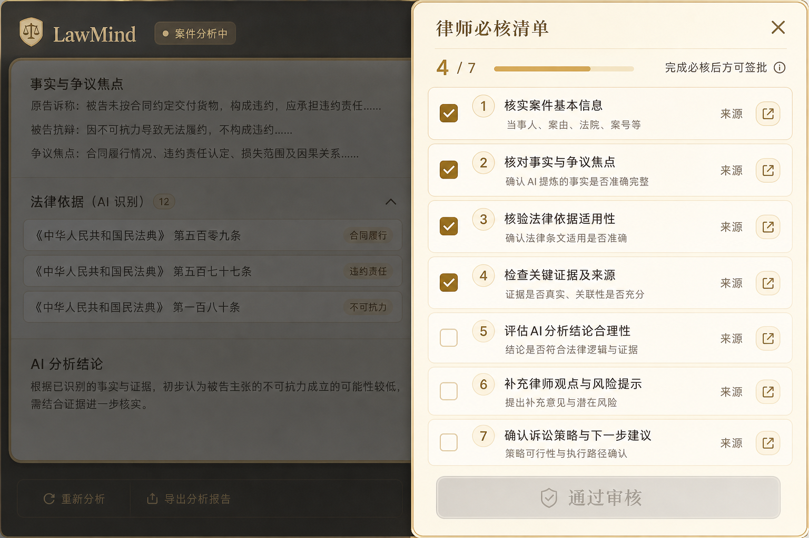
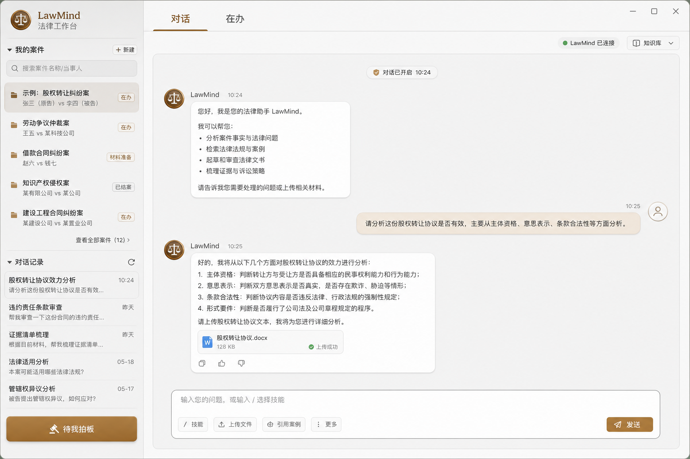
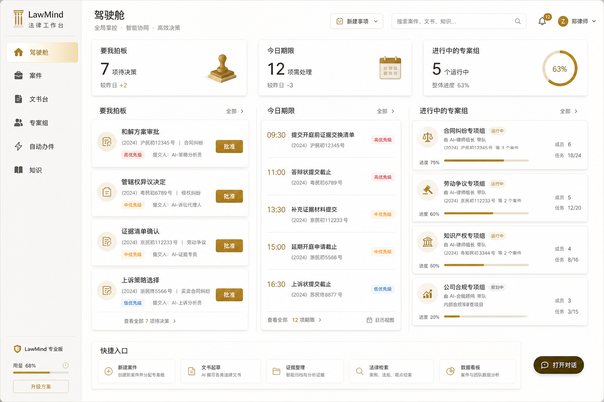

# LawMind Agent Skills 史诗：详细工作计划（供决策）

> **状态**：**已决策（2026-07-20）** — 十二史诗全部做；接受完整 UI/IA 大改；**Solo Edition 最高优先**；总人力预算 **500 人周**。  
> **周级执行计划（真相源）**：[LAWMIND-AGENT-SKILLS-500PW-PLAN.md](LAWMIND-AGENT-SKILLS-500PW-PLAN.md)（W01–W100）。下文 §7 为 100 人周压缩对照版，**不以 §7 为排期**。  
> **创建**：2026-07-20  
> **母文档**：[LAWMIND-AGENT-SKILLS-OPTIMIZATION.md](LAWMIND-AGENT-SKILLS-OPTIMIZATION.md)（调研索引与史诗概述）  
> **UI 线框图**：[`assets/skills-epic-ui/`](assets/skills-epic-ui/)（示意图，非像素级实现稿）  
> **现行 IA**：[LAWMIND-DESKTOP-UI.md](LAWMIND-DESKTOP-UI.md) §1.1（将被 §7 中的 Solo 驾驶舱默认入口取代；保留「经典布局」开关）

---

## 0. 如何用本文做决定

1. 决策已定：先读 **§6** + **[500 人周计划](LAWMIND-AGENT-SKILLS-500PW-PLAN.md)**。
2. 实施某史诗时再读 **§3** 对应工作包与 UI 图。
3. 拆周任务以 500PW 计划 Wxx 为准；Firm/Private 密度不得破坏 Solo 默认清爽。
4. 每完成一 Wave，勾选工作包并更新附录 B / 500PW 进度。

**工作量刻度（人周，含设计+引擎+桌面+测试，粗估）**

| 标记 | 含义                 |
| ---- | -------------------- |
| S    | 1–2 人周             |
| M    | 3–5 人周             |
| L    | 6–10 人周            |
| XL   | 10+ 人周（建议分期） |

---

## 1. 决策总表（优先改哪个看这张）

| 史诗                  | 一句话                              | 工作量 | 产品冲击         | UI 大改          | 依赖             | 建议默认优先             |
| --------------------- | ----------------------------------- | ------ | ---------------- | ---------------- | ---------------- | ------------------------ |
| **E1 分诊台**         | Intake 变成 GREEN/YELLOW/RED 再执行 | M      | 极高（日活入口） | 中               | 弱               | **P0 候选**              |
| **E6 必核清单**       | 未勾完不能「审核通过」              | S–M    | 极高（信任）     | 中（文书台右侧） | 弱               | **P0 候选**              |
| **E4 Grounded**       | 严格援引开关 + 效力闸               | M      | 极高（信任）     | 低（开关+横幅）  | MCP 可选         | **P0 候选**              |
| **E2 审查专案组**     | 并行角色 + Safety Score + 报告      | L–XL   | 极高（核心卖点） | **高**           | E6 更顺          | **P1**（可与 E6 叠）     |
| **E5 Matter OS**      | 案件页变经营台（plan/RAID/scope）   | L      | 高（Firm）       | **高**           | Matter 写侧已有  | **P1–P2**                |
| **E3 案件理论**       | ReasoningGraph 一等公民             | L–XL   | 高（差异化）     | **高**（新页）   | E2/E4 互补       | **P2**                   |
| **E11 驾驶舱导航**    | Home 取代「打开即聊天」             | L      | 极高（IA）       | **极高**         | E1/E5 有料才不空 | **慎做：建议晚于 E1+E5** |
| **E8 矩阵与比对**     | 批量表格审查 + 版本 diff            | M–L    | 高（效率）       | 中               | Jobs             | **P2**                   |
| **E7 Skills Runtime** | 本地 SKILL.md 市场                  | L      | 中高（扩展）     | 中（设置）       | bundles          | **P2**                   |
| **E9 进化闭环**       | 复盘提案 + 首过率仪表               | M      | 中高             | 低–中            | Memory Adoption  | **P2–P3**                |
| **E10 信任加固**      | 特权预检 / diff 审批 / Doctor       | M      | 高（Firm 售卖）  | 低               | Edition          | **可与 P0 并行小步**     |
| **E12 中国法务包**    | 中文推理/诉讼剧本自研包             | M–L    | 高（区域差异）   | 低               | E7 或 workflows  | **P2（内容向）**         |

**已采纳路径（Solo-first · 全量 · 允许换默认首页）→ 详见 §7**

```text
S0 底座 → S1 信任+分诊 → S2 审查专案组 → S3 Solo 驾驶舱大改
→ S4 Matter轻量+理论 → S5 矩阵/技能/中国包 → S6 进化+Firm密度补齐
```

---

## 2. 现行界面基线（改前共识）

摘自桌面 IA（2026-07 修订）：

- **默认入口**：`workspace` 对话交办。
- **顶栏**：主「对话」；「在办」条件出现；「会议室 / 自动办件」在更多菜单。
- **文书台** `review`：场景进入，非顶栏对等 Tab。
- **待我拍板**：侧栏底部常驻 → 进入「在办」needs-decision 焦点。
- **案件**：侧栏列表 / cockpit；材料、任务、期限、交付物真相源。

下列线框为**示意**，用于对齐「改什么」，不是最终视觉设计。

---

## 3. 史诗详细计划

---

### E1 — 分诊台（Triage Session）

#### 3.1.1 目标

律师提交材料/描述后，先看到 **档位 + 推荐剧本 + 澄清项**，确认后才进入重执行（对齐 skill `nda-triage` / AI Act triage）。

#### 3.1.2 UI 改动前后

**改前**：交办表单偏线性「填完 → 开始执行」。



**改后**：分诊结果卡（绿/黄/红）+ 推荐工作流 + 澄清清单 + 「确认并执行」。



| 区域                | 改前              | 改后                                         |
| ------------------- | ----------------- | -------------------------------------------- |
| Job Intake / 交办   | 描述+附件+执行    | 增加「分诊结果」步骤（可跳过策略按 Edition） |
| Router 对用户可见性 | 多为内部/健康提示 | 档位、理由、recommendedWorkflowId 上屏       |
| 澄清                | 聊天里 awaiting   | 分诊阶段即可收集 `pendingClarifications`     |

#### 3.1.3 工作包（可勾选）

**A. 数据与引擎**

- [ ] 定义 `TriageResult` / `TriageSession` 类型（档位、理由、剧本、澄清、预估、证据指针）
- [ ] 落盘：`matters/<id>/triage/<sessionId>.json`（或 task 附属）
- [ ] Router 或独立 `triage` 服务：输入 intent+附件摘要 → `TriageResult`
- [ ] 内置规则剧本：NDA 快筛、合同标准审查、诉讼材料分诊（可配置 JSON）
- [ ] 与 Clarify–Execute 联动：RED/YELLOW 未确认不得 `draft_document` / `execute_workflow`
- [ ] 审计事件：`triage.created` / `triage.confirmed` / `triage.overridden`

**B. API**

- [ ] `POST /api/triage`（preview）
- [ ] `POST /api/triage/:id/confirm`（启动 workflow / fleet）
- [ ] `GET /api/triage/:id`
- [ ] health / Doctor：triage 规则是否加载

**C. 桌面 UI**

- [ ] 改造 `LawmindJobIntakeForm`（或新建 `LawmindTriagePanel`）为两步：输入 → 分诊确认
- [ ] 档位色与文案（中文：可直接执行 / 需确认 / 必须澄清）
- [ ] 「仅保存分诊」「确认并执行」「升级为完整审查」
- [ ] Solo：记住「GREEN 跳过确认」偏好

**D. 测试**

- [ ] 引擎单测：同一样本档位稳定；RED 阻断 draft
- [ ] e2e：`job-intake` 扩展分诊确认路径
- [ ] mock-api 夹具

#### 3.1.4 验收

1. 律师从附件到确认路径清晰，YELLOW 必须显式确认。
2. 未确认时重工具 API 返回可理解错误。
3. 分诊结果可在 matter 内回看。

#### 3.1.5 刻意不做

- 不做远程上千 skill 自动分诊。
- 首版不做完美「财务敞口金额」估算。

---

### E2 — 审查专案组（Fleet Playbook + Safety Score）

#### 3.2.1 目标

合同/高风险文书审查默认是**可见多角色专案组**，聚合 Safety Score、谈判优先级、可导出报告（对齐 ai-legal-claude 五 Agent）。

#### 3.2.2 UI 改动前后

**改前**：文书台偏「稿件列表 + 正文 + 验收/引用」单线程。



**改后**：顶栏 Score + 风险计数；中栏角色 Tab；右栏谈判清单与必核（与 E6 合流）。



| 区域            | 改前                   | 改后                           |
| --------------- | ---------------------- | ------------------------------ |
| ReviewWorkbench | 稿+验收+自检           | 专案组分栏 + Score Sticky      |
| Agent Fleet     | 通用 spawn             | 「合同审查」一键 Playbook      |
| 导出            | acceptance-pack / docx | + `review-report`（内/客两版） |

#### 3.2.3 工作包

**A. 引擎**

- [x] `ReviewCampaign` / Fleet Playbook 定义：角色、权重、工具 allowlist、超时（MVP：`src/lawmind/review-campaign/`）
- [x] 默认角色：条款 / 风险 / 合规 / 义务时间线 / 引用核验（可选：对方律师、冷读）
- [x] 聚合器：Safety Score、高中低计数、谈判优先级列表（启发式可复现）
- [ ] 子结果写入 matter deliverables；主 task 挂 `campaignId`
- [x] 单角色重跑 + 取消；idempotencyKey（Job 真并行挂接待 W22 深化）
- [x] Edition：Solo/Firm/Private 默认 `reviewCampaignParallel=true`（本地启发式并行；LLM 真并行仍 backlog）

**B. API**

- [x] `POST /api/review-campaigns`
- [x] `GET /api/review-campaigns/:id`（含角色状态）
- [x] `POST .../roles/:role/rerun`
- [x] `GET .../report`（markdown；pdf 待 W32）

**C. 桌面**

- [ ] `ReviewWorkbench` 信息架构重构（大改）
- [x] Sticky：Score + gate + checklist（Score 面板已挂 meta sticky）
- [x] 角色卡片；失败/任意角色可重跑（Tab 网格待 W27）
- [x] Fleet 入口：「用审查专案组」预设
- [x] 报告预览（Markdown）；导出按钮待 PDF

**D. 测试**

- [ ] 聚合单测；e2e `agent-fleet` / `review-entry` 扩展
- [ ] 成本预算测试（max tool calls）

#### 3.2.4 验收

默认合同审查可见 ≥4 角色结论；Score 可复现；单角色重跑不摧毁全文。

#### 3.2.5 刻意不做

首版不做「销售用炫酷动画」；PDF 报告版式可第二迭代。

---

### E3 — 案件理论（LegalReasoningGraph）

#### 3.3.1 目标

实质任务具备可编辑的「案件理论」：争点树、要件、依据、论证、开放问题；高风险交付物无理论锚点不可 strict render。

#### 3.3.2 UI 改动前后

**改前**：无独立理论页；推理多在聊天/内部。

**改后（新表面）**：



| 区域   | 改前            | 改后                              |
| ------ | --------------- | --------------------------------- |
| Matter | 档案/任务/稿    | 增加「理论」页（或三栏之一）      |
| Chat   | 自由结论        | 「采纳到理论」动作                |
| Gate   | acceptance 字段 | + theory strength / openQuestions |

#### 3.3.3 工作包

**A. 引擎**

- [ ] `LegalReasoningGraph` 类型与 Zod/校验
- [ ] 落盘 `matters/<id>/reasoning/<taskId>.json` + 导出 `THEORY.md`
- [ ] Pipeline stages（可配置）：要素→结构闸→争点→检索→效力→演绎→论证强度→草稿
- [ ] Reasoning Gate 与 Clarify–Execute 对齐
- [ ] Agent 工具：`update_reasoning_graph` / `get_reasoning_graph`

**B. API**

- [ ] CRUD `/api/matters/:id/reasoning/:taskId`
- [ ] export markdown
- [ ] drafts 带 `reasoningRef`

**C. 桌面**

- [ ] Matter「案件理论」页：争点树 / 论证矩阵 / 开放问题
- [ ] 从审查台/聊天跳转锚点
- [ ] Solo 轻量模式（三块：争点、依据、开放问题）

**D. 测试**

- [ ] gate 单测；理论↔草稿引用完整性测试

#### 3.3.4 验收

无理论锚点时 strict render 422；导出理论可他案只读复用。

---

### E4 — Grounded 引用模式

#### 3.4.1 目标

`citationMode: grounded | assisted | off`；grounded 下无源/未核实不得进对外稿。

#### 3.4.2 UI 改动前后

**UI 幅度：低**（无整页重排）。改动点：

- 设置 / 案件级开关「严格援引」
- Citation Banner 增加状态：已核实 / 待核实 / 模型记忆
- Source Preview 显示效力校验结果
- Doctor：`citationModeActive`

（线框可复用审查台改后图中的「引用核验」Tab。）

#### 3.4.3 工作包

- [ ] policy 字段 + Edition 默认（Private 默认 grounded）
- [ ] draft validator 新规则
- [ ] retrieval 后置 `norm-validity`（本地规则优先；MCP 可选）
- [ ] 红队核验 Job（可选）
- [ ] UI 横幅与阻断文案
- [ ] 单测 + e2e：假法条被拦

#### 3.4.4 验收

断开外部库时全部变「待检索」且不可 strict render。

---

### E5 — Matter 操作系统

#### 3.5.1 目标

案件页从「档案」升级为 **Ops Dashboard**：brief/scope、plan、RAID、审批瀑布、期限关键路径、交付验收汇总。

#### 3.5.2 UI 改动前后

**改前**：案件 cockpit 偏列表与档案。



**改后**：KPI + RAID + 计划时间线 + 范围基线 + 审批 + 期限。



#### 3.5.3 工作包

**A. 数据**

- [ ] `scope.json`（baseline、变更记录）
- [ ] `plan.json`（phases、owners、milestones、依赖）
- [ ] `raid.jsonl`（Risk/Assumption/Issue/Decision）
- [ ] 与现有 `deadlines.jsonl` / `approvals.jsonl` / deliverables 聚合 API

**B. API**

- [ ] matter ops summary：`GET /api/matters/:id/ops`
- [ ] scope/plan/RAID CRUD
- [ ] 从邮件/纪要提取 RAID（可选，接 mail）

**C. 桌面**

- [ ] `MatterView` 信息架构大改：默认 Ops，子页保留材料/对话/会议
- [ ] Solo：顶部「简报条」折叠完整网格
- [ ] Automations：daily-briefing / status-report 工作流入口
- [ ] 结案归档 checklist

**D. 测试**

- [ ] 存储与聚合单测；matter e2e 冒烟

#### 3.5.4 验收

律师可在不打开聊天的情况下更新 RAID/范围并看到期限与待批准。

---

### E6 — 统一律师必核清单

#### 3.6.1 目标

高风险交付物：`VerificationChecklistSpec`；未勾选完不能 `review.approve`。

#### 3.6.2 UI 改动前后

**改前**：AcceptanceGate + SelfCheck 信息分散。  
**改后**：右侧「律师必核清单」进度；主按钮禁用直至完成。



（完整文书台语境见 E2 改后图。）

#### 3.6.3 工作包

- [ ] `VerificationChecklistSpec` 按 DeliverableType / Playbook
- [ ] 勾选状态写入 approvals / draft 附属
- [ ] API：approve 校验 checklist（422）
- [ ] UI：与 SelfCheck、Acceptance 三合一
- [ ] 清单项跳转 citation / 理论节点
- [ ] acceptance-pack / 合规导出带 checklist
- [ ] 单测 + e2e

#### 3.6.4 验收

缺勾选无法标已审核；清单版本进入审计。

---

### E7 — 本地 Skills Runtime

#### 3.7.1 目标

`workspace/lawmind/skills/*/SKILL.md` 可发现、签名校验、路由匹配；设置里管理启用。

#### 3.7.2 UI

**幅度：中** — 设置新页「技能库」；Automations/分诊可选 skill。无整壳导航大改。

#### 3.7.3 工作包

- [ ] 扩展 bundles 校验 → Skills Runtime 加载器
- [ ] 元数据标准（对齐 AgentCounsel 字段子集）
- [ ] Router skill 匹配层
- [ ] `pnpm lawmind:skill:init`
- [ ] 设置 UI + Doctor
- [ ] **许可证流程**：禁止直接 vendoring NC/AGPL 原文进发行包
- [ ] 安全：脚本类 skill = 危险工具审批

#### 3.7.4 验收

新 skill 目录无需改引擎代码即可被路由；篡改签名拒绝。

---

### E8 — 审查矩阵与版本比对

#### 3.8.1 目标

多文档×检查列矩阵；两版合同危险变更摘要。

#### 3.8.2 UI

**幅度：中** — 新交付视图（表格）+ 比对面板；可挂文书台或 FileWorkbench。

#### 3.8.3 工作包

- [ ] DeliverableType `tabular.review`
- [ ] 批量 screening Job → queue
- [ ] structured compare（不仅文本 diff）
- [ ] 导出 xlsx/csv + 格内 citation
- [ ] UI 矩阵编辑器
- [ ] 测试与 e2e

---

### E9 — 进化度量闭环

#### 3.9.1 目标

首过率/改写率可见；结案复盘 → MemoryAdoption 提案收件箱。

#### 3.9.2 UI

**幅度：低–中** — Insights/学习面板升级；Matter 结案向导。

#### 3.9.3 工作包

- [ ] 指标聚合存储
- [ ] continuous-improvement Job
- [ ] 成长收件箱 UI（采纳/驳回）
- [ ] 与 contract-revision、审核学习统一
- [ ] 离线评估集（20 黄金任务）挂钩

---

### E10 — Firm/Private 信任加固

#### 3.10.1 目标

特权预检、危险工具 propose→diff→approve、Doctor 一屏。

#### 3.10.2 UI

**幅度：低** — Compose 前提示条；工具审批卡增强 diff；Doctor 字段。

#### 3.10.3 工作包

- [ ] privilege-sentinel（可配置）
- [ ] 危险工具预览与审批合流
- [ ] Doctor 项：grounded / skills 签名 / mandatory rules / edition
- [ ] 测试夹具

---

### E11 — 领导驾驶舱导航（IA 大改）

#### 3.11.1 目标

打开应用先看「要我拍板 / 今日期限 / 进行中专案组」，聊天降为 Matter/Task 工作表面。

#### 3.11.2 UI 改动前后

**改前（现行）**：打开即对话为主。



**改后**：一级导航含驾驶舱；Home 三列决策/期限/专案组。



| 区域            | 改前           | 改后                                               |
| --------------- | -------------- | -------------------------------------------------- |
| 默认 `mainView` | `workspace`    | `home`（新）                                       |
| 顶栏/侧栏       | 对话中心       | Home / Matters / 文书台 / 专案组 / 自动办件 / 知识 |
| 待我拍板        | 侧栏入口进在办 | Home 主列之一                                      |
| 兼容            | —              | 「经典布局：打开即对话」开关                       |

#### 3.11.3 工作包

- [ ] 新增 `LawmindMainView = "home"`
- [ ] `HomeView`：聚合 needs-decision、deadlines、fleet/jobs、improvement 提案
- [ ] Sidebar / Header IA 重构 + 迁移引导
- [ ] 经典布局 preference 持久化
- [ ] 全量改导航相关 e2e（smoke、golden-path、workspace-layout…）
- [ ] 文档：USER-MANUAL / DESKTOP-UI §1.1 重写

#### 3.11.4 风险与前置

**强烈建议**：E1（分诊有入口）、E5（案件有 Ops 数据）、E2（专案组有状态）至少两项有数据后，再改默认 Home，否则驾驶舱空洞。

#### 3.11.5 验收

可用性：处理 3 个待批准 + 查看 1 个期限，可不经过聊天输入框。

---

### E12 — 中国法务深度包

#### 3.12.1 目标

自研中文流程包（检索→效力→要件→文书）；可选 MCP；不锁库。

#### 3.12.2 UI

**幅度：低** — 模板/工作流/技能列表增加「中国法务」分类与空态引导。

#### 3.12.3 工作包

- [ ] 自研 workflow/skill 文案（不复制 NC 许可原文）
- [ ] 诉讼/劳动/合同高频剧本
- [ ] 检索适配器接口标准化
- [ ] 证据清单、期限、立案-结案与 E5 字段对齐
- [ ] 文档与示例 workspace

---

## 4. 跨史诗依赖图

```text
E1 分诊 ──────────────┐
E6 必核清单 ──┐       ├──► E2 审查专案组 ──► E8 矩阵/比对
E4 Grounded ──┴───────┘         │
                                ▼
E5 Matter OS ────────────────► E3 案件理论
        │                         │
        └────────────► E11 驾驶舱 ◄─┘（建议有数据后再改默认首页）
E7 Skills Runtime ──► E12 中国包（内容）
E9 进化 依赖 E2/E6 的审核事件
E10 可与任意 Wave 并行小步
```

---

## 5. 测试与度量（所有史诗共用）

| 项         | 说明                                                |
| ---------- | --------------------------------------------------- |
| 黄金任务集 | 20 条（合同×5、诉讼文书×5、催告意见×5、批量比对×5） |
| 产品指标   | 首过通过率、改写轮次、gate 失败原因分布、分诊确认率 |
| 工程门禁   | `pnpm test`；相关 desktop e2e；typecheck            |
| 文档       | 每史诗落地后更新 USER-MANUAL + 本文附录「已落地」   |

---

## 6. 决策区（已填写 · 2026-07-20）

### 6.1 本轮意向

| 史诗              | 做 / 缓做 / 不做 | 优先级（执行序）       | 备注                                      |
| ----------------- | ---------------- | ---------------------- | ----------------------------------------- |
| E1 分诊台         | **做**           | 1（S1）                | Solo 日活入口                             |
| E6 必核清单       | **做**           | 2（S1）                | 与分诊同 Wave                             |
| E4 Grounded       | **做**           | 3（S1）                | Solo 默认可 `assisted`，一键升 `grounded` |
| E10 信任加固      | **做**           | 4（S1 小步 → S6 补齐） | Solo 先 Doctor+危险工具预览               |
| E2 审查专案组     | **做**           | 5（S2）                | Solo **串行专案组**；Firm 真并行放 S6     |
| E11 驾驶舱导航    | **做**           | 6（S3）                | **接受换默认首页**；保留经典布局          |
| E5 Matter OS      | **做**           | 7（S4）                | Solo 默认「简报条」；完整网格可展开       |
| E3 案件理论       | **做**           | 8（S4）                | Solo 轻量三块理论                         |
| E12 中国法务包    | **做**           | 9（S5）                | Solo 中文律师差异化，提前于纯 Firm 功能   |
| E8 矩阵与比对     | **做**           | 10（S5）               |                                           |
| E7 Skills Runtime | **做**           | 11（S5）               | 承载自研中国包与剧本                      |
| E9 进化闭环       | **做**           | 12（S6）               | 依赖审核事件积累                          |

### 6.2 约束（已确认）

- 最大可接受 UI 颠覆程度：☑ **允许换默认首页（完全大改）**
- 目标 Edition 优先：☑ **Solo**（Firm / Private 能力全做，但默认密度与文案以 Solo 为先）
- 下个迭代人力大概：**500 人周**（含设计 + 引擎 + 桌面 + 测试 + 内容 + 文档；周序见 [500PW 计划](LAWMIND-AGENT-SKILLS-500PW-PLAN.md)）

### 6.3 Solo-first 产品硬规则（全史诗遵守）

1. **默认清爽**：任何 Firm 级信息密度必须可折叠；Solo 首次打开不出现「律所运营驾驶舱」压迫感。
2. **一个人也能跑通**：分诊 → 专案组审查 → 必核 → 导出，不依赖多律师协作。
3. **成本可控**：Solo 默认串行 Fleet、更紧的 tool budget；设置里可开「更快（耗更多）」.
4. **经典逃生舱**：`preferClassicChatHome` —— 打开即对话，给老用户。
5. **Edition 开关**：同一套代码；Firm/Private 只加密度与强制策略（如 Private 默认 grounded），不另起产品。

### 6.4 决策记录

| 日期       | 决定                                                                                 | 说明               |
| ---------- | ------------------------------------------------------------------------------------ | ------------------ |
| 2026-07-20 | 全量十二史诗 + 完全 UI 大改 + Solo 最高优先 + ~100 人周                              | 初版排期 §7        |
| 2026-07-20 | 人力上调为 **500 人周**；周级计划见 [500PW-PLAN](LAWMIND-AGENT-SKILLS-500PW-PLAN.md) | 用户要求更详细排期 |

---

## 7. 对照：100 人周压缩版（已弃用为排期）

> **排期请用 [500 人周计划](LAWMIND-AGENT-SKILLS-500PW-PLAN.md)。**  
> 以下保留为「若必须压缩到 ~100 人周」的对照骨架；超支时仍遵守：先砍 Firm 密度，不砍 Solo 主路径。

### 7.1 总览

| Wave   | 主题         | 史诗                                   |    人周 | Solo 验收一句话                        |
| ------ | ------------ | -------------------------------------- | ------: | -------------------------------------- |
| **S0** | 底座         | 度量 / 黄金集 / IA 设计令牌 / 许可证表 |       4 | 能量化「首过率」                       |
| **S1** | 信任闭环     | E1 + E6 + E4 + E10-lite                |      16 | 分诊确认 → 必核才能通过 → 可开严格援引 |
| **S2** | 核心卖点     | E2（Solo 串行专案组 + 报告 v1）        |      18 | 合同审查像专案组，有 Score             |
| **S3** | IA 大改      | E11（Solo 驾驶舱为默认首页）           |      14 | 打开先看拍板/今日事，不必先聊天        |
| **S4** | 一案一脑     | E5-lite + E3-lite                      |      20 | 案件有简报+轻量理论，稿可锚定          |
| **S5** | 效率与内容   | E12 + E8 + E7                          |      16 | 中国剧本可用；批量/比对；技能可装      |
| **S6** | 进化与加密度 | E9 + E10-full + Firm 并行/完整 Ops     |      12 | 越用越像你；Firm 开关可用              |
|        |              | **合计**                               | **100** |                                        |

```text
时间方向（示意）

S0 ████
S1 ████████████████
S2 ██████████████████
S3 ██████████████          ← 默认首页切换落在此处（已有分诊+专案组喂数据）
S4 ████████████████████
S5 ████████████████
S6 ████████████
```

### 7.2 Wave S0 — 底座（4 人周）

| #    | 工作                                                  | 产出                        |
| ---- | ----------------------------------------------------- | --------------------------- |
| S0.1 | 20 条黄金任务夹具（合同/诉讼/催告/批量）              | `fixtures/` 或 e2e fixtures |
| S0.2 | 指标：首过通过率、改写轮次、gate 失败原因、分诊确认率 | 本地 JSONL 或 health 扩展   |
| S0.3 | 新壳设计令牌对齐（Home/专案组/分诊）                  | DESKTOP-UI 补丁草案         |
| S0.4 | 第三方 skill 许可证白名单（只借鉴思想）               | 本文或 SECURITY 附表        |

**退出标准**：黄金集可跑通现状基线并记下分数（改造后对比）。

### 7.3 Wave S1 — 信任闭环（16 人周）≈ E1+E6+E4+E10-lite

| #    | 工作                                                               | 人周 |
| ---- | ------------------------------------------------------------------ | ---: |
| S1.1 | `TriageSession` 类型/落盘/API + 规则剧本（NDA/合同/诉讼材料）      |    4 |
| S1.2 | Job Intake → 分诊确认 UI；RED/YELLOW 闸                            |    3 |
| S1.3 | `VerificationChecklistSpec` + approve 422 + 文书台右侧清单 UI      |    3 |
| S1.4 | `citationMode` + Banner 三态 + Solo 默认 assisted、设置升 grounded |    4 |
| S1.5 | E10-lite：Doctor 字段 + 危险工具 diff 预览（不做完整特权引擎）     |    2 |

**Solo 验收**

- [x] 丢一份 NDA：看到黄/红档 → 确认 → 进入任务（`e2e/triage-nda.spec.ts` + mock）
- [x] 审核无勾完必核 → 无法「通过」（`e2e/skills-trust.spec.ts`）
- [x] 打开严格援引后，无源结论不能 strict 导出（API e2e + 引擎 gate）

### 7.4 Wave S2 — 审查专案组（18 人周）≈ E2

| #    | 工作                                                              | 人周 |
| ---- | ----------------------------------------------------------------- | ---: |
| S2.1 | ReviewCampaign / Playbook 引擎 + 五角色定义 + 聚合 Score          |    6 |
| S2.2 | Solo：**串行**跑角色（UI 仍显示专案组）；预算与取消               |    3 |
| S2.3 | ReviewWorkbench 大改：Score Sticky + 角色 Tab + 谈判清单（接 E6） |    6 |
| S2.4 | `review-report` Markdown/PDF v1（律师向）                         |    2 |
| S2.5 | e2e：审查专案组路径                                               |    1 |

**Solo 验收**

- [x] 「标准合同审查」一键出现 ≥4 角色结论与 Score
- [x] 可重跑单角色；导出报告（MD；PDF backlog）

### 7.5 Wave S3 — Solo 驾驶舱 IA 大改（14 人周）≈ E11

> 用户已接受完全大改；排在 S1/S2 之后，避免空壳首页。

| #    | 工作                                                                 | 人周 |
| ---- | -------------------------------------------------------------------- | ---: |
| S3.1 | `mainView=home` + `HomeView`（拍板 / 今日分诊与期限 / 进行中专案组） |    5 |
| S3.2 | Sidebar/Header 一级导航重构；对话降为 Matter/Task 表面               |    4 |
| S3.3 | `preferClassicChatHome` + 首次迁移引导                               |    2 |
| S3.4 | 全量导航 e2e 修复 + USER-MANUAL / DESKTOP-UI §1.1 重写               |    3 |

**Solo 首页内容原则（区别于 Firm 组合盘）**

- 主列：**待我拍板** + **待确认分诊** + **进行中的审查专案组**
- 次列：今日期限（个人 matter）
- 不默认展示：所内 panel、外部 counsel、多律师 WIP

**Solo 验收**

- [x] 新装默认进 Home；处理拍板不必先打开聊天
- [x] 一键切回经典「打开即对话」（迁移横幅 + 外观偏好）

### 7.6 Wave S4 — 一案一脑（20 人周）≈ E5-lite + E3-lite

| #    | 工作                                                      | 人周 |
| ---- | --------------------------------------------------------- | ---: |
| S4.1 | scope / plan / RAID 存储 + `GET .../ops`                  |    5 |
| S4.2 | Matter：**简报条默认** + 展开完整 Ops 网格                |    5 |
| S4.3 | `LegalReasoningGraph` + 轻量三块 UI（争点/依据/开放问题） |    6 |
| S4.4 | Reasoning Gate 与草稿/验收挂钩；「采纳到理论」            |    3 |
| S4.5 | 测试与文档                                                |    1 |

**Solo 验收**

- [x] 单人案件不靠表格也能看清下一步与风险（Ops 简报 + RAID/阶段）
- [x] 高风险稿无理论锚点时 strict 导出失败（可配置）

### 7.7 Wave S5 — 效率与内容（16 人周）≈ E12+E8+E7

| #    | 工作                                                                  | 人周 | MVP |
| ---- | --------------------------------------------------------------------- | ---: | --- |
| S5.1 | E12：自研中国法务 workflow/skill 文案与模板分类（合同/诉讼/劳动高频） |    5 | ✅  |
| S5.2 | E7：Skills Runtime 加载/签名/设置页/router 匹配                       |    5 | ✅  |
| S5.3 | E8：tabular.review + 版本比对 + 导出（CSV+compare lite）              |    5 | ✅  |
| S5.4 | 示例 workspace + e2e 冒烟（`e2e/skills-pack.spec.ts`）                |    1 | ✅  |

**Solo 验收**

- [x] 启用「中国法务」包后，分诊能推荐中文诉讼/合同剧本
- [x] 10 份 NDA 矩阵产出带引用；两版合同危险变更可读（fixtures + compare UI）

### 7.8 Wave S6 — 进化与加密度（12 人周）≈ E9+E10-full+Firm 开关

| #    | 工作                                                        | 人周 | MVP     |
| ---- | ----------------------------------------------------------- | ---: | ------- |
| S6.1 | E9：指标面板 + 复盘提案收件箱（Home 成长列）                |    5 | ✅      |
| S6.2 | E10-full：privilege tip + Doctor 私有化清单                 |    3 | ✅      |
| S6.3 | Firm：`reviewCampaignParallel` 闸门（完整网格密度 backlog） |    3 | ✅ 闸门 |
| S6.4 | 黄金集 + `--compare` 对比报告                               |    1 | ✅      |

**Solo 验收**

- [x] Solo 默认仍不被 Firm 密度淹没
- [x] 成长收件箱可采纳/驳回；首过率相对 S0 可汇报（`--compare` 报告）

### 7.9 风险与缓冲（已含在 Wave 内，不另加 100 外预算）

| 风险                                | 应对                                                   |
| ----------------------------------- | ------------------------------------------------------ |
| ReviewWorkbench + Home 双重大改冲突 | S2 先定审查 IA 组件；S3 只重组壳，不重画审查内核       |
| Solo 串行专案组「看起来慢」         | UI 显示阶段进度；设置「更快模式」                      |
| Grounded 无外网库不可用             | S1 本地规则 +「待检索」空态；MCP 作增强非硬依赖        |
| 100 人周超支                        | 砍 S6 Firm 密度与 PDF 精美版式，不砍 S1–S3 Solo 主路径 |
| 许可证                              | S5 中国包必须自研文案，禁止粘贴 NC/AGPL skill 正文     |

### 7.10 下一行动

见 [500PW 计划 §10](LAWMIND-AGENT-SKILLS-500PW-PLAN.md)：口令 **「按 W01 开工」**。

---

## 附录 A — UI 图文件清单

| 文件                                             | 对应        |
| ------------------------------------------------ | ----------- |
| `assets/skills-epic-ui/epic-shell-before.png`    | E11 改前    |
| `assets/skills-epic-ui/epic-shell-after.png`     | E11 改后    |
| `assets/skills-epic-ui/epic-triage-before.png`   | E1 改前     |
| `assets/skills-epic-ui/epic-triage-after.png`    | E1 改后     |
| `assets/skills-epic-ui/epic-review-before.png`   | E2 改前     |
| `assets/skills-epic-ui/epic-review-after.png`    | E2 改后     |
| `assets/skills-epic-ui/epic-matter-before.png`   | E5 改前     |
| `assets/skills-epic-ui/epic-matter-after.png`    | E5 改后     |
| `assets/skills-epic-ui/epic-theory-after.png`    | E3 新页     |
| `assets/skills-epic-ui/epic-checklist-after.png` | E6 必核清单 |

> 图为产品讨论用示意，最终实现须遵循 [LAWMIND-DESKTOP-UI](LAWMIND-DESKTOP-UI.md) 令牌与组件，可再出高保真。

## 附录 B — 修订记录

| 日期       | 摘要                                                                                         |
| ---------- | -------------------------------------------------------------------------------------------- |
| 2026-07-20 | 初版：12 史诗详细工作包 + UI 前后示意图                                                      |
| 2026-07-20 | 决策锁定：全做 + 完全 UI 大改 + Solo 优先；§7 为 100 人周对照                                |
| 2026-07-20 | 排期升级 500 人周 → [LAWMIND-AGENT-SKILLS-500PW-PLAN.md](LAWMIND-AGENT-SKILLS-500PW-PLAN.md) |
