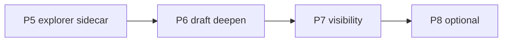

# LawMind ↔ Codex 子工/并行差距收敛计划

> 目标：在**不破坏**原话 SSOT、`compileIntent` 为 `runTurn` 唯一路由、CORE 12、真循环 cassette 准入的前提下，尽量消除与 Codex subagent 循环的实质差距。  
> 对标对象：Codex `spawn_agent` / custom agents（explorer · worker · reviewer），不是把律师产品做成第二个 IDE。  
> 现状基线：P0–P7 已落地（understand-first、工作任务书、共用只读 sidecar、`explore_folder` 真循环、`draft_worker` 预算 5 + 轻验收、律师卡进度）。P8 可选。

## 硬约束（不做）

| 约束                             | 原因                                                                           |
| -------------------------------- | ------------------------------------------------------------------------------ |
| 不把 `routeAsync` 接入 `runTurn` | 见 `docs/LAWMIND-ROUTE-ASYNC-DECISION.md`                                      |
| 不静默改写律师原话               | Codex/Cursor 也不做 hidden rewrite；原话是 SSOT                                |
| 不嵌套完整 `runTurn`             | 会偷走父会话 cassette、审批、playbook、compact 语义；子工用 **sidecar 真循环** |
| CORE 目录保持 12 名              | `draft_worker` / `explore_folder` 继续做 disclosed extras                      |
| 不第二套分类器                   | 同一 acting model；父模型写 brief，子工执行                                    |

## 差距表（2026-09-17，P5–P7 后）

| 能力                  | Codex                  | LawMind 现在                                    | 差距等级    | 计划       |
| --------------------- | ---------------------- | ----------------------------------------------- | ----------- | ---------- |
| 原话进主循环          | 原样 append            | SSOT + understand-first                         | ✅ 已对齐   | 守住       |
| 父写子任务书          | `spawn_agent.message`  | `validateWorkerBrief` / goal·not_goal·materials | ✅ 已对齐   | 守住       |
| explorer 真循环       | 只读 agent + 工具多轮  | bootstrap + 只读 sidecar（嵌套时确定性）        | ✅          | 守住       |
| worker 真循环         | 完整子线程             | 只读 ≤5 轮 + 强制收束 + 轻验收                  | ✅ 实质对齐 | 守住       |
| 并行 wait / 汇总      | wait all → parent 汇总 | `isConcurrencySafe` + cassette 双 brief         | ✅          | 守住       |
| 子工可见 / 可停       | Active·Done / steer    | 律师卡 `toolsUsed` 进度 + abortSignal           | 🟡 浅       | P8 UI 可选 |
| 角色静态 instructions | agent TOML             | 内置 `DEVELOPER_INSTRUCTIONS`                   | 🟡 浅       | P8 角色包  |
| compact 进子工        | 子线程可 compact       | 无                                              | 🟢 可延后   | P8 可选    |
| 自定义 agent 文件     | `.codex/agents/*.toml` | 硬编码                                          | 🟢 可延后   | P8 可选    |

## 分阶段

### P5 — Explorer 升格为只读 sidecar（最大剩余差距）

**要做什么**

1. 抽出共用 `runReadonlyWorkerLoop`（从 `draft-worker-loop.ts` 泛化）：allowlist、轮次预算、强制收束、结果截断、deny 写工具。
2. `explore_folder` 在有 `workspaceDir` 时走该循环（模型驱动 list/read/search），不再只靠文件名排序。
3. 确定性 `rankExploreCandidates` 保留为 **bootstrap 候选**（首轮 user 消息里的提示），不是唯一决策。
4. 回报合同不变：目录树 + 候选 + 摘录；禁止声称交件完成。
5. cassette：父会话并行两个 `explore_folder`；断言子工工具表不含写名；父历史只见摘要不灌满原始目录。

**验收**

- 单元：工具预算、deny `draft_document`、abort、空材料 fail-closed。
- cassette：披露条件 + 下一轮请求体不含脏中间输出。

### P6 — Draft worker 逼近 Codex worker（仍非嵌套 runTurn）

**要做什么**

1. 轮次预算：只读默认 3 → **可配置 5**（env / ctx），强制收束保留。
2. 允许只读集合扩到与 explorer 共用（含 `read_project_file` / `search_host` 若治理允许）；写名仍 deny。
3. **片段轻验收**：稿长、缺口非空、citation 接地失败 → 同 sidecar 再采样一轮（对齐 same-turn-verify 精神，但不进父会话历史）。
4. 并行语义：父工具表支持同 round 多个 `draft_worker`；编排层 `Promise.all` 已有则补「全部完成后再采样」的显式注释与测试。
5. `permissionMode` / host grants：**显式继承父只读面**，文档写清「永不升级为写」。

**验收**

- 接地失败会触发 sidecar 重试，仍 fail-closed（无占位稿）。
- cassette：两节并行 → 父下一轮同时看到两份摘要；CORE 仍 12。

### P7 — 律师可见的子工活动（对齐 Codex Active/Done）

**要做什么**

1. 结构化事件：`worker.started` / `worker.tool` / `worker.done` / `worker.failed`（进现有 events / 律师卡，不新开产品线）。
2. 桌面：工具卡展开显示「正在读 / 已检索 / 已交回片段」；Stop 打到子工 `abortSignal`（已有则补 e2e）。
3. 不把子工全文对话灌进主 transcript；父只收 **summary payload**（draft / citations / gaps / sources / toolsUsed）。

**验收**

- 律师卡文案不含 snake_case 工具名（沿用 `tool-lawyer-card`）。
- Stop 中途：`aborted: true`，父可换路径。

### P8 — 可选深化（明确可延后）

- 子工内微型 compact（仅当 grounding > N tokens）。
- 角色包配置化（类 TOML：name / description / developer_instructions / tool_allowlist / max_rounds），默认仍内置 explorer + draft_worker。
- `delegate_task` 与 sidecar 共用 brief 合同与事件模型（今天已是完整子会话，保持；只统一 brief 校验与可见性）。

## 明确不做（产品差异，不是欠债）

1. 子工可写原件 / 外发邮件（法律交付必须停在父会话拍板）。
2. Ultra 式「静默主动派生子工」——律师产品默认显式或 Skill 指示，避免账单惊吓。
3. 把法律稳态当成 `tsc`：真稿对照继续走 Guardian / fixtures，不塞进 sidecar。
4. 为对齐而把 `explore_folder` 升进 CORE 12。

## 实施顺序与依赖

建议一次只合一个 P：每阶段必带 targeted vitest + 相关 cassette；全量 `pnpm test` 绿灯后再开下一阶段。

## 完成定义（整体）

当下列全部为真，可视为「实质差距已收敛」：

1. Explorer 与 Draft 都是 **模型驱动的只读 sidecar 真循环**，不是玩具排序/单次采样。
2. 父会话只消费摘要；中间工具噪声不污染主上下文。
3. 并行 wait + Stop + 律师可见进度齐备。
4. 上述硬约束零破例；cassette 仍是编排准入票。
