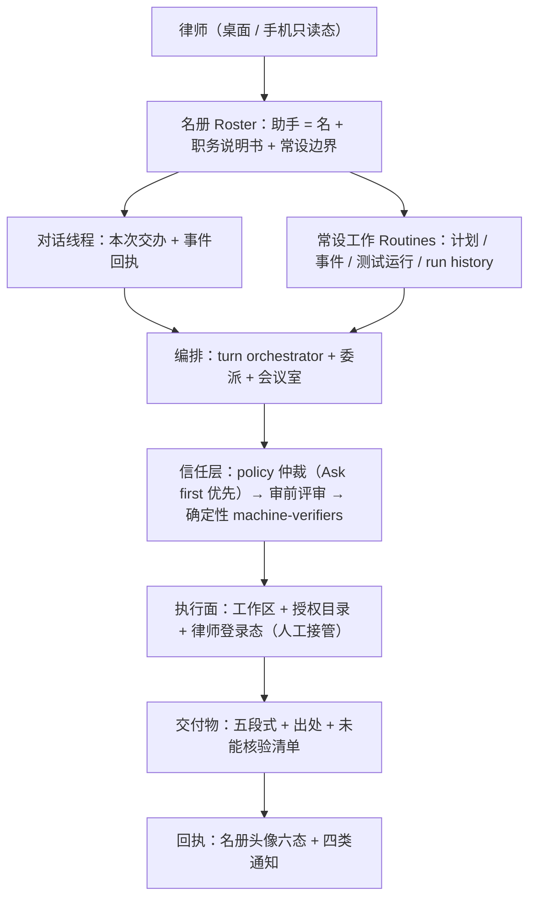

# LawMind × Grok Bot 深度借鉴评审（≥50 条清单 + LawMind Bot 重构方案）

- 日期：2026-09-21
- **想读人话版请先看 [`docs/LAWMIND-STRATEGY-MASTER.md`](LAWMIND-STRATEGY-MASTER.md)**；本文是详版（含每条证据与落点）。
- 对象：xAI/Cursor 的 **Grok Bot**（持久命名 Bot + 每用户一台云电脑 + Skills/Routines/审批/多 Bot 协作）
- 目的：把 Grok Bot 公开文档与实际形态**逐层拆开**，找出 LawMind 可以抄的机制（**98 条**）、明确**不抄**的 10 条、并给出「LawMind Bot」形态的重构方案与分期路线。
- 口径：Grok Bot 侧证据全部来自公开文档（见 §7）；LawMind 侧证据为**本树实际代码路径**（已核对存在）。
- 可视化（可筛选 88 条）：[lawmind-grok-bot-borrow-review](/Users/shl/.cursor/projects/Users-shl-nvidia-LawMind-1/canvases/lawmind-grok-bot-borrow-review.canvas.tsx)。
- 路线决策（单产品双面 vs 双产品，含需改的不变量）：[`docs/LAWMIND-PRODUCT-ROUTE-COMPARISON.md`](LAWMIND-PRODUCT-ROUTE-COMPARISON.md)。
- 前瞻战略（终局形态「采信层」、定价路线、反证条件）：[`docs/LAWMIND-ACCEPTANCE-LAYER-STRATEGY.md`](LAWMIND-ACCEPTANCE-LAYER-STRATEGY.md)。
- 本文不改写任何历史评分，也不替代 [`docs/LAWMIND-AGENT-PARITY-REVIEW.md`](LAWMIND-AGENT-PARITY-REVIEW.md) 与 [`docs/archive/LAWMIND-ENGINEERING-REVIEW.md`](archive/LAWMIND-ENGINEERING-REVIEW.md) 中 2026-08-20 的 Grok 附录。

---

## 0. 三句话结论

1. **形态不能照搬，机制可以大抄。** Grok Bot 卖的是「有自己的云电脑、代你登录、你下线它还在跑、回来交成品」。LawMind 的执业前提是**卷宗本机、案件硬隔离、律师本人登录法宝/法院**——这三条决定了 LawMind 不能变成「云 VM 托管客户卷宗」。
2. **LawMind 缺的不是能力，是「对象模型 + 生命周期 + 可观察性」。** Grok Bot 把 `Bot / Chat / Prompt / Tool / Artifact` 五个原语之外的一切都藏起来；LawMind 目前向律师暴露了 `办件 / 能力 / 技能 / 角色 / 模板 / 自动办件 / 会议室 / 守护 / 判断分级` 等一整套工程词汇。**会话是主对象、助手是附属**——这是最大的可抄点。
3. **差距集中在四处，全部可落地**：① `lawmindd` 无监护（无重启/无日志/无心跳/无单实例锁）；② 自动办件只有「最后一次结果」（无 run history/无事件触发/无时区/无缺数据策略）；③ 审批缺「Ask first 优先」仲裁与「审前动作级评审」；④ 缺「关窗后仍在办」的可信信号（presence/通知/失败上报）。

> **是否全盘重构成 Grok Bot？** 不建议。见 §4.5：全形态重构会把「保密 + 案件隔离 + 登录合规 + 公证/许可」四项成本一次性拉满，收益集中在外观层。建议走 §4.4 的**同构改造**（Stage 0–4），保留本机形态，抄它的对象模型与运维层。

---

## 1. Grok Bot 到底做了什么（证据版拆解）

### 1.1 五个原语与「其余藏起来」

官方设计文稿明确：产品只留 5 个概念——**Bots / Chats / Prompts / Tools / Artifacts**，其余（context window、memory、system prompt、sandbox、permissions、automations…）都收到界面之下。

- Bot = 持久 agent，有自己的 identity、memory、runtime、tools。
- Chat = 与该 Bot 对话的界面（**次要对象**）。
- Prompt = 一次性指令 / 存成 Skill / 由 Routine 自动触发。
- Tool = connector、API、shell、computer use。
- Artifact = Bot 产出的持久物。

来源：[Designing Grok Bot](https://x.ai/news/designing-grok-bot)。

### 1.2 分层能力矩阵

| 层              | 提供什么                         | 用户仍须自己承担               |
| --------------- | -------------------------------- | ------------------------------ |
| Bot             | 持久角色、会话、记忆、工作上下文 | 范围、成功标准、审批边界       |
| Cloud computer  | 浏览器、文件系统、终端、持久会话 | 登录卫生、敏感文件、吊销、恢复 |
| Plugin / MCP    | 结构化访问外部系统               | 权限、厂商条款、最小权限       |
| Skill           | 可复用的做事方法                 | 验收、版本、策略               |
| Routine         | 定时或事件驱动的执行             | 重试、陈旧数据、幂等、监控     |
| Group / handoff | 可见的多 Bot 协作                | 归属、状态、冲突、最终批准     |

来源：[Grok Bot Guide: Always-On AI Agents](https://www.ai.joaoqueiros.com/blog/grok-bot-always-on-ai-agent-teams-routines-skills-security)。

### 1.3 运行面（这是 LawMind 最该抄的一层）

- **工作不依赖客户端在线**：云端电脑跑，关 app/关笔记本不停；有 Routine 与「开始于另一个 Bot 的消息」两种非人类触发起点。
- **每 Bot 一块虚拟屏**：多 Bot 并行使用浏览器/桌面工具，但**一块屏同一时刻只跑一个 computer-use 任务**。
- **共享边界写得很直白**：一个用户一台电脑，所有 Bot 共享文件/浏览器会话/登录/CLI 凭据；**「Bot 不是安全边界」**；跨用户才是硬件级隔离（Firecracker microVM）。
- **计算机生命周期**：`Update`（保文件）/`Recover`（不可达时）/`Reset`（回最近快照，未同步的丢）；**会话存在计算机之外**，Reset 也不丢。
- **三档可见性**：状态点（标题栏变色）→ 侧栏预览（跟读不打断）→ 全屏接管（只在需要人时）。设计原则：**越显眼越鼓励人去盯着**，所以默认只给「知道它在干活」。
- **头像即状态**：idle / working / waiting / blocked / thinking / done 六态由头像动效承载，悬停看当前动作。

来源：[computer-and-apps](https://docs.x.ai/grok-bot/computer-and-apps)、[Work with Grok Bot](https://cursor.com/docs/grok-bot/work)、[Designing Grok Bot](https://x.ai/news/designing-grok-bot)。

### 1.4 Skill / Routine / Trigger 的三段式

- **Skill 六要素**：何时用、需要的输入与访问、工作序列、如何验证、交付什么、哪些要批准。
- **Routine 六确认**：归属 Bot、计划与时区、输入源、期望结果、审批边界、**源数据缺失时怎么办**。
- **升级顺序（本评审最推荐直接抄的一条）**：`一次性任务 → 修正过的一次性任务 → 存成 Skill → 测过的 Routine → 事件触发`。「不要把第一次侥幸成功存成 Skill。」
- **Test run 是真实工作**（会导航、改文件、调用工具），不是模拟；要检查：是否选了当前输入、输出格式、每步有出处、是否在预期的审批点停下、失败态是否显式。
- **限额与保留**：一个 Bot 最多 50 个 Routine；每个 Routine 保留最近 20 次运行记录；删除 Routine 立即生效不可撤销；删 Bot 连带删 Routine。
- **Teach a task**：演示浏览器流程（≤10 分钟、不录音频）生成**草稿** Skill，必须人工补规则、在安全输入上测试后才能上计划。
- **事件触发**：窄匹配（「每条新消息都触发」是反例）；计划 ≠ 通知策略（每天跑，但只在阈值越线时通知）。

来源：[skills-routines-and-automations](https://docs.x.ai/grok-bot/skills-routines-and-automations)、[Work with Grok Bot](https://cursor.com/docs/grok-bot/work)、[Grok Bot 101](https://x.ai/bot/guides/grok-bot-101)。

### 1.5 审批与信任（Auto Review 的仲裁语义值得逐条抄）

- **独立评审模型**（Auto Review）在执行前评估 tool call 与 computer action，可 allow / block / escalate。
- **规则只有两态**：`Ask first`（命中必然停下来问人）与 `Allow automatically`（只有在自动评审没发现其它必须停的理由时才放行）；**两者同时命中时 Ask first 赢**。
- 规则写**窄条件**（动作 + 范围）；官方明确「`允许浏览器里的一切` 这类宽规则是反例」，并强调 Auto Review 是模型判断，**不能替代最小权限与显式审批边界**。
- 团队规则强制；成员自己的规则**只能更严**，不能更松。
- 审批只控制**尚未发生**的动作，**不回滚已完成的工作**。
- 密码/passkey/2FA/CAPTCHA/支付/身份核验**交还给人**；安全 secret 请求的输入**掩码、不入 transcript、不进入模型**。
- 本地电脑执行独立成策：`Ask every time`（默认）/`Always allow`/`Never allow`，团队管理员可设上限（成员只能更严）。

来源：[approvals-security-and-privacy](https://docs.x.ai/grok-bot/approvals-security-and-privacy)。

### 1.6 企业与治理层（律所版可直接对照）

- 架构四原则：**按用户隔离**（Firecracker microVM，硬件级）、**默认无权限**、**人在环审批**、**管理员控制**。
- 控制面：总开关、分组访问、Team Rules、Enforce Auto-review、Auto-review 团队规则、Network Controls（四档，从 allow-all 到白名单）、Team Setup（装机脚本 manifest）、Grok Bot Computers（批量重建/终止）、Cloud Agent 开关、公版模板分享开关。
- 审计两类分开：**Audit logs**（控制面：建 Bot、权限变更、routine、MCP 认证）与 **Action Recording**（动作面：MCP 调用、shell、浏览器导航、computer-use 会话；**脱敏**——shell 洗密钥、URL 去 query string 只留 `scheme://host/path`、computer-use 只记动作数与时长不记截图/点击/输入）。
- OTel 导出到客户自有 collector；Admin API；Conversation Insights 按「工作类型 / 自动化等级」分类。

来源：[teams-and-enterprises](https://docs.x.ai/grok-bot/teams-and-enterprises)。

### 1.7 LawMind 现状一句话对照（详见 §2 每条的「现状」列）

| 轴      | Grok Bot                                     | LawMind（本树）                                          |
| ------- | -------------------------------------------- | -------------------------------------------------------- |
| 主对象  | Bot 名册                                     | 会话（`sessions/`）+ 办件叠加层（`lawmind/works/`）      |
| 执行面  | 每用户一台云电脑                             | 本机工作区；`lawmindd` 只在桌面退出后接管                |
| 守护    | 托管，平台负责                               | `lawmindd` 无 supervisor/无日志/无心跳/无单实例锁        |
| Routine | 计划 + 事件触发 + run history + 缺数据策略   | 只有墙钟计划；只有 `lastRun*`；无时区；无事件            |
| Skill   | 六要素 + 演示教学 + 账户级共享               | frontmatter + 签名 + 内置 skill + 改稿学习               |
| 审批    | Auto Review 仲裁（Ask first 优先）+ 团队规则 | Guardian（模型评审）+ policy + `RequiresAction` 五类暂停 |
| 隔离    | 跨用户硬件隔离；用户内**不**隔离             | 案件/伦理墙**路径级硬隔离**（比它更严）                  |
| 可观察  | 头像六态 + 三档计算机可见性 + 通知阈值       | 过程移出对话（有意），缺「一眼知道在干活」的常驻信号     |

### 1.8 已经抄过的（不要重复计数）

2026-08-20 已落地「Grok 三刀」：本机守护 `lawmindd`、办件→存成自动办件（`POST /api/works/automation`）、软预算续跑（`continue_tools`）。见 [`docs/archive/LAWMIND-ENGINEERING-REVIEW.md`](archive/LAWMIND-ENGINEERING-REVIEW.md) 附录 704–725 行。本清单默认**这三条已完成**，第 2 节列的是**尚未抄到的部分**（含把这三条补成「可信生产形态」）。

---

## 2. 可借鉴清单（98 条）

> 优先级：**P0** = 直接影响「交付前不让律师再介入 / 不出事故」；**P1** = 显著提升可用性；**P2** = 打磨或治理层。
> 「抄法」只写**机制**，落点写**本树文件**。凡是与铁律冲突的，见 §2.J。

### 2.A 对象模型与产品 IA（10 条）

| #   | Grok Bot 机制                                            | LawMind 现状（证据）                                                                  | 抄法（落地）                                                                                  | P   |
| --- | -------------------------------------------------------- | ------------------------------------------------------------------------------------- | --------------------------------------------------------------------------------------------- | --- |
| A1  | Bot 是首要对象（名字/职务/头像/描述），会话是它的附属    | 主对象是会话：`src/lawmind/agent/session.ts`；办件是叠加：`src/lawmind/work/store.ts` | 把「在办」升格为**编制/名册**一等对象；`LawyerWork` 挂到 `assistantId` 下，会话只作其工作线程 | P0  |
| A2  | 只暴露 5 个原语，其余藏起来                              | 律师可见词汇：办件/能力/技能/角色/模板/自动办件/会议室/守护/判断分级                  | 收成 4 个律师词：**助手 / 对话 / 办件 / 交付物**；其余进设置「专业控制」                      | P0  |
| A3  | 角色用操作性语言写（Own… / Never… without approval）     | 助手有人设与描述，但无统一「职务说明书」模板                                          | 新增职务说明书模板（职责/输入源/输出物/**禁止项**/**升级条件**），随 assistant 落盘并进系统段 | P0  |
| A4  | `Description` 放恒久规则，`Message` 放本次任务           | 本次指令在 turn；本件目标有 sidecar：`src/lawmind/work/goal.ts`                       | 显式二分：常设边界（assistant 描述/policy）vs 本次交办（work goal），提示装配按层注入         | P0  |
| A5  | Pin / Hide / Duplicate 名册管理                          | `LawmindAgentFleetPanel.tsx` 有列表，无隐藏/复制语义                                  | 加 Pin/Hide；**复制助手**只带角色+技能+routine，不带记忆与对话（律所「再开一个同岗」刚需）    | P1  |
| A6  | 模板分享：公开链接不含电脑/登录/对话；接收方得到独立副本 | 有模板体系，无「脱敏导出 + 独立实例」的显式契约                                       | 导出前**强制脱敏检查单**（密钥/内部 URL/客户数据），接收方副本与源完全解耦                    | P1  |
| A7  | 名册有上限（约 50 Bots；群聊 ≤6）                        | 无上限概念                                                                            | 编制上限 + 超限提示，避免无限膨胀与协调噪音                                                   | P2  |
| A8  | 「General Helper 是坏角色」，必须专业分工                | 有 assistant-specialist 与角色模板                                                    | 文案与默认模板禁止泛化角色；泛化角色给降级提示                                                | P1  |
| A9  | 现有 Bot 可以建议/创建新 Bot（长寿命责任人）             | 无「把这件事独立成常设助手」的提议                                                    | 办件完成后可**建议**独立成常设助手；必须律师显式确认才创建                                    | P1  |
| A10 | 搜索/命令面板跨 Bot 找历史消息/文件/routine              | 已有跨对话检索 `search_conversations`；无跨名册的交付物/办件检索                      | 扩检索引擎到「交付物 + 办件 + routine 运行记录」，按助手分组呈现                              | P1  |

### 2.B 进程与运行时（12 条）

| #   | Grok Bot 机制                                                         | LawMind 现状（证据）                                                                                                                | 抄法（落地）                                                                             | P   |
| --- | --------------------------------------------------------------------- | ----------------------------------------------------------------------------------------------------------------------------------- | ---------------------------------------------------------------------------------------- | --- |
| B1  | 工作不依赖客户端在线                                                  | `lawmindd` 仅桌面退出后接管：`apps/lawmind-desktop/electron/main.mjs:217`、`apps/lawmind-desktop/server/lawmind-local-server.ts:73` | 给 `lawmindd` 补**监护**：退避重启、崩溃计数、给律师可见的失败原因                       | P0  |
| B2  | 持久计算机（浏览器/文件/终端/凭据）                                   | 等价物是本机工作区 + `.env.lawmind` + 律师自己的浏览器会话                                                                          | 定义「LawMind 执行面」清单（哪些目录持久、哪些凭据在哪、谁能读），**不抄云 VM**          | P0  |
| B3  | 每 Bot 一屏，一屏同时只跑一个 computer-use                            | turn 串行只在会话级：`src/lawmind/agent/session-turn-gate.ts`                                                                       | 扩到**每助手一个执行槽**（同助手并发互斥），避免同助手抢同一法宝/Word 会话               | P1  |
| B4  | 明确写出「Bot 不是安全边界」                                          | 反过来：案件/伦理墙是硬边界（`matters/`、`cases/` 路径围栏）                                                                        | 写清「助手之间共享什么、不共享什么」契约（工作区共享、案件围栏不共享）并写进 SECURITY.md | P0  |
| B5  | 跨用户硬件级隔离；用户内共享                                          | 单机单用户；多进程仅靠 pid + 文件锁；**Electron 无 single-instance lock**                                                           | 加 `app.requestSingleInstanceLock()` + 工作区写者租约，明确「一工作区一写者」            | P0  |
| B6  | 计算机生命周期 Update/Recover/Reset；会话在计算机之外                 | 会话在 `sessions/`、交付物在 `matters/`，但无「工作区体检/修复/回滚」分层                                                           | Doctor 增「工作区体检」：可重建的（索引/缓存）vs 不可重建的（交付物/会话），并给修复动作 | P1  |
| B7  | 只有 `/workspace` 是持久路径，临时目录可丢                            | `workspace/`、`lawmind/`、`cases/`、`matters/` 混用；AGENTS.md 已警告 workspace 混有运行时产物                                      | 出「持久真相源清单」文档 + 启动时校验；把可丢目录显式标记                                | P1  |
| B8  | Update/Recover 保文件，Reset 回最近快照                               | 有 `docs/lawmind/LAWMIND-MATTER-REPLICA.md`（副本/同步），无 per-matter 快照回滚                                                    | 案件级快照 + 一键回滚（配合原子写 `writeJsonAtomic`）                                    | P1  |
| B9  | 恢复顺序：retry → 重启 app → Recover → Update → Reset（最不破坏优先） | Doctor 有诊断，无成文的「修复阶梯」                                                                                                 | Doctor 落地修复阶梯，每步说明可逆性与影响面                                              | P1  |
| B10 | 关 app 不停工作；预览不打断                                           | 关窗后 `lawmindd` 只跑 tick（`setInterval 30s`），失败不通知，无心跳                                                                | 加心跳 + 状态徽章 + 失败上报（重开即见「你走后发生了什么」）                             | P0  |
| B11 | 本机执行与云执行分离，本机默认 Ask every time                         | 有 host-access 与授权留痕：`docs/lawmind/LAWMIND-HOST-ACCESS.md`                                                                    | 成文三档（never/ask/allow）+ 首次全量同意 + 团队上限；与 Word 插件授权留痕统一           | P1  |
| B12 | 静态出口 IP / 网络策略（企业）                                        | 有 `docs/lawmind/LAWMIND-EGRESS-POLICY.md`                                                                                          | 提供「可选出口白名单 + 直连/代理声明」，便于律所 IT 放行与审计                           | P2  |

### 2.C Routine 与 Skill 生命周期（12 条）

| #   | Grok Bot 机制                                             | LawMind 现状（证据）                                                                                    | 抄法（落地）                                                                   | P   |
| --- | --------------------------------------------------------- | ------------------------------------------------------------------------------------------------------- | ------------------------------------------------------------------------------ | --- |
| C1  | Skill 六要素模板                                          | skills 有 frontmatter/签名/契约测试：`src/lawmind/skills/skill-runtime.ts`                              | 把六要素写进 skill 模板 + lint（缺「何时用/缺数据怎么办/哪步要批准」即警告）   | P1  |
| C2  | Routine 六确认（含**缺数据怎么办**）                      | `LawyerAutomation` 无「缺数据策略/期望结果/批准边界」字段：`src/lawmind/platform/lawyer-automations.ts` | schema 增三字段，创建 UI 未填不允许保存                                        | P0  |
| C3  | 先一次性成功再自动化（升级顺序）                          | 已有「办件→存成自动办件」：`src/lawmind/platform/automation-from-work.ts`                               | 加**升级闸**：至少 1 次成功交付才允许转常设；转常设时显示上次成功证据          | P1  |
| C4  | Test run 是真跑（非模拟），要留证据                       | 只有 `runNow`（`nextRunAt=epoch0`）：`apps/lawmind-desktop/server/lawmind-server-route-automations.ts`  | 加「测试运行」语义：标记 test、写侧动作仍走审批、结果单独保留不覆盖正式记录    | P1  |
| C5  | Run history（每 routine 保留 20 次）                      | 只有 `lastRunAt/lastJobId/lastResultSummary/lastError*`（覆盖式）                                       | `lawmind/automations/<id>/runs/*.json` 保留 N 条（默认 20）+ 失败详情 + 可检索 | P0  |
| C6  | 事件触发（Slack/GitHub/webhook）                          | 只有墙钟 `daily/weekly/once/interval`                                                                   | 先做本机三源：**目录变更 / 新邮件 / Webhook**；外部 SaaS 后置                  | P1  |
| C7  | 窄匹配规则；禁「每条消息都触发」                          | 无触发器概念                                                                                            | 触发器 lint：必须有明确条件 + 频率上限 + 先 dry-run                            | P1  |
| C8  | 计划与时区显式（含 DST）                                  | `computeNextRunAt` 用本机墙钟、无 tz 字段                                                               | 加 IANA 时区字段与 DST 测试；跨地/出差不跑偏                                   | P1  |
| C9  | 计划 ≠ 通知策略；静默成功不打扰                           | 自动办件进收件箱，无「静默成功」；`AutomationInboxItem` 状态机偏重发送审批                              | 加 notify 阈值与静默成功；收件箱只放「需要律师动作」的项                       | P0  |
| C10 | 50 routines / 20 runs；删除不可撤销；删 Bot 连带删        | 删除自动化无影响面预览；inbox 无保留策略                                                                | 删除前影响面预览 + 软删/回收站；inbox 与 runs 有保留期                         | P1  |
| C11 | 长期离开会主动问「还继续跑吗」，不答则暂停                | 无此护栏                                                                                                | 加「长期未确认则暂停 routine」策略（省电/省额度/防走错）                       | P2  |
| C12 | Teach a task（演示≤10 分钟→草稿 skill，必须补规则并测试） | 有改稿学习与示例：`src/lawmind/learning/edit-examples.ts`、`draft-edit-learning.ts`                     | 做「本机演示→草稿技能」；**本地存储、可删、不入云**，启用需律师确认            | P2  |

### 2.D 审批与信任（12 条）

| #   | Grok Bot 机制                                                 | LawMind 现状（证据）                                                                                            | 抄法（落地）                                                         | P   |
| --- | ------------------------------------------------------------- | --------------------------------------------------------------------------------------------------------------- | -------------------------------------------------------------------- | --- |
| D1  | 独立评审模型在执行前评估工具调用与电脑动作                    | Guardian 是独立模型调用：`src/lawmind/guardian/run.ts`；确定性校验：`src/lawmind/guardian/machine-verifiers.ts` | 补**动作级审前评审**（当前偏交付物审稿），并保留确定性层为硬闸       | P0  |
| D2  | Ask first / Allow automatically 两态；冲突时 **Ask first 赢** | policy/permission 有 allow/deny，无显式仲裁规则                                                                 | 照抄仲裁：`Ask first` 命中即停，`Allow` 仅在无其它停止理由时放行     | P0  |
| D3  | 规则必须窄（动作 + 范围）；宽规则是反例                       | 无规则语法校验                                                                                                  | policy 校验器：宽规则告警/拒绝，必须带 scope；写入测试               | P1  |
| D4  | 团队规则强制且只读；成员只能更严                              | 有 policy 文件与设置，无团队/个人两层                                                                           | 加团队规则层（只读展示、锁定图标），本地覆盖只允许收紧               | P1  |
| D5  | 边界写在请求里（先展示当前值/建议值/影响再批准）              | 外发硬暂停已有：`src/lawmind/platform/requires-action.ts`                                                       | 升级卡必填「当前值 / 建议值 / 影响面」三件套                         | P0  |
| D6  | 审批只控制未发生的动作，不回滚已完成                          | 有授权留痕，但语义未强调                                                                                        | 审批 UI 明写「批准/拒绝均不回滚已完成动作」，并列出已完成清单        | P1  |
| D7  | 审批卡展示目标/范围/取值；识别不了就不批                      | `LawMindRequiresAction` 有 toolArgs/riskFlags                                                                   | 强制人类可读目标 + 不可逆标记 + 影响面；缺字段不允许出卡             | P0  |
| D8  | 凭据由人接管；secret 掩码、不入 transcript、不进模型          | 律师自己登录法宝/法院；**无 secret 通道**                                                                       | 加「人工接管」流程（暂停→人做→继续）与 secret 输入（掩码、不入历史） | P1  |
| D9  | 本机执行三档 + 首次全量同意 + 团队上限                        | host-access 有授权留痕                                                                                          | 成文三档设置与团队上限                                               | P1  |
| D10 | 高风险清单：发送/发布/购买/删除/权限/生产/接受法律条款        | 已有外发硬暂停、改原稿、终稿导出等控制                                                                          | 形成「不可逆动作清单」并作为 policy 默认集（含对外平台提交）         | P0  |
| D11 | 最小权限清单（只连需要的、只读起步、定期复核）                | Doctor 有诊断，无授权面复核                                                                                     | Doctor 增「授权健康检查」：连接器/routine/授权留痕定期复核提示       | P2  |
| D12 | 删 Bot 不删共享电脑上的文件与登录（文档明说）                 | 会话删除有级联：`src/lawmind/agent/session-delete-cascade.ts`                                                   | 明确「删助手 = 删会话/routine，不删案件交付物」，并给清理向导        | P1  |

### 2.E 记忆与上下文边界（8 条）

| #   | Grok Bot 机制                                                | LawMind 现状（证据）                                                                                   | 抄法（落地）                                                         | P   |
| --- | ------------------------------------------------------------ | ------------------------------------------------------------------------------------------------------ | -------------------------------------------------------------------- | --- |
| E1  | 工具/技能账户级共享，**记忆与 routine 归 Bot**               | 记忆集中：`src/lawmind/memory/index.ts`；无 assistant 归属                                             | memory 与 automation 绑定 `assistantId`；skill/工具表保持全局        | P0  |
| E2  | 「记忆不是权威源」：变更事实回源系统，重要决策要引用当前数据 | 已有诚实标注/SKIP 与先例库规则                                                                         | 把该原则写进记忆注入提示与 MemoryInspector 文案（`MemoryInspector`） | P1  |
| E3  | 记忆只留稳定偏好/重要事实/摘要，不重放历史                   | compaction + memory 已有：`src/lawmind/agent/compact.ts`                                               | 记忆条目三分类 + 过期/纠错入口（当前有采纳，无 expiry）              | P1  |
| E4  | 跨 Bot 传递靠共享文件/群聊/直接交接，不靠共享记忆            | 有消息总线与委派：`src/lawmind/agent/collaboration/message-bus.ts`                                     | 定义交接契约（产物路径 + 验收标准 + 未决问题），交接不带私有记忆     | P1  |
| E5  | 长对话让重复运行更贵；常设工作交给干净 Bot                   | 自动办件已新建会话；未固定「不继承长上下文」                                                           | routine 绑定「干净会话」，显式禁用长对话继承                         | P1  |
| E6  | 结果五段式：事实 / 假设 / 已完成 / 待批准 / 未决             | 交付物与决策头已有结构：`src/lawmind/deliverables/types.ts`、`src/lawmind/delivery/decision-header.ts` | 五段式落成结构化字段 + lint（缺「未决问题」不算完成）                | P0  |
| E7  | 可独立复核的交付（源链接/截图/时间戳/动作日志/未能核验清单） | 有 source 与 audit；「未能核验清单」未强制                                                             | 交付物模板强制「未能核验」一节；无出处行不得进正文                   | P0  |
| E8  | 可随时更正陈旧假设                                           | 有采纳流与批量采纳                                                                                     | MemoryInspector 加「一键更正并留痕」                                 | P2  |

### 2.F Presence / 可观察性 / 通知（10 条）

| #   | Grok Bot 机制                                                    | LawMind 现状（证据）                                                                                    | 抄法（落地）                                                       | P   |
| --- | ---------------------------------------------------------------- | ------------------------------------------------------------------------------------------------------- | ------------------------------------------------------------------ | --- |
| F1  | 头像六态（idle/working/waiting/blocked/thinking/done）           | `LawyerWorkStatus` 六态几乎同构：`src/lawmind/work/types.ts:3`                                          | 把状态表达上移到**助手/办件头像**，替代对话内过程芯片              | P0  |
| F2  | 三档可见性：状态点 / 侧栏预览 / 全屏接管                         | 有工具轨迹（设置内）、在办抽屉、Word 窗格                                                               | 加常驻「正在做什么」信号（标题栏/头像），详情按需展开              | P1  |
| F3  | 悬停看当前动作一行，而不是长描述                                 | 过程信息被移出对话（有意），但缺常驻替代                                                                | 「当前动作一行」+ 悬停详情；避免长篇叙述                           | P1  |
| F4  | 异构 transcript（对话 + 系统事件 + 交互卡片 + 可视化同一时间线） | 有意把过程移出对话；事件回执不足                                                                        | 只加**事件回执行**（创建 routine、改设置、助手交接），不加过程芯片 | P1  |
| F5  | 用卡片/表格回答，而不是散文；表单替人填                          | 有决策头、审查表、批注                                                                                  | 抄 inline widget：期限确认、批注勾选、发送前预览卡                 | P1  |
| F6  | 通知与计划分离；只在阈值越线时打扰                               | 仅在 `awaiting_lawyer_review` 通知：`apps/lawmind-desktop/src/renderer/lawmind-lawyer-review-notify.ts` | 补「失败/长时间阻塞/需要人工接管/daemon 掉线」四类通知             | P0  |
| F7  | 用户直接消息优先于后台工作，可打断；停止不回滚                   | steer/interrupt 已有：`src/lawmind/agent/turn-interrupt.ts`                                             | 明确「打断不回滚」，并让后台 routine 让位给律师指令                | P1  |
| F8  | 换设备/关 app 回来是同一份工作                                   | 单机；重开靠轮询推导（3.5s/8s/11s 多套）                                                                | 关窗后 daemon 的进展以**同一时间线**回放（事件流 + 心跳）          | P0  |
| F9  | 搜索能找 routine 与其运行历史                                    | 跨对话检索已有；routine 无历史可搜                                                                      | 运行历史可检索（配合 C5）                                          | P2  |
| F10 | 诚实空状态（如「Run history 可能显示 No runs yet」）             | 无 run history，故无空态                                                                                | 区分「从未运行 / 已暂停 / 从未触发」三种空态文案                   | P2  |

### 2.G 多助手协作（8 条）

| #   | Grok Bot 机制                                    | LawMind 现状（证据）                                            | 抄法（落地）                                             | P   |
| --- | ------------------------------------------------ | --------------------------------------------------------------- | -------------------------------------------------------- | --- |
| G1  | Chief of Staff + 专家团，律师不当路由器          | 有 fleet/roles/会议室                                           | 定义「首席助手」一等角色：路由 + 汇总 + 只在判断点拉人   | P1  |
| G2  | Group chat（2–6 人，共享上下文，交接可见）       | 会议室：`apps/lawmind-desktop/src/renderer/app/MeetingView.tsx` | 对齐「群聊 = 共享上下文 + 单负责人」，人数上限与交接可见 | P1  |
| G3  | Bot→Bot 异步消息（唤醒、稍后回复、人可见）       | `collaboration/message-bus.ts`、`delegation-registry.ts`        | 补律师可读的交接回执 + 超时/失败可见                     | P1  |
| G4  | 每阶段单一负责人（避免并行交接重复劳动）         | 有工作流 DAG 执行器                                             | 执行器约束：一个阶段一个 owner，重叠交接告警             | P1  |
| G5  | 交接要带产物（群聊消息只能文本，故图直接发 Bot） | 委派以会话/任务为主                                             | 交接必须带产物路径与验收标准，而非纯文本                 | P1  |
| G6  | Reviewer 不能自审 + 明确量规                     | Guardian 是独立模型调用（写者不自评）                           | 把「写者不得自评」定为不变量；rubric 可配且随版本留档    | P0  |
| G7  | 只在判断点拉人（judgment calls）                 | `judgment-tiering` + escalation 卡                              | 继续放大该机制：把「每步确认」一律改成「判断点确认」     | P0  |
| G8  | 名册最小化：先 1 个端到端负责人再加专业角色      | 无成文规则                                                      | 写进产品文案与默认模板（避免协调噪音）                   | P2  |

### 2.H 企业 / 治理 / 合规（8 条）

| #   | Grok Bot 机制                                                                 | LawMind 现状（证据）                                 | 抄法（落地）                                                                                       | P   |
| --- | ----------------------------------------------------------------------------- | ---------------------------------------------------- | -------------------------------------------------------------------------------------------------- | --- |
| H1  | 管理员总开关 + 分组访问；关掉不删电脑                                         | 有 edition（solo/firm/private_deploy），无集中控制面 | 律所版加管理员开关与分组（不删工作区）                                                             | P2  |
| H2  | Team Rules 强制、成员不可关                                                   | policy 已分层但无团队层                              | 团队规则层：只读 + 锁定 + 本地只能更严                                                             | P1  |
| H3  | 强制 Auto-review（防成员关闭）                                                | firm 默认 Guardian `block`（见 GOALS 第十九期）      | 命名为「强制独立审稿」并在 UI 明示不可关                                                           | P1  |
| H4  | Action Recording 脱敏规则（洗密钥、URL 去 query、computer-use 不记截图/输入） | `src/lawmind/audit/`、`src/lawmind/metrics/`         | 对齐脱敏规则，尤其浏览器 URL 与密钥；写成测试                                                      | P1  |
| H5  | OTel 导出到客户自有 collector                                                 | 自托管、无标准出口                                   | 提供 OTel/SIEM 出口（律所 IT 刚需）                                                                | P2  |
| H6  | 审计分两类：控制面事件 vs 动作事件                                            | audit 目前混装                                       | 拆两类，控制面事件（建助手/权限变更/routine 变更）单独呈现                                         | P1  |
| H7  | 网络策略四档 + 分组策略                                                       | egress 文档已有原则                                  | 落成可配白名单（含分组），与 B12 合并                                                              | P2  |
| H8  | Conversation Insights（按工作类型/自动化等级）                                | metrics 有运行时事件                                 | 做「本周交办类型 / 自动化覆盖率 / 纠正时间」给律师，**不做审计营销**（遵守 GOALS §「关于可审计」） | P2  |

### 2.I 运营 / 成本 / 质量（8 条）

| #   | Grok Bot 机制                                                                                          | LawMind 现状（证据）                                      | 抄法（落地）                                         | P   |
| --- | ------------------------------------------------------------------------------------------------------ | --------------------------------------------------------- | ---------------------------------------------------- | --- |
| I1  | 额度与限额透明（周额度、超额、无独立花费上限也要说明）                                                 | 有许可与 Doctor；用量不透明                               | 设置内做律师可懂的用量页（本周交办/自动化消耗/预计） | P1  |
| I2  | 每次运行都消耗，**空跑也消耗**                                                                         | interval routine 无成本提示                               | 创建/编辑 routine 时给「频次 × 成本」估算与空跑提示  | P1  |
| I3  | 缺数据/陈旧数据要报告失败，而不是用旧数据                                                              | 多处「诚实标注/SKIP」已成型                               | 提升为 routine 必填字段 + lint（缺字段不允许保存）   | P0  |
| I4  | 重试幂等                                                                                               | `idempotencyKey` 小时桶 + `automation-dispatch-ledger.ts` | 推广到全部 routine，并写进创建模板                   | P1  |
| I5  | 部分完成要上报（partial completion）                                                                   | 无「部分完成」语义                                        | 交付物与在办支持部分完成态与缺口清单                 | P1  |
| I6  | 升级闸：连续 3 次带源链接、无越权、成本可预测、失败可恢复、纠正时间下降才扩面                          | 无成文准入门槛                                            | 直接抄成「自动化准入量表」，进 Doctor 与创建流程     | P0  |
| I7  | 指标：完成率/纠正分钟/误报/源新鲜度/审批数/失败数/单次可接受成本                                       | metrics 有运行时事件                                      | 对齐这 7 个指标，明确「活动量 ≠ 产出」               | P1  |
| I8  | 7 天试点剧本（选一个只读可复核任务 → 建 Bot → 连最小数据 → 手动跑 → 存 skill → 测第二个输入 → 上计划） | 无成文试点流程                                            | 做成内置「新自动化向导」，把 7 天压成交互式检查单    | P1  |

### 2.J 明确不抄（10 条，反面清单）

| #   | Grok Bot 做法                    | 为什么不抄                             | LawMind 应该怎么做                                            |
| --- | -------------------------------- | -------------------------------------- | ------------------------------------------------------------- |
| J1  | 客户卷宗放在厂商云 VM            | 律师保密义务、法域与职业责任、数据出境 | 保持本机工作区 + 案件围栏；云只作可选能力（如用户自有服务器） |
| J2  | 「Bot 不是安全边界」由用户自担   | 律师不会也不该承担这种设计风险         | 案件/伦理墙必须是**硬边界**（路径 + 鉴权 + 测试），不靠提示词 |
| J3  | 代登法宝/法院/银行等第三方系统   | 账号共享、平台 ToS、执业合规风险       | 律师本人登录；必要时「人工接管」一步后交回                    |
| J4  | 浏览器自动化点法律系统做提交     | 不可逆提交 + 页面改版即翻车            | 只做只读抓取；写动作一律回到律师确认或人工完成                |
| J5  | 录屏教学（云端保存）             | 敏感信息上屏、留存在第三方             | 若做演示教学：**本地存储、可删、不入云、明确提示勿露密**      |
| J6  | 模型不可选（平台托管）           | 律师/律所会要求指定模型与本地化        | 保持可换模型与本地部署为卖点                                  |
| J7  | 必须云存储，不支持隐私模式       | 与律师行业前提冲突                     | 保持「不联网也能干活」为默认，联网能力逐项显式开启            |
| J8  | 把 Auto Review（模型判断）当防线 | 模型判断不能替代最小权限与确定性闸     | 双保险：确定性 machine-verifiers 为硬闸，模型评审只做加法     |
| J9  | 用「记录了什么」证明可信         | 与 GOALS 铁律一致：可审计 ≠ 可信       | 只在调试/恢复/撤销/合规义务处保留记录，不作卖点               |
| J10 | 无界名册、无界触发（噪音与成本） | 律师侧会变成新的待办源                 | 名册上限 + 触发频率上限 + 运行预算闸 + 静默成功               |

**合计：A10 + B12 + C12 + D12 + E8 + F10 + G8 + H8 + I8 + J10 = 98 条。**

### 2.K 优先级汇总（先做哪 27 条）

计数（88 条可借鉴 + 10 条不抄 = 98）：**P0 共 27 条 · P1 共 48 条 · P2 共 13 条**。

**P0 速赢（27 条，两周内可动）**

- `A1 A2 A3 A4` → 名册化与词汇收敛；
- `B1 B2 B4 B5 B10` → daemon 监护 + 执行面清单 + 隔离契约 + 单实例锁 + 关窗可信回路；
- `C2 C5 C9` → routine 六确认 + run history + 静默成功；
- `D1 D2 D5 D7 D10` → 审前动作级评审 + Ask-first 仲裁 + 承诺卡三件套 + 不可逆清单；
- `E1 E6 E7` → 记忆/routine 归助手 + 五段式交付 + 未能核验清单；
- `F1 F6 F8` → 头像六态 + 四类通知 + 关窗后同一时间线；
- `G6 G7` → 写者不自审 + 只在判断点拉人；
- `I3 I6` → 缺数据策略 + 自动化准入量表。

**P1 中期（48 条）**：名册管理（Pin/Hide/复制/模板脱敏）、run 测试语义、事件触发（本机三源）、时区、删除影响面、团队规则层、脱敏审计、用量页、交接契约、presence 详情、部分完成、7 天向导等。

**P2 打磨（13 条）**：名册上限、演示教学（本地）、快照回滚、OTel 出口、网络白名单、Insights、纠错入口、诚实空态、长期不管则暂停等。

---

## 3. LawMind 已经不差、不要自毁的地方（对照提醒）

Grok Bot 强在**托管与统一体验**，LawMind 有几处**结构性更强**，改造时不要为了「像 Grok Bot」而削掉：

1. **案件/伦理墙硬隔离** > Grok Bot 的「Bot 不是安全边界」。别把隔离降级为提示词。
2. **确定性机械闸**（lint/机器校验/最小改动 span 复核）> 纯模型评审。别用 Auto Review 替换它们。
3. **可换模型 / 可离线 / 自托管** > 托管订阅。这是律所采购的硬要求。
4. **改稿是最小 span 落槌**（`docs/lawmind/LAWMIND-MINIMAL-EDITS.md`）> Grok Bot 的「文档类交付」。这是法律交付的核心差异。
5. **诚实 SKIP / 不假绿**（真稿闸门、类案探测）> 产品化的「看着很顺」。别为了体验掩盖失败。

---

## 4. 「LawMind Bot」重构方案

### 4.1 目标形态一句话

> **把 LawMind 从「一个会办事的对话框」重构成「一组有名字、有职责、能自己接着办的助手名册」，而执行面仍旧是本机工作区与律师自己的登录态。**

### 4.2 对象模型映射

| Grok Bot             | LawMind Bot（目标）                                    | 本树落点                                                                                          |
| -------------------- | ------------------------------------------------------ | ------------------------------------------------------------------------------------------------- |
| Bot                  | **助手**（名/职务/说明书/常设边界/技能/记忆/常设工作） | 新 `src/lawmind/agents/` 域；复用 `assistantId` 与 `LawmindAgentFleetPanel.tsx`                   |
| Chat                 | **对话线程**（助手的工作线程，不再是一等对象）         | `src/lawmind/agent/session.ts` 保留，但列表按助手下钻                                             |
| Prompt               | 一次性交办 / 存成 Skill / 挂成 Routine                 | `src/lawmind/work/goal.ts`、`src/lawmind/skills/`、`src/lawmind/platform/lawyer-automations.ts`   |
| Tool                 | 工具表 + connector（法宝/法院/邮件/Word）              | `src/lawmind/runtime/tool-pipeline.ts`、`apps/lawmind-desktop/server/lawmind-server-route-mcp.ts` |
| Artifact             | **交付物**（含五段式与未能核验清单）                   | `src/lawmind/deliverables/`、`src/lawmind/delivery/`                                              |
| Cloud computer       | **本机执行面**（工作区 + 授权目录 + 律师登录态）       | `src/lawmind/platform/lawmind-daemon.ts`、`docs/lawmind/LAWMIND-HOST-ACCESS.md`                   |
| Skill                | Skill（六要素 + 签名 + 归属）                          | `src/lawmind/skills/`、`docs/lawmind/LAWMIND-SKILLS-SIGNING.md`                                   |
| Routine              | **常设工作**（计划/事件 + run history + 缺数据策略）   | `src/lawmind/platform/lawyer-automations*.ts`                                                     |
| Auto Review          | **审前评审**（Guardian 动作级 + policy 仲裁）          | `src/lawmind/guardian/`、`src/lawmind/policy/`                                                    |
| Group chat / handoff | **协作**（会议室 + 委派 + 交接契约）                   | `src/lawmind/agent/collaboration/`                                                                |
| Avatar presence      | **名册头像六态**                                       | `src/lawmind/work/types.ts` + renderer 名册                                                       |

### 4.3 目标架构（分层不变量）

**四条不变量（不允许为了像 Grok Bot 而松动）**：

1. 案件围栏与伦理墙是硬边界；
2. 律师不得把凭据交给模型（人工接管）；
3. 写者不得自评（Guardian 独立）；
4. 缺数据必须诚实失败或标注，不得用旧数据/编造填充。

### 4.4 分期路线（建议）

| 阶段                                 | 目标                                                        | 主要落点                                                                         | 验收（可测）                                                                       |
| ------------------------------------ | ----------------------------------------------------------- | -------------------------------------------------------------------------------- | ---------------------------------------------------------------------------------- |
| **Stage 0** 名册化（1–2 周）         | 助手成为一等对象；词表收敛；职务说明书模板                  | 新 `src/lawmind/agents/bot-profile.ts`；`assistants` 域；renderer 名册           | 名册 CRUD + 复制（不带记忆/对话）+ 职务说明书进系统段；cassette 断言边界字段入提示 |
| **Stage 1** 可信后台（2–4 周）       | daemon 监护 + 心跳 + 单实例锁 + 关窗回执                    | `apps/lawmind-desktop/electron/server-supervision.mjs` 复用；`lawmind-daemon.ts` | 杀 daemon 自动重启；重开应用看到「你走后发生了什么」；两实例第二实例让位           |
| **Stage 2** 常设工作生产化（3–4 周） | 六确认 + run history + 静默成功 + 缺数据策略 + 时区         | `lawyer-automations*.ts`、`automation-from-work.ts`、renderer 面板               | 老 automation 文件向后兼容迁移；run history 可检索；缺数据必填                     |
| **Stage 3** 信任层补齐（3–4 周）     | 审前动作级评审 + Ask-first 仲裁 + 承诺卡三件套 + 不可逆清单 | `guardian/`、`policy/`、`requires-action.ts`                                     | 仲裁单测（两条规则冲突时 Ask first 胜）；审前拦截带单测                            |
| **Stage 4** 协作与治理（4 周+）      | 首席助手 + 交接契约 + 团队规则层 + 脱敏审计 + 用量页        | `collaboration/`、`audit/`、`metrics/`                                           | 交接回执可见；团队规则只收紧；脱敏规则有测试                                       |

### 4.5 如果你真要「全盘重构成 Grok Bot 形态」

给出诚实的成本与后果，供你决定——**本评审不建议**：

- **会失去**：案件围栏硬隔离（云 VM 共享卷宗）、律师本人登录合规线、离线可用、可换模型、最小 span 改稿的本地确定性复核。
- **会新增**：云基础设施与运维、跨法域数据合规（出境/保密/职业责任）、第三方系统 ToS 风险、公证与许可流程（配合 GOALS P2-A）、单位经济模型（每次空跑都烧钱）。
- **收益**：外观统一（名册/头像/接管）、零安装、跨端可达。
- **折中**：**只抄对象模型与运维层（Stage 0–4），执行面不做云化**；如果确需「跨端可达」，优先做「用户自己的机器/服务器上的 LawMind 节点 + 端到端加密」，而不是托管云电脑。

---

## 5. 风险与盲点（改之前先看）

1. **别把「名册化」做成新的待办源**：Grok Bot 的静默成功 + 通知阈值是配套的；只抄名册不抄静默会加重律师负担。
2. **别把 Auto Review 当第二道闸的全部**：它同时命中「Ask first 优先」，且官方自称不能替代最小权限。LawMind 必须保留确定性闸。
3. **删助手语义要一次说清**：Grok Bot 的现实是「删 Bot 不删电脑上的文件与登录」。LawMind 若不写清，律师会以为交付物也没了。
4. **事件触发是能力一个个测出来的，不是承诺**：连 Grok Bot 也只有部分 connector 支持；LawMind 应从本机三源开始。
5. **共享执行面的隐藏耦合**：多助手共享工作区/浏览器会话时，一个助手的失败会污染另一个（同一法宝会话、同一临时目录）。B3/B4 必须先立规矩。
6. **成本与噪声**：interval routine 是隐性成本源（「每 15 分钟 = 一天 96 次」）。I1/I2/I10 必须同时在位。

---

## 6. 下一步建议（可直接开工的三件）

1. **`A1/A3/A4` 名册化最小闭环**：`bot-profile` 类型 + 职务说明书模板 + 名册 UI + cassette 断言常设边界入提示。
2. **`B1/B5/B10` 后台可信最小闭环**：daemon 监护、单实例锁、心跳与「你走后发生了什么」回执。
3. **`C2/C5/C9/I3` 常设工作生产化最小闭环**：六确认 schema、run history、静默成功、缺数据策略（含向后兼容迁移）。

需要的话，我可以把这三件按仓库现有节奏拆成可提交的分期任务（含测试与 cassette 清单）。

---

## 7. 来源

**Grok Bot（官方）**

- [Introducing Grok Bot](https://x.ai/news/introducing-grok-bot)
- [Designing Grok Bot for a world of persistent agents](https://x.ai/news/designing-grok-bot)
- [Grok Bot 文档总览](https://docs.x.ai/grok-bot)
- [Use the computer and apps](https://docs.x.ai/grok-bot/computer-and-apps)
- [Create and manage Bots](https://docs.x.ai/grok-bot/bots)
- [Skills and routines](https://docs.x.ai/grok-bot/skills-routines-and-automations)
- [Approvals, security, and privacy](https://docs.x.ai/grok-bot/approvals-security-and-privacy)
- [Teams and enterprises](https://docs.x.ai/grok-bot/teams-and-enterprises)
- [Grok Bot 101（SpaceXAI DevRel 指南）](https://x.ai/bot/guides/grok-bot-101)
- [Work with Grok Bot（Cursor 文档）](https://cursor.com/docs/grok-bot/work)

**第三方拆解**

- [A deep dive into Grok Bot](https://flaviocopes.com/grok-bot/)
- [Grok Bot Guide: Always-On AI Agents, Routines, and Limits](https://www.ai.joaoqueiros.com/blog/grok-bot-always-on-ai-agent-teams-routines-skills-security)

**LawMind 本树依据（关键）**

- 运行时/进程：`src/lawmind/platform/lawmind-daemon.ts`、`apps/lawmind-desktop/server/lawmind-local-server.ts`、`apps/lawmind-desktop/electron/server-supervision.mjs`
- 常设工作：`src/lawmind/platform/lawyer-automations.ts`、`lawyer-automations-runner.ts`、`automation-from-work.ts`、`automation-dispatch-ledger.ts`
- 信任层：`src/lawmind/platform/requires-action.ts`、`src/lawmind/guardian/run.ts`、`machine-verifiers.ts`、`src/lawmind/runtime/tool-pipeline.ts`
- 对象与状态：`src/lawmind/agent/session.ts`、`src/lawmind/work/store.ts`、`src/lawmind/work/types.ts`、`src/lawmind/work/goal.ts`、`src/lawmind/deliverables/types.ts`、`src/lawmind/delivery/decision-header.ts`
- 协作：`src/lawmind/agent/collaboration/message-bus.ts`、`delegation-registry.ts`
- 治理文档：`docs/lawmind/LAWMIND-HOST-ACCESS.md`、`docs/lawmind/LAWMIND-EGRESS-POLICY.md`、`docs/lawmind/LAWMIND-MATTER-REPLICA.md`、`docs/lawmind/LAWMIND-MINIMAL-EDITS.md`、`docs/LAWMIND-AGENT-PARITY-REVIEW.md`、`GOALS.md`
- 历史对照：`docs/archive/LAWMIND-ENGINEERING-REVIEW.md`（2026-08-20 Grok 附录 704–725 行）
