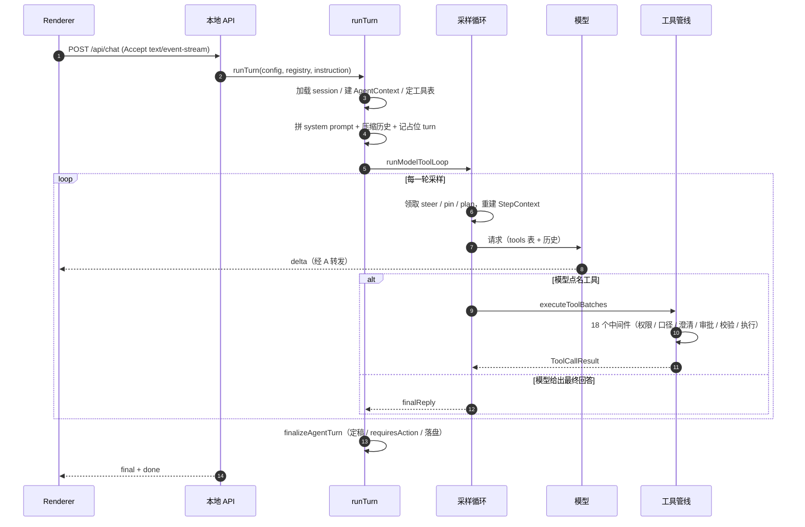
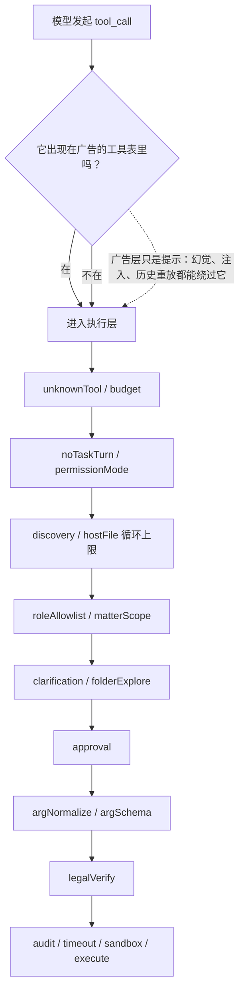
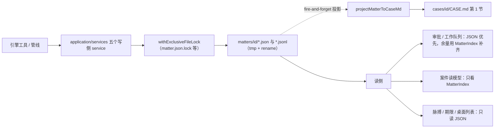
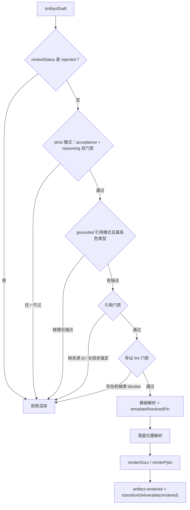

# LawMind 架构研读笔记

> **这份文档是干什么的**：带一个没写过这个仓库的人（也包括三个月后的我自己）走进 LawMind 的引擎内部——它想解决什么问题、怎么分层、一次对话实际发生了什么、每个决策在代码里的哪个位置、以及哪些地方它其实没做到。
>
> **不是**：不是 API 手册，不是发布说明，不是「架构图很好看」的宣传稿。文中每一处判断都尽量给出 `路径:行号`，方便你直接跳过去自己核。
>
> **读法**：第 1–2 节是思想，第 3–4 节是引擎主脊（最重要），第 5–8 节是业务域，第 9 节是信任边界，第 10 节讲测试契约，第 12 节是诚实清单。时间紧的话，读第 0、3、4、12 节。
>
> **交叉引用**：[LAWMIND-ARCHITECTURE.md](../LAWMIND-ARCHITECTURE.md)（现行架构口径）· [LAWMIND-REPO-LAYOUT.md](../LAWMIND-REPO-LAYOUT.md)（目录职责）· [engine-vs-agent.md](./engine-vs-agent.md)（双入口）· [DEVELOPER-WORKFLOW.md](./DEVELOPER-WORKFLOW.md)（脚本与 CI）· [LAWMIND-ITERATION-SPEED-AND-GUARDRAILS.md](./LAWMIND-ITERATION-SPEED-AND-GUARDRAILS.md)（测试与护栏）

---

## 0. 一句话

LawMind 是**一个律师桌面程序**，它的架构可以浓缩成四句话：

1. **两条执行入口**：确定性的 `createLawMindEngine`（管线）和模型驱动的 `createLawMindAgent`（对话）。二者共用交付物、门禁、审计契约，但**不共用真相源**——聊天记录永远不是案件状态。
2. **一条贯穿所有工具调用的门禁链**：模型看到什么工具（广告）和它实际能用什么工具（执行）是**两套机制**，只有后者是承重的。
3. **一个以案件为中心的写侧**：`workspace/matters/<id>/` 下的 JSON 是真相源，`CASE.md` 是给人看的投影，写动作被五个 service 收口。
4. **一条永不静默的证明链**：审计事件走 HMAC 哈希链 + 每日根锚，机械核对报告自带「通过 ≠ 法律正确」的口径说明，指标宁可返回 `null` 也不编一个 `0%`。

规模感：`src/lawmind/` 下 1300 多个 TypeScript 文件、约 13.5 万行（含测试）。所以下面不是全景图，而是**主干道 + 岔路口**。

---

## 1. 先立规矩：五条设计原则，以及它们各自的代价

[LAWMIND-ARCHITECTURE.md](../LAWMIND-ARCHITECTURE.md) 开篇列了五条原则。原则本身容易背，难的是理解每条**放弃了什么**。我按「原则 → 代码落点 → 代价」重排一遍。

**① Markdown 是记忆真相源**

落点：`src/lawmind/memory/`、`cases/<matterId>/CASE.md`、`LAWYER_PROFILE.md`、`memory/YYYY-MM-DD.md`。
引擎产出的结构化中间层（draft JSON、research snapshot）可以重建，人的积累不可以。

代价：Markdown 难做事务。所以 2026 年 Q3 之后大量新增状态其实走了 JSON 真相源（见第 5 节），留下**双轨读**这个历史包袱——有的读路径优先 JSON，有的还在读 `MatterIndex` 派生。这不是设计失误，是迁移中的必然脏。

**② 模板化交付优先于自由生成**

落点：`src/lawmind/templates/`、`src/lawmind/artifacts/render-docx.ts`、`render-pptx.ts`。
模板给的是「格式下限」，模型只填内容。

代价：模板解析要引入 `templateResolvedPin()`（`src/lawmind/templates/index.ts:393`）把「这一版产物用的是哪一版模板」钉进审计。否则模板一改，历史产物无法复现——这是模板化的隐性成本，很多团队做到交付才踩到。

**③ 结构化中间层优先于直接出文书**

落点：`TaskIntent` → `ResearchBundle` → `ArtifactDraft`。三个契约串联整条管线，而不是「输入一句话，输出一篇 Word」。

代价：多一层就多一处可能丢信息。实际后果是 `parseLegalReasoningGraphMeta()`（`src/lawmind/reasoning/legal-graph.ts:284`）只能从序列化 Markdown 里恢复 `taskId/matterId/overallConfidence/builtAt` 四个字段——`issueTree`、`argumentMatrix`、`authorityConflicts` 全部丢失。所以「结构化」是单向的：**写出去了，读不回来**。这一点在推理门禁上留下了真实后果（见第 8 节）。

**④ 高风险动作默认需要确认**

落点：`src/lawmind/runtime/tool-pipeline.ts` 的 `approvalMiddleware`、`src/lawmind/agent/dangerous-tool-policy.ts`。

代价：这里有一条被反复误读的边界。运行期真正会被打断回合的动作**只有一个**——`send_email`：

```75:77:src/lawmind/platform/lawyer-outbound-decision.ts
/** 工具门禁：只有真正发信才打断律师。prepare_outbound_mail 只写入待发信，拍板在 inbox。 */
export function toolRequiresLawyerPause(name?: string | null): boolean {
  return name?.trim() === "send_email";
}
```

草稿、渲染、改稿、导出**都不**弹确认。代码注释把理由写得很直白：这些动作的结果留在本地、律师看得见、可撤销；只有「从律师这边发出去」才不可回头。而 `ToolGovernanceMetadata` 里有 30 个工具被标成 `lawyer_approved_write`（`src/lawmind/agent/tool-name-sets.ts:90`）——**治理元数据比运行期门禁宽得多**。读文档时区分这两层，否则会以为写合同也要拍板。

**⑤ 功能可扩展，但边界必须稳定**

落点：`src/lawmind/platform/contracts.ts`、`src/lawmind/policy/edition.ts`。

代价：新增字段一律「兼容式补充」。于是 `TaskExecutionState`、`RunTurnEvent`、`GateDecision` 这些契约只增不改，字段会慢慢变多、变松。这是有意的——契约一破，所有历史 workspace 都读不了。

---

## 2. 运行域：四层，两条入口

### 2.1 四层

| 层            | 位置                                             | 它负责什么                                                     | 它**不**能做什么                          |
| ------------- | ------------------------------------------------ | -------------------------------------------------------------- | ----------------------------------------- |
| 桌面壳        | `apps/lawmind-desktop/electron/`                 | 窗口、菜单、IPC、文件对话框、本地 API 子进程监管               | 不直接跑引擎                              |
| 本地 HTTP API | `apps/lawmind-desktop/server/`                   | 渲染进程的 `/api/*` 写侧入口，127.0.0.1 + Bearer               | 不对外网暴露                              |
| 引擎          | `src/lawmind/`                                   | Agent 循环、工具治理、lint、runtime、audit、memory、检索、交付 | 不做 UI，不自己发起网络请求（走出口代理） |
| 文档与交付    | `apps/lawmind-docs/`、`workspace/`、`artifacts/` | 文档站、工作区盘面、最终产物                                   | —                                         |

数据主链路：

```text
律师指令（renderer）
  → 本地 API（/api/chat）
  → 引擎 runTurn（Agent / tools / gates / lint / audit）
  → 状态回写（session / task / draft / matter JSON）
  → renderer 同步（SSE）
  → 律师审核签批
  → 渲染交付物
  → 审计事件
```

### 2.2 双入口，以及最容易混淆的一条边界

`createLawMindEngine` 和 `createLawMindAgent` 是**两个东西**，见 [engine-vs-agent.md](./engine-vs-agent.md)：

- **Engine**：`路由 → 检索 → 草稿 → 审核 → 渲染`，步骤固定、好测、审计事件强一致。脚本、`lawmind:ops`、黄金路径单测走这条。
- **Agent**：模型 + 工具策略驱动，可中断、可续跑、可多轮澄清。律师自然语言走这条。

它们共享的一层是 `src/lawmind/application/domain-state.ts` 所描述的状态。也就是说：**对话是"怎么做的"记录，案件 JSON 是"做成了什么"的真相**。任何「把聊天记录当案件状态」的实现都是 bug。

这条边界在代码里的体现是 `AgentContext`——它是**每次 turn 一个的可变执行环境**（`src/lawmind/agent/types.ts:75`），不是全局单例。领域状态只能通过工具写回 `tasks/`、`drafts/`、`matters/`。

---

## 3. 一次对话的一生

这一节是全篇的核心。理解了 `runTurn`，仓库其余部分就都是它的挂件。

### 3.1 分层：`runtime.ts` 只是门面

`src/lawmind/agent/runtime.ts` 只有 29 行，全是 re-export。真正的 `runTurn` 在 `src/lawmind/agent/turn-orchestrator.ts:95`。这个拆分本身是有意的，`runtime.ts` 的文件头注释写着：

> SSE 解析与模型调用的唯一实现位于 `runtime-model-call.ts`；此处仅做 re-export，避免双份实现漂移（测试覆盖的即线上运行的）。

实际是**四层**，不是两层：

| 层        | 文件                                              | 生命周期                                                                        |
| --------- | ------------------------------------------------- | ------------------------------------------------------------------------------- |
| 门面      | `agent/runtime.ts`                                | —                                                                               |
| Turn 编排 | `agent/turn-orchestrator.ts`（816 行）            | **每轮对话一次**：建 session、建 ctx、定工具表、拼 system prompt、短路、收尾    |
| 采样循环  | `agent/turn-orchestrator-model-loop.ts`（559 行） | **每次模型采样一次**：领 pin/steer、重建 step、算 token、调模型、派工具、判终止 |
| 工具轮    | `agent/turn-orchestrator-tool-round.ts`（636 行） | **每个 tool_call 一次**：剥能力位、构 ctx、跑中间件管线、写回历史               |

外加三个收口模块：`turn-orchestrator-prompt.ts`（1001 行，工具集与 prompt 组装）、`turn-orchestrator-events.ts`（事件类型）、`turn-orchestrator-finalize.ts`（结束态）。

**这个拆法的价值**：`runTurn` 的复杂度不是「一坨 800 行」，而是「一次 turn 的 N 件事 + 每轮的 M 件事 + 每个工具的 K 件事」。想知道某段逻辑多久跑一次，看它在哪个文件就够了。

### 3.2 开跑之前，`runTurn` 会做这些事

按代码顺序（行号见 `turn-orchestrator.ts`）：

1. **会话闸门**：同 `sessionId` 已有 turn 在跑时，用 `withSessionTurnGate` 串行化（递归调自己一次，带 `skipSessionTurnGate: true`）。不是循环，只有一层。
2. **挂 MCP**：`attachEnabledMcpServers`，失败吞掉。
3. **定预算与模式**：`resolveToolCallBudgets`、`maxHistory`、`toolTimeoutMs`、`permissionMode`、`strictDangerousToolApproval`。
4. **加载/建 session**：assistant 不匹配直接 throw。然后 `pruneTurnPlanForNewInstruction` + `ensureLawyerWorkForTurn`（best-effort）。
5. **生成 `turnId`，推导几个开关**：`wordRevisionTurn` / `deliveryIntent` / `mailContractTurn` / `contractFastLaneTurn` / `noTaskTurn`。
6. **构造 `AgentContext`**。这里埋了跨轮澄清门禁的种子：
   `clarificationBlockingHeavyTools = selectHardClarificationKeys(session.pendingClarificationKeys).length > 0`。
7. **定工具表**：`resolveAssistantTooling`（Role ∩ preset ∩ 父级继承）、playbook lock、`peekPinnedDocuments`、`compileIntent`、已披露工具、隐藏工具。注意 `noTaskTurn` 会把**广告**层降到 `readonly`。
8. **拼 prompt**：`prepareTurnPromptContext` → `{ memory, systemPromptFinal, lawMindRoot }`。
9. **把用户消息原样压进历史**，然后 `freezeTurnContext`、建一个 `status:"running"` 的占位 turn 并落盘。**为什么先落盘**：进程被杀时能看出「这一轮没结束」。
10. **绑中断**：`bindTurnAbortSignal` + 一个 200ms 的 `abortMirror` 轮询 `shouldAbort`。
11. **事件出口**：`emitEvent = appendSessionEvent + applyLiveTurnEvent + onEvent`；发 `turn_begin` 和 `intent`。
12. **压缩**：`autoCompactSessionHistory`，被压缩则做 reinjection 并记录 `lastCompactBoundary`，发 `compact_boundary`。
13. **四个短路**（按顺序，命中即结束，不调模型）：模型身份问答、模型连通性自检、公开事实快问、**intake 澄清硬门禁**、自动交付工作流。
14. **进采样循环** `runModelToolLoop`。
15. **收尾**：中断走 `finishAbortedByUser`；completed 时补做 Word 修订；最后 `finalizeAgentTurn`。

第 13 步里的 intake 门禁值得单独说：它在**任何模型调用之前**跑。如果律师的指令缺 `addressee / claim_facts / claim_deadline / parties / claims` 这类硬键（`src/lawmind/router/intake-gate.ts:106`），引擎会直接推一张澄清卡，不浪费一次采样。这是「先理解再执行」的工程版：不理解就别开始。

### 3.3 采样循环：`runModelToolLoop`

每一轮大致是这样：

```text
while (loopCount < hardCeiling + 1):
  中断检查 → 收拢历史并返回 aborted
  领取并应用：pins / world-state patch / turn plan / steer / work goal
  重建 StepContext（工具名、披露增量、host 文件账本）
  发 round_start；必要时发 tool_delta
  算 token 预算 → 派生采样用消息 → callModelWithRetry
     ├ 用户中断 → aborted
     ├ 上下文溢出 → prune 一次 tool result 后重试
     └ 其他错误 → status=error 收尾（不抛）
  记录 usage；把 assistant 消息（含 tool_calls）写进历史
  没有 tool_calls？
     ├ 有待澄清问题 → awaiting_clarification，退出
     ├ 需要同轮 bounce → 注入隐藏 user 消息继续
     └ 否则 → completed，finalReply = content，退出
  执行工具批次（并发分批 → 串行收口）
  重放 pending craft/plan；重建 step；重新算广告工具
  awaiting_approval / abort / 工具预算硬停 → 退出
```

同一个循环画成时序是这样（注意「模型要说的话」和「工具真的做了什么」是两条独立通道）：



几个值得注意的实现选择：

**「先落占位、后补内容」**。第 9 步的占位 turn 和第 10 步的 abortMirror 是同一套思路：**任何时候被杀，磁盘上都得留下足够的证据解释发生了什么**。这是法律软件的底线要求，不是过度设计。

**错误不抛，只收尾**。模型 HTTP 失败不会让 `runTurn` throw，而是把 turn 置为 `status:"error"` 并发 `model_error` 事件。调用方（本地 API）负责把它变成用户看得懂的话。有专门的 cassette 锁这个行为（`turn-orchestrator-cassettes.test.ts`）。

**溢出是一次性补救，不是重试循环**。`pruneSessionToolResults` 只跑一次就重试，避免「prune → 还是溢出 → 再 prune」的死循环。

**流式的降级条件是明确的**：只有当本轮已经有工具响应、或工具表为空、或没开严格模式时，才用上游 token 流（`turn-orchestrator-model-loop.ts:257`）。一旦 `delta.tool_calls` 出现，就立刻停止往外吐 delta，改为聚合完整 chunk（`runtime-model-call.ts:322`）。原因很实在：**半个 tool_call 没法执行，吐给用户只会造成「它好像选了工具但没动」的错觉**。

### 3.4 工具轮与 `AgentContext` 的两次「冻结/重建」

这里有个我觉得是整套设计里最聪明的细节之一：`TurnContext` 和 `StepContext`。

- `TurnContext`（`turn-step-context.ts:12`）在 turn 开始时 `freezeTurnContext`，中途不改。
- `StepContext`（`:35`）每轮 `rebuildStepContext` 重建一次。

为什么要两层？因为工具表在**一轮对话内是稳定的**（律师这一轮的权限、案件、模式不该中途变），但在**轮与轮之间必须可变**（`list_more_tools` 会披露新工具、pin 会改变可见范围）。用一个对象既当常量又当变量，就会出现「工具 A 拿到的是改动前的 ctx，工具 B 拿到的是改动后的」这种时序 bug。

工具的**并发批次**也有硬约束，写在 `src/lawmind/runtime/tool-concurrency.ts:25`：

> Approval-gated tools must never share a concurrent batch (approvalRequest race)

因为 `turn.pendingToolApproval` 是 first-wins 的（`if (!turn.pendingToolApproval)`），两个需要拍板的工具并发就会出现「只暂停了一个，另一个静默跳过」的语义污染。

### 3.5 三个中途机制：compact / steer / clarification

这三个是 Agent 类系统的经典难题，LawMind 的实现各有取舍。

**Compact（上下文压缩）**——`src/lawmind/agent/compact.ts:276`

触发条件：预算等级到 `compact`，或历史条数超 `maxHistoryMessages`。切分时用 `adjustIndexToPreserveToolPairs` 保证不切断 tool_call/tool_result 配对（配对断了模型会 400）。压缩后插入 digest，并设置 `needsCompactReinjection`，由 `applyCompactReinjectionToSession` 注入一段标记为 `压缩后红线重注（仍有效）` 的内容（`compact-insert.ts:8`）。

**为什么要有「重注」**：压缩会把早期的引用、强制规则挤掉。如果不重注，律师写的红线会在第 40 轮悄无声息地失效——这属于「静默失效」，是法律场景里最不能接受的一类 bug。cassette 里专门有一条锁「被压缩掉的引用仍在下一次请求里存活」。

**Steer（中途指示）**——`src/lawmind/agent/session-context-steer.ts`

走 sidecar 文件 `sessions/<id>.pending-steer.json`，上限 8 条 / 每条 2000 字，用排他锁 + 原子写。关键约束是**领取时机**：

> Claimed only at the start of a model round (after prior tool results, before the next fetch). Same-turn: next model sample. Does not open a new turn.

也就是：律师中途插话，**不会**打断当前 turn、不会开新 turn，只是让下一次采样带上这条指示。这避免了「律师一打字，正在跑的工作流就被打断」的体验灾难。cassette 断言：steer 出现在第 1 次请求里、不在第 0 次里，且**不产生新 session**。

**Clarification（澄清门禁）**——这是三个里最硬的

分两层，别混：

- **Intake 门禁**：模型调用前，靠 `intake-gate.ts` 的硬键判断，直接出卡片。
- **跨轮写门禁**：上一轮以 `awaiting_clarification` 结束且存在硬键时，本轮 `ctx.clarificationBlockingHeavyTools = true`，由 `clarificationGateMiddleware`（`tool-pipeline.ts:523`）拦截 `WRITE_HEAVY_TOOL_NAMES`（= `WRITE_TOOLS` + `draft_worker`）。

被拦的是**写和交付**，读和检索照常放行。注释写得很清楚：

> research_task and other read/analyze tools stay allowed so the model can gather facts before the lawyer answers.

门禁的**清除**只有两条路：律师在卡片里逐条作答（结构化 resume 显式清键，`runtime-resume.ts:96`），或者本轮以带硬键的 `awaiting_clarification` 结束（此时键被持久化到 `session.pendingClarificationKeys`，`turn-orchestrator-finalize.ts:187`）。软性问题（advisory）从不冻结任何东西。

一个真实的粗糙处：`clarificationBlockingHeavyTools` 挂在共享的 `AgentContext` 上，而同一批次里并发的工具可能一个返回硬键、另一个还在跑。第一个把 flag 翻起来时，兄弟工具已经在执行了。这是**已知的时序窗口**，不是漏洞，但写并发工具时要心里有数。

### 3.6 收尾：`finalizeAgentTurn`

收尾要做的事比看上去多：把 turn 状态定稿、生成 `requiresAction`（律师下一步该点哪个按钮）、清或保留澄清键、写 session、发终态事件。`platform/requires-action.ts` 的 `buildRequiresActionsFromTurn` 把 turn 状态翻译成 UI 卡片，`kind:"tool_approval"` 那种就对应「待我拍板」。

---

## 4. 工具管线：18 个中间件，以及一条最重要的架构决定

### 4.1 唯一承重的强制点

先记住这条：

```158:165:src/lawmind/runtime/tool-pipeline.ts
   * 发给模型的工具广告清单（resolveModelToolNames）只是提示层：模型幻觉、被注入的模型输出或历史 tool_call 重放都可能绕过清单直接点名写工具，本中间件是唯一强制点。
```

翻译一下：**「我有没有把 `draft_document` 告诉模型」和「模型能不能调 `draft_document`」是两件事**。前者是 `resolveModelToolNames`（`agent/tools/governance.ts:90`），一个纯过滤函数；后者是中间件链。写过 LLM 系统的人都知道这个坑——你从 prompt 里删掉一个工具，模型照样能编出来，历史里的 tool_call 也会被重放。

所以真正的安全边界全部落在 `buildDefaultToolPipeline()` 返回的 18 个中间件上（`tool-pipeline.ts:812`）。



两条虚线路径汇到同一个点，就是这套设计想表达的全部意思：**广告表不构成门禁**。

### 4.2 顺序，以及顺序为什么是这个顺序

| #   | 中间件                        | 拦什么                                                       | 为什么在这个位置                       |
| --- | ----------------------------- | ------------------------------------------------------------ | -------------------------------------- |
| 1   | `unknownToolMiddleware`       | 工具不存在                                                   | 最便宜的前置检查                       |
| 2   | `budgetMiddleware`            | 超工具预算                                                   | 同上                                   |
| 3   | `noTaskTurnGateMiddleware`    | 非任务轮的写动作                                             | 会话级语义，先于权限                   |
| 4   | `permissionModeMiddleware`    | `readonly`/`research` 档位的写动作                           | **安全边界**，要在业务口径之前         |
| 5   | `discoveryLoopMiddleware`     | 重复检索                                                     | 防「检索死循环」，按 token 动态定上限  |
| 6   | `hostFileLoopMiddleware`      | 重复读本机文件                                               | 同上，另有硬上限 `fileTaskReadHardCap` |
| 7   | `roleAllowlistMiddleware`     | Role/playbook 不允许的工具                                   | 业务口径，在安全之后                   |
| 8   | `matterScopeMiddleware`       | 缺 `matter_id` 的案件工具                                    | 数据完整性                             |
| 9   | `clarificationGateMiddleware` | 澄清未决时的写动作                                           | 依赖 #4 已放行                         |
| 10  | `folderExploreGateMiddleware` | 没探索目录就写                                               | 防「没看材料就下笔」                   |
| 11  | `approvalMiddleware`          | 需拍板的动作                                                 | 在参数校验**之前**                     |
| 12  | `argNormalizeMiddleware`      | 别名、默认值                                                 | 参数开始被信任                         |
| 13  | `argSchemaMiddleware`         | schema 校验                                                  | 硬失败点                               |
| 14  | `legalVerifyMiddleware`       | 法务复核（lint / 同轮 verify / 法条试算 / 特权与收件人检查） | 需要合法的参数                         |
| 15  | `auditMiddleware`             | —                                                            | 包住 16–18，超时也能记上               |
| 16  | `timeoutMiddleware`           | 超时                                                         | 给 `execute` 派生 abort signal         |
| 17  | `subprocessSandboxMiddleware` | 需沙箱的工具                                                 | 在 execute 前短路                      |
| 18  | `executeMiddleware`           | —                                                            | 真正执行                               |

两个顺序上的细节：

- **`permissionModeMiddleware`（#4）在 `roleAllowlistMiddleware`（#7）之前**。代码里解释了为什么要分成两个：allowlist 是「办件/岗位」的业务口径，权限模式是「律师设置的会话级安全边界」。分开之后，readonly 下点写工具，律师看到的是权限错误；而不是一句含糊的「你的角色不允许」。**报错文案也是设计的一部分**。
- **`approvalMiddleware`（#11）在参数校验（#13）之前**。意味着**拍板是针对模型给的原始参数**的。律师点批准之后，参数校验仍可能报错——这个行为是对的（不能让一个非法参数因为被批准就变合法），但读代码时容易困惑。

### 4.3 `__approved`：服务端能力位，不是模型参数

这是整条管线里我最欣赏的一处设计。

模型想调一个需要拍板的工具时，引擎**无条件剥掉**它自带的审批旗标（`turn-orchestrator-tool-round.ts:345`）：

```text
delete toolArgs.__approved;
delete toolArgs.ethics_wall_acknowledged;
delete toolArgs.acknowledge_ethics_wall;
```

注释一句话说清性质：

> 审批旗标是服务端能力位，不是模型参数

然后只在**两个合法来源**注入 `__approved=true`：律师预批准（resume 路径），或沙箱工作流步骤的 C3 策略（且 strict 模式下不生效）。

再往下一层是「批准的是哪组参数」——`src/lawmind/agent/approval-cache-key.ts` 的文件头：

> Approval is action-shaped: tool + matter + canonical args. Name-only template pre-approve must not cover hunk-shaped writes or outbound recipient/attachments.

`ARGS_BOUND_APPROVAL_TOOLS = new Set(["apply_surgical_edits", "prepare_outbound_mail"])`（`:10`）。对这两个工具，光名字对上不够，必须 `approvalArgsMatch`（任务 id + 归一化后的 find/replace 片段；或收件人 + 排序后的附件路径）。而且 resume 时是**整体替换参数**，不是浅合并——律师批准的是「这一组参数」，合并出的第三种参数集不能被自动放行。

这套东西防的是很具体的一类事故：模型先申请批准一个无害的「改一句话」，拿到批准后把参数换成「改一整条免责条款」。审批缓存键把这条路堵死了。

### 4.4 四种权限模式

`src/lawmind/agent/permission-mode.ts`：

| 模式       | 广告层                                       | 执行层     | 拍板姿态                                |
| ---------- | -------------------------------------------- | ---------- | --------------------------------------- |
| `standard` | 不过滤                                       | 不额外拦   | 按 `allowDangerousToolsWithoutApproval` |
| `strict`   | 不过滤                                       | 不额外拦   | 强制开启严格审批                        |
| `readonly` | 只剩 `READONLY_AGENT_TOOL_NAMES`             | 中间件硬拦 | 写动作到不了拍板                        |
| `research` | readonly + `research_task` + `deep_research` | 同上       | 同上                                    |

一条注释值得原样抄下来：

> This is a tool-name allowlist, not an OS jail — writes are blocked, but reads still use isPathInsideRoot. Do not advertise readonly as "cannot read ~/.env".

即：`readonly` 是**工具名白名单**，不是操作系统沙箱。它拦的是「写」，不是「读」。新增读工具如果忘了加进 `READONLY_AGENT_TOOL_NAMES`，它在 readonly 下会**静默消失**——这是这套机制的真实维护成本。

---

## 5. 案件写侧：把「案子」当一等对象

### 5.1 磁盘布局

```text
workspace/matters/<matterId>/
  matter.json                     ← 单一对象，原子替换
  matter.json.lock
  deliverables/<deliverableId>.json
  approvals.jsonl                 ← append-only
  queue.jsonl
  deadlines.jsonl
  ops/{scope.json, plan.json, raid.jsonl, theory-lite.json}
workspace/cases/<matterId>/CASE.md  ← 给人看的投影
```

数据流大致是这样（注意「投影」是虚线，因为它不参与写路径的成败）：



IO 原语在 `src/lawmind/adapters/matter-storage/io.ts`：`writeJsonAtomic`（写 `.tmp-*` 再 rename）、`appendJsonl`（先 zod parse 再 append）、`rewriteJsonl`、`readJsonl`（坏行静默跳过）。

排他锁 `withExclusiveFileLock`（`:164`）用 `open(lockPath, "wx")` 实现，带 `staleMs` 自愈：**owner pid 已死**（`process.kill(pid, 0)`）或锁文件超龄，就 rename 到一边再抢。这是文件锁能做的比较完整的一套了。

但它有两个诚实的缺口：

- **没有 fsync**。rename 保证「进程崩溃后读者看不到半截 JSON」，但掉电不保证。JSONL 追加中途崩溃会留半行——`readJsonl` 会跳过它。
- **锁是协商性的**。绕过 `withExclusiveFileLock` 的写者不受约束。而仓库里**确实有**这样一个写者：`src/lawmind/matter-ops/storage.ts`（`:86/:104/:123/:154` 直接 `fs.writeFileSync` / `appendFileSync`）。它用 `assertSafeMatterId` 做路径安全，但没有锁、没有原子写、没有 zod。这是目前最明显的一处「双标准」（见 §12.5）。

### 5.2 五个写侧 service

| service                | 真相源                | 状态机                    | 并发控制                  |
| ---------------------- | --------------------- | ------------------------- | ------------------------- |
| `matter-write-service` | `matter.json`         | **无**（status 任意翻转） | 文件锁 + 投影             |
| `deliverable-service`  | `deliverables/*.json` | **有**（唯一硬状态机）    | 文件锁                    |
| `approval-service`     | `approvals.jsonl`     | CAS：`pending → 终态`     | 文件锁 + compare-and-swap |
| `queue-write-service`  | `queue.jsonl`         | 无                        | 文件锁                    |
| `deadline-service`     | `deadlines.jsonl`     | 无                        | 文件锁                    |

只有两处做了状态语义保护，且都写在注释里：

```8:11:src/lawmind/application/services/approval-service.ts
 * `resolveApproval` 使用文件锁 + compare-and-swap（仅 pending → 终态），避免并发双写翻转。
 * CAS 输家返回 `already_resolved`（勿当作本请求写入成功）。
```

「CAS 输家返回 `already_resolved`」这个细节很关键：HTTP 201 和 409 的区别，决定了两个律师同时点「通过」时，谁的那个请求会被诚实地告知「你没写成功」。

### 5.3 唯一的硬状态机：Deliverable 生命周期

`src/lawmind/core/deliverable-lifecycle.ts` 我读了全文，一共 12 条边：

```text
planned → drafting → pending_review → approved → rendered → delivered → learned
                ↘ blocked ↗        （reopen 三条回边）
```

具体回边：`approved / blocked / rendered → pending_review`。`learned` 是终点，没有出边。

守卫函数 `canTransitionDeliverable`（`:40`）有个容易忽略的宽松点：`from === to` 返回 `true`，所以「原地不动」总是合法。真正的拒绝是跳级，比如 `planned → rendered`、`approved → delivered`——测试里明确断言这三种为 false。

还有一个**有意的绕过**：`applyDeliverableReviewStamp`（`deliverable-service.ts:234`）即使遇到非法跳级也会**收敛审查戳但不改 status**。注释解释了原因：审查戳是 SSOT（`matters/<id>/deliverables/<id>.json` 的 `currentReviewStatus`），草稿的 `reviewStatus` 是**从它同步过来**的，不是反过来。所以中途出现「status 和戳不一致」是合法状态，不是脏数据。

这个设计防的是一类很难查的 bug：律师在旧的 review 面板点了个「重开审核」，把已批准状态冲掉。代码里另一处注释点了名：

> New pending/modified body after sign-off must reopen; otherwise desk shows an approved deliverable whose draft JSON is unreviewed text.

### 5.4 投影：JSON → CASE.md，以及为什么测试里要 `drainMatterProjections`

`matter.json` 是真相源，`cases/<matterId>/CASE.md` 是**人类可读投影**，而且只投影 §1 基本信息（`application/matter-projection.ts` 的文件头就写着 "§1 structured fields only"）。叙事章节（争点、进展）是律师和模型写的，投影不碰。

写侧有个刻意的选择：`createMatterIfMissing` / `updateMatterStatus` / `setMatterStrategy` 是**同步**的，投影是**fire-and-forget**：

```40:40:src/lawmind/application/services/matter-write-service.ts
const pendingMatterProjections = new Set<Promise<void>>();
```

好处：写业务状态不被磁盘 IO 拖住。坏处：测试里立刻读 `CASE.md` 会读到旧内容。

于是有了 `drainMatterProjections()` 和一段很聪明的测试基建：`awaitMatterProjectionInVitest`（`:51`）在 `VITEST=true` 时用 `MessageChannel` + `receiveMessageOnPort` **同步阻塞当前线程**直到投影 promise settle。`test/lawmind-setup.ts:40` 在 `afterEach` 里 drain，防止上一测试的投影写进下一测试。

这是「为可测性牺牲一点纯度」的典型案例。它不优雅，但它让一个异步副作用在测试里获得了确定性——比在每个测试里 `await` 一个不该暴露的内部 promise 要好。

`matter-consistency.ts` 是配套的漂移探测器：`checkMatterConsistency` 给出 `title_drift / status_drift / sensitivity_drift / client_drift / cause_drift / counterparty_drift` 等码，`repairMatterProjections` 负责重修。有检测、有修复、不自动触发——这个分寸是对的。

### 5.5 双轨读：不是全局规则，是逐面规则

架构文档里说「read 侧优先 JSON，缺失回退 `MatterIndex`」。**这句话只在部分读路径成立**，别当成全局不变量：

| 读面            | 代码                                                                  | 实际行为                                                            |
| --------------- | --------------------------------------------------------------------- | ------------------------------------------------------------------- |
| 审批 / 工作队列 | `application/services/queue-service.ts:27`                            | JSON 优先，缺失 id 用 MatterIndex 派生补齐（唯一真正 merge 的地方） |
| 案件读模型      | `core/contracts.ts:415` `buildMatterReadModelFromIndex`               | **只看 MatterIndex**，不读 `matter.json`                            |
| 案件脉搏 / 期限 | `desk/matter-pulse.ts:289`                                            | 只读 JSON，缺文件返回 null                                          |
| 桌面案件列表    | `apps/lawmind-desktop/server/lawmind-server-route-lawyer-desk.ts:169` | 只读 JSON                                                           |

所以迁移期的工作区里，**同一条信息在两条路径上可能不一致**，这是设计内的（`LAWMIND-FUTURE-ISSUES.md` 明确记录了「不做 Markdown↔JSON 合并编辑器」）。`task-draft-consistency.ts` 的注释把这个口径说得很直白：

> Preferred read path: structured JSON … Markdown CASE/projection is secondary.

判断一段代码走哪条路，最快的办法是看它 import 的是 `application/services/*` 还是 `core/derive.ts`。

---

## 6. 记忆：可采纳的建议，不是自动写入

### 6.1 五态，不是四态

`src/lawmind/memory/adoption-service.ts:59`：

```ts
export type MemoryAdoptionState =
  | "pending"
  | "adopted"
  | "auto_adopted"
  | "dismissed"
  /** 采纳动作已记录，但该 kind 无落盘面（或已由他处落盘）——不得宣称已生效。 */
  | "recorded_noop";
```

`recorded_noop` 这个状态值得单独点赞。它的存在是为了让系统**永远不宣称一次没发生的写入**。`project.note` 和 `source.annotation` 这两种 kind 从来没有目标文件（`adoption-apply.ts:189`），过去的实现要么假装成功、要么报错；现在它们诚实地记录「决定已记，无落盘面」。

### 6.2 采纳是两段式，而且写盘在锁外

`adoptMemorySuggestion` 的形状：锁定读 → 校验 `pending` → **解锁**跑 writer（写 Markdown）→ 锁定复读 → CAS 翻转状态 → 输家返回 `not_pending`。

Markdown 写入和 JSONL 状态翻转**不在同一把锁里**。这不是疏忽，是取舍：writer 可能是多文件的（`lawyer.habit_pattern` 要写三个地方），把它包进锁会让锁的持有时长不可控。代价是「写成功但状态没翻」或反之的窗口存在。注释里也承认跨进程写者不在当前部署模型的范围内（进程内还有一层 `adoptionMutationQueue`）。

批量采纳也是刻意分成两步：`planBatchAdoption`（纯读，出 diff，零写入）→ `adoptBatch`（律师确认后才写）。文件头写的是：

> 把确认从「一条一次」变成「一批一次」，并强制两步

### 6.3 谁进 system prompt，谁不进

这是全仓最容易被文档误导的地方，我列一张表（依据 `memory/memory-sources.ts` 的 `buildAgentMemorySourceReport` 与 `turn-orchestrator-prompt.ts` 的注入点）：

| 文件                             | 进 Agent system prompt？ | 上限                                              |
| -------------------------------- | ------------------------ | ------------------------------------------------- |
| `LAWYER_PROFILE.md`              | ✅ 「当前律师」          | 800 字                                            |
| `assistants/<id>/PROFILE.md`     | ✅ 「本助手专属偏好」    | 800 字                                            |
| `clients/<id>/CLIENT_PROFILE.md` | ✅ 「客户画像」          | 800 字                                            |
| `cases/<id>/CASE.md`             | ✅ 「当前案件」          | 1600 字                                           |
| `memory/<今天>.md`               | ✅ 「今日工作记录」      | 600 字                                            |
| **`MEMORY.md`**                  | ❌                       | 只进检索管线（2500 字）与 `search_workspace` 兜底 |
| `FIRM_PROFILE.md`                | ❌                       | —                                                 |
| `MATTER_STRATEGY.md`             | ❌                       | 只被推理快照读                                    |
| `memory/<昨天>.md`               | ❌                       | 只进检索                                          |
| `playbooks/*.md`                 | ❌                       | 走 skill / 检索                                   |

`memory/index.ts:6` 的文件头写「读取顺序（固定）：1. MEMORY.md …」——那是**加载顺序**，不是注入顺序。两个概念分开看，否则会得出「MEMORY.md 每轮都在 prompt 里」的错误结论。

**为什么不注入 MEMORY.md**：架构里的解释是「偏好更贴近人设，通用更偏可检索知识」。偏好（你是谁、你习惯怎么写）每轮都得在场；通用规则（工作流、风险红线）体量大，靠检索命中更划算。如果律师想让某条规则**每轮必现**，正确做法是写进 `lawmind.policy.json` 的 `agentMandatoryRules` / `agentMandatoryRulesPath`，由 `resolveAgentMandatoryRulesForPrompt`（`policy/workspace-policy.ts:305`）解析后注入 §工作区强制规则——**不是**写进 `MEMORY.md` 然后指望它出现。

这份提示词的文案也很有性格：

> 本轮请先只读/回复确认，下一轮将自动放行。
> 工作区强制规则（不可忽略）

（`system-prompt.ts:535` 起）。带上「不可忽略」四个字是有意的——因为模型确实会拿「检索没命中」当借口。

### 6.4 空模板不注入

`memory/lawyer-profile-for-prompt.ts:1`：

> Empty LAWYER_PROFILE templates must not enter the system prompt as if they were preferences.

逻辑分三种：没填身份字段且没有真实积累 → 返回 `undefined`（不注入）；没填身份但有积累 → **只返回 §八**（丢掉样板头）；填了身份 → 返回全文。`isStockLawyerProfileBullet` 逐条识别「库存说明」式条目（含 `_（例：`、`学习队列（稍后采纳）` 等）。

这个细节的意义：默认模板里写着「- **姓名**：_」这种占位，如果原样注入，模型会认为律师叫「_」。**小 bug，但会一路传到交付物上。**

### 6.5 提示词窗口不是粗暴截断

`memory/prompt-windows.ts:1`：

> Prompt 注入窗口：长记忆进模型前截断，避免 CASE/画像/日志无限膨胀拖垮 token。超帽必须带溢出指针（工具名 + 路径），禁止静默 slice。

`windowCaseMarkdownForPrompt` 对 `## 8. 工作进展记录` 有特判：只保留最近 24 条，并附「更早 N 条已省略」，其余部分按 head 65% / tail 35% 切。**尾部保留得比头部多，因为进展和结论通常在后面**——这种细节是踩过坑才有的。

---

## 7. 检索：合并而不排序

### 7.1 真实的 `ResearchBundle`

它在 `src/lawmind/types.ts:190`，不在 `retrieval/` 里：

```ts
export type ResearchBundle = {
  taskId: string;
  query: string;
  sources: ResearchSource[];
  claims: ResearchClaim[]; // 每条 claim 的 sourceIds 必须能解析到 sources
  riskFlags: string[]; // 不得省略
  missingItems: string[];
  requiresReview: boolean;
  completedAt: string;
};
```

### 7.2 `retrieve()` 只做四件事

`src/lawmind/retrieval/index.ts:57`：

1. 按 `supports(intent)` 过滤适配器；一个都没有 → `missingItems` 加一条。
2. `Promise.allSettled` 并发跑；失败的适配器 → `riskFlags` 加一条（**不中断整体**）。
3. 按 `source.id` 去重，**先到先得**。
4. 校验：`claim.sourceIds` 无法全部解析的 claim → **丢弃**，同时记 riskFlag 和 missingItem。

然后算 `requiresReview`。

**没有排序阶段。** 输出顺序 = 适配器顺序 + 去重后的顺序。所有打分都在各个检索器内部（知识检索是 FTS5 BM25 + 加权 boost；跨对话检索是标题 +8 / 正文 +2 / 近因 +3；类案召回按章节权重 争点 2.6 / 风险 2.2 / 策略 1.6）。

这是一个诚实的设计。假装有一个全局 reranker，只会掩盖「不同适配器的分数根本不可比」这个事实。

### 7.3 适配器名单

`workspace`（永远支持）、`authority`（`needsAuthority` 会看**中文关键词正则**，不只是 `kind`）、`brave-web`、`url-dossier`、`model-general`、`model-legal`、若干国内模型预设、LexEdge、partner。

两个 fail-closed 的地方值得记：

- `brave-web` 的 `supports` 恒为 `true`，但没配好时会返回 `missingItems`——这**单独**就能把 `requiresReview` 置为 `true`。
- 权威源 provider 解析未知值时**回退到 `open`**（本地语料），不是报错放行（`authority-provider.ts:39`）。

### 7.4 法宝（pkulaw）是 BYOK 占位，不是内置能力

`AuthorityProviderId = "open" | "generic" | "pkulaw" | "lexis"`（`retrieval/authority-provider.ts:13`）。法宝是**闭源占位 / 需手动凭证**，三种线上模式（`providers/pkulaw/client.ts:28`）：

- `rest_compat`：`GET {endpoint}?q=&type=law|case`
- `search_post`：`POST {query, searchType, q, text}`
- `mcp_tools_call`：JSON-RPC `tools/call`，工具名默认 `search_article` / `search_case`

注释里有条踩坑记录：官方 MCP 工具**拒绝未知字段**（传 `query`/`q` 会直接 `isError`），所以 MCP 模式必须用 `{ text, size }`。

健康检查对 MCP 模式要发 `POST initialize`（协议版本 `2024-11-05`），因为「Official 法宝 MCP does not speak GET ?q=」。SSRF 防护也做得厚：主机黑名单、IP 段黑名单、DNS 解析后再校验（fail-closed）、连接层 DNS pin 防 rebinding、8MiB 响应体上限。

`lexis` 明确是 `unimplemented` 占位——注意它**不是 `invalid`**，所以给个假 endpoint 也不会显示绿灯（`authority-health.ts:266`）。这种「分类设计用来防止误判」的思路，比单纯报错更省事。

开源的 open-law 路径把「诚实边界」写在了 README 里：

> 内置 sample 仅演示检索与 citation 管线，**不是**完整中国法库。无命中仍拒答/缺源；正式引用须核对官方法条。直播/外部 dump **不会**伪装成法宝。

### 7.5 索引：FTS5，不是向量

`workspace/lawmind/search-index.sqlite`，四张 FTS5 表（`indexing/fts-schema.ts`）：

| 表              | 分词器        | 内容                                            |
| --------------- | ------------- | ----------------------------------------------- |
| `audit_fts`     | `unicode61`   | 审计事件                                        |
| `session_fts`   | `unicode61`   | 会话消息                                        |
| `knowledge_fts` | **`trigram`** | CASE / strategy / memory / profiles / playbooks |
| `materials_fts` | **`trigram`** | 案件材料（带 `page` 定位）                      |

`embeddings/index.ts:1` 的文件头很坦白：

> Default: disabled. When LAWMIND_EMBEDDING_ENABLED=1, uses a deterministic local hash-embedding stub suitable for tests / offline smoke — **NOT a production semantic model**.

也就是说：**当前生产形态是词法检索**，向量是一条留好的缝。`rankHybrid` 即便开启也是 `0.55*cosine(stub) + 0.45*termOverlap`，而且没有接进 `searchPersonalKnowledge`。读文档时别把它说成「混合检索」。

分块规则简单直接：知识按 `/^## /` 切标题，然后 1800 字一窗（无重叠）；材料也是 1800 字，`page` 是**块序号，不是 PDF 页码**——这个字段名会骗人。

`restricted` 敏感级案件会被整案跳过索引（`fts-ingest-knowledge.ts:302`）；跨案件检索需要 `LAWMIND_ALLOW_CROSS_MATTER_SEARCH=1`。

### 7.6 `lm-session:` 引用协议

`search_conversations` 返回的 `citeAs` 是 Markdown 链接 `[标题](lm-session:<sessionId>?a=<assistantId>)`，渲染进程用 `apps/lawmind-desktop/src/renderer/lawmind-session-link.ts` 解析。两端各有一个 id 正则，注释明确要求「Keep the id regex aligned」——**这种跨端复制的小正则，是典型的会漂移的东西**，值得知道它存在。

而且 `search_conversations` 有个刻意的行为：**没有关键词也没有时间窗时返回空**，绝不 dump「最近的对话」。因为对话历史里混着大量上下文，dump 出来会把 token 预算吃光，还会让模型误以为「这些就是本案事实」。

---

## 8. 从草稿到交付：门禁链

`renderDraft`（`engine/rendering.ts:54`）是交付的唯一出口，它按顺序过这些闸：



图里看不出来的三件事：被拦下时会写一条 `artifact.render_blocked` 审计（带两份报告的结果）；模板解析的产物 `templateResolvedPin` 会被钉进审计，否则模板一改历史产物就无法复现；渲染成功后会连带推进交付物状态机，而不只是写个文件。

### 8.1 lint 的职责边界，写在类型定义里

```2:5:src/lawmind/lint/types.ts
 * Legal lint report — mechanical correctness signals (not legal judgment).
 * Passing lint ≠ legally correct; it means enumerated mechanical checks found no defect.
```

这句话被塞进每份报告的 `coverageNote` 字段（`run-lint.ts:94`），形如「运行 N 条规则，本次适用 M 条（参数库 v…）。通过 ≠ 法律正确，只表示已知机械缺陷未漏网。」

**为什么值得这么较真**：法律产品的最大风险不是漏检，是让律师误以为「系统说没问题」。所以报告结构里自带免责口径，而不是只放在文档里。

导出闸的口径也很克制：

> only mechanical residual blockers flip the result. Warnings and judgment-class findings (statutory caps, forum choice, stance) never block export

自动修订同样克制。`self-revise.ts` 里唯一会自动应用的是全角空格归一化；法定参数类的产出是 `requiresLawyerDecision: true` 的**提案**。理由写在注释里，我原样引：

> 超过法定上限是否调整、如何调整是交易结构判断（如定金超过 20% 的法律后果是「超过部分不产生定金效力」，而非必须削到 20%），自动改违反「不替律师做法律判断」铁律

### 8.2 推理门禁：设计对，但现在是半哑的

`ReasoningGateSpec`（`deliverables/types.ts:45`）在高危 spec 上要求 `minIssues: 2`、`mustResolveAuthorityConflicts: true`、`minFacts: 2`。校验器产出 6 项检查（`reasoning-validator.ts:93`）：`graph_present`、`min_issues`、`facts_grounded`、`authority_conflicts_resolved`、`issues_have_authority`、`confidence_ok`。

问题在于**两个检查的严重级别被硬编码成了 warning**：

- `facts_grounded` 的条件写成 `required ? "warning" : "warning"`——永远不可能是 blocker，`minFacts: 2` 事实上不起作用。
- 更根本的是：当前唯一的图生产者 `buildLegalReasoningGraph`（`reasoning/legal-graph.ts:46`）**从不填充 `facts`**（只填 `evidence`）。所以 `facts_grounded` 对规则生成的图**必然失败**，又必然不拦。

`ArgumentPosition.rebuttals` 同样是恒为 `[]`。这类「字段存在、语义缺失」的地方，是将来接 LLM 推理图时要补的第一批洞。门禁本身（strict 模式下和 acceptance 一起把关）是工作的，但**推理质量目前主要由规则而非模型保证**。

另外，`authorityConflicts` 的判定是「两个 claim 引用同一个 source 且置信度差 > 0.3」（`:143`）——按 source 撞，不按法律主题。两个不相关的结论引了同一条法条就会被报成「权威冲突」。这是启发式的粗糙，但它保守（宁可多报），在门禁语境下可以接受。

### 8.3 修订轨：最小修改是硬约束

`render-docx-tracked.ts` 是律师最在意的功能。核心不变量：

```288:290:src/lawmind/artifacts/render-docx-tracked.ts
 * 「一句话里只改几个字」时，绝不能整句删+整句增——那会让同事无法逐处接受，
 * 也会把别人手上的修订轨冲掉。
```

实现上做了四件事：

1. `computeMinimalEditSpans(before, after)` **重新计算**最小编辑跨度，不信任上层给的 hunk 粒度。
2. 按 `spanStart` **从右到左**应用，避免前面的改动位移影响后面的定位。
3. 每个 op 独立预解析；`matched > 1`（find 文本不唯一）→ **回滚并整条跳过**，记进 `ambiguousHunkIds`，而不是赌一把。
4. 每个文件先备份 `.lm-bak`；`rollbackFailed` 时调用方**不得交付**。

落盘规则也有一条底线：存在合同基线时 `refuseTemplateFallback = true`，失败就返回 `{ok:false}`——**引擎绝不拿模板重建一份覆盖律师原件的东西**。

还有一处产品细节：

```665:665:src/lawmind/artifacts/render-docx-tracked.ts
 * // Explicit: engine must never shell-open Word; lawyer opens the file.
```

### 8.4 文件名与落盘位置

文件名规则：`标题_YYYYMMDD_NN.ext`，绝不用 task hash（`matter-word-delivery.ts:71`）。序号从目标目录里扫已有文件推出来，上限 99。

位置优先级（`default-output-location.ts:216`）：`named_place`（桌面/下载/文稿，**只允许这三个**）→ `explicit`（必须在工作区、项目目录或命名位置内，且不能覆盖源文件）→ `beside_source` → `cases/<matterId>/artifacts` → 项目目录 → 工作区 `artifacts/`。注释总结得很形象：

> Mirrors Cursor / Codex, not a global dumpster

`kind:"note"` 的产物永远不进 `artifacts/`——这样 `write_document` 就没法绕过草稿门禁把内容直接落到交付目录。

---

## 9. 信任边界

### 9.1 本地 API：四道门

`lawmind-server-dispatch.ts:17` 的处理顺序：

1. **CORS**：只有 `null` / `localhost:*` / `127.0.0.1:*` / `file://*` 的 origin 才被回显，其余强制成 dev 端口。
2. **Host 校验**：必须是 `127.0.0.1` / `localhost` / `::1`。打包版缺 Host 头直接 400——**这是 DNS rebinding 防御**。
3. **Bearer 校验**：`timingSafeEqual` 比对。token 由主进程每次 spawn 时 `randomBytes(32).toString("hex")` 生成，只通过环境变量传给子进程。
4. **限流**：`TokenBucket { rate: 100, capacity: 200 }`，超了返回 429 且**带 CORS 头**（否则浏览器侧只能看到网络错误，看不到原因）。

有一个刻意的例外：`/word-addin` 的 **GET 静态资源**不校验 Bearer（Word 取页面时还没令牌，鸡生蛋问题），但 `/api/word-addin/*` 数据面照旧走鉴权。这个区分写在注释里，是对的。

### 9.2 工作区写保护

`src/lawmind/runtime/protected-workspace-rels.ts:12`：

```ts
const EXACT_PROTECTED_RELS = new Set(["lawmind.policy.json", ".env", ".env.lawmind"]);
const PROTECTED_REL_PREFIXES = ["lawmind/", "audit/", "sessions/", "tasks/", "matters/"];
const PROTECTED_BASENAMES = new Set([".lawmind-dms.json", "RULES.md", "ethics-wall.json"]);
```

理由写得很清楚：

> 否则模型一次写调用即可改写策略、MCP 配置、审计链、会话/任务真相源或案件 RULES.md（`matters/` 前缀与任意深度 `RULES.md` 均受保护；RULES 会被注入系统提示词），治理体系名存实亡。

三个执行点：引擎的 `write_document`、`POST /api/fs/write`、Electron `lawmind:fs:write`。

匹配是「整串转小写后再比」，所以任何大小写变体（`LawMind.policy.json`、`RULES.MD`）都命中；前缀是纯字符串前缀，`matters2/` 不受保护，这是有意的。

维护成本是**两份实现要手工同步**——`apps/lawmind-desktop/electron/fs-bridge.mjs` 的注释自己承认了这一点（Electron 主进程是 `.mjs`，不能 import TS）。这类「因为技术限制而复制」的常量，是将来最容易漂移的地方；目前没有单测保证两份清单一致。

**同一个文件的另一条规则是「挂载点只读」**：已选本机文件夹（`mount:<id>`）一律不可写，写操作要点名四个落地位置（Electron 的 `fs:write/mkdir/rename/delete/copy` 与 HTTP `/api/fs/write`）才关得严。这条规则的文案收敛在 `host-access/access-broker.ts` 的 `MOUNT_WRITE_REFUSAL`（详见 §12.3）。

### 9.3 SSE 有三种方言，别当成一个

| 端点                       | 事件名                                                            | 心跳               | 首包                            |
| -------------------------- | ----------------------------------------------------------------- | ------------------ | ------------------------------- |
| `GET /api/events`（总线）  | `fs:change` / `review:status` / `task:update` / `approval:update` | `: heartbeat`，15s | `connected` + 最多 64 条 replay |
| `POST /api/chat`           | `RunTurnEvent.type` 原样                                          | `: ping`，25s      | 无（turn 就是请求）             |
| `GET /api/jobs/:id/stream` | **没有 event 名**                                                 | `: ping`，25s      | `{ok, job}` 快照                |

`/api/jobs/:id/stream` 的契约一句话：

> Job/automation SSE is `{ ok, job }` snapshots — not a second RunTurnEvent dialect.

总线的背压处理很直白：`res.write()` 返回 false 就**直接关连接**，注释写着「这里不做复杂流控，直接关闭避免拖垮」。这是个合理的选择——SSE 客户端本来就会重连，而一个慢客户端拖住服务器才是真问题。

`/api/chat` 有个值得注意的细节：客户端断开时**不**调 `requestTurnAbort`，只置 `sseClosed`。原因是正常完成也会触发 `close` 事件，调 abort 会误杀紧随其后的下一轮。这类 off-by-one 的竞态，只有真跑起来才会发现。

### 9.4 出口代理与 allowlist

两层，别混淆：

- **出口代理**（`platform/outbound-proxy.ts`）：管协议、SSRF、私网段、DNS 重解析、响应体上限、重定向逐跳校验、超时重试、审计。拒绝时**抛 `OutboundProxyError`**。
- **网络白名单**（`policy/network-allowlist.ts`）：管「这个主机在不在策略里」。拒绝时是**工具级拒绝或过滤**，不是异常。

白名单的匹配是后缀式的（`pkulaw.com` 命中 `www.pkulaw.com`，"`*.x`" 命中裸域和子域）。Firm/Private 版空配置 + 强制开启时是 **fail-closed**：

> Firm/严格模式下须在工作区策略中配置 networkAllowlist（例如 api.search.brave.com）后才可联网检索。

一个容易误读的默认值：`allowLocalNetwork` 默认 **true**。桌面程序确实需要 localhost，所以 `10/8`、`172.16/12`、`192.168/16`、`::1` 默认可达；无条件拦的只有 `0.0.0.0/8`、`100.64/10`、`169.254/16`、`fe80::/10` 和 metadata 主机名。**别把出口代理当成 loopback 出口的防线**。

### 9.5 本机能力：漏斗，不是开关

设计文档里那句话是整节的核心：

> 索引层可全盘只读 → 读取层逐次授权 → 写入层死守工作区。

`resolveHostPath`（`host-access/access-broker.ts:104`）是一条 11 步的漏斗：黑名单 → 跨案件围栏 → 工作区内（可写）→ 挂载点（**只读**）→ 授权覆盖 → 写否决 → `needs_grant`/`escape`。

黑名单**不可被「始终允许」覆盖**，理由是有意为之：

> 律师要读某份误落在黑名单里的材料，只能先把文件复制到本机文件夹或本案目录——这是有意的摩擦力。

命令执行另有一套：`FORBIDDEN_BINARIES`（`sh/bash/zsh/sudo/osascript/curl/wget` 等）恒拒；office 级之外**任何命令都要 `approved === true`**；参数里的绝对路径必须在允许根内。会话级授权只存在进程内存里，本地 API 一重启就失效——这是对的默认值。

这里有一条容易看漏的区分：office 级命令（`officecli` / `mdfind` / `mdls`）**不走**那条逐次审批，因为审批分支写成了 `needed !== "office" && approved !== true`。而 officecli 是能改写文件的，所以「参数根」在这一层承担了全部约束——`allowedRootsForCommands` 会把挂载点也算进允许根，于是可写命令必须单独收窄到工作区（见 §12.11）。只读命令（`mdfind` / `mdls`）不受影响，仍可检索已选本机文件夹。

参数校验还要区分两类 `/` 开头的参数：officecli 的**文档位置选择器**（`/`、`/body`、`/body/p[3]`、`/header[1]`、`/sheet[1]`…）是范围而不是路径，走白名单豁免；其余一律按文件系统路径校验（见 §12.13）。

### 9.6 审计：哈希链 + 根锚 + 外部锚

哈希的 canonical payload 是**恰好六个字段**、固定 key 顺序、`?? ""` 兜底（`audit/hash-chain.ts:18`）：

```ts
JSON.stringify({ eventId, taskId, kind, actor, actorId, detail, timestamp });
```

链步：`eventHash = HMAC-SHA256(key, previousHash + canonicalPayload(event))`。

三处设计值得单独说：

**① `previousHash` 文件尾优先于内存缓存**

> 跨进程续链时文件是唯一真相，内存 Map 只覆盖「文件尚不存在」的起链场景，避免双进程各自按内存续链而分叉。

桌面进程和 `lawmindd` 守护进程会同时写审计；只靠内存必然分叉。

**② attach 与 append 在同一把文件锁临界区内**

> 否则桌面服务器与 lawmindd 双进程并发续链会分叉。锁原语自带 stale 自愈。

**③ 校验时 `create: false`**

> verify 场景无密钥即不可用，而不是静默生成一把新钥匙让历史数据全部校验失败且难以诊断

这条是运维视角的智慧：一个「自动修好密钥」的贴心行为，会把「密钥丢了」变成一个几乎无法定位的故障。

根锚 `audit/audit-root.log` 记录每日最后一笔的 `eventHash`，用来抓**尾部截断**。它的边界也写在注释里：

> 外锚与链文件同处工作区，防的是「只改链文件」的篡改/撕档与意外截断；同时改写两个文件或异机锚定（导出到外系统）属于后续工作。

也就是：**同机双文件篡改防不住**，真要防得靠 `LAWMIND_AUDIT_EXTERNAL_ANCHOR_URL` 推到外部系统。这个边界说清楚了，比含糊其辞强得多。

### 9.7 edition 和 license 是两件事

`EDITION_FEATURES`（`policy/edition.ts:33`）是一张 `feature × {solo, firm, private_deploy}` 的常量表，设计原则写得很克制：

> 1. 单一真相源：edition 来自环境变量或 `lawmind.policy.json`（policy 优先）。2. 默认值 = `solo`，永远不报错。3. **Edition 只决定显隐，不决定数据结构**；任何 edition 写入的工作区都能被任何 edition 读取。

`license` 则是**软门槛**，`LicenseState.blocking: false` 是字面类型：

> 软门槛：永不阻断交办，只在 UI 提醒。

这意味着两件事你要知道：**license 不 gate 任何 feature**（`resolveEdition` 从不读 `resolveLicenseState()`），而 `policy.edition` 优先于环境变量且 `lawmind.policy.json` 可由设置路由写入——所以 edition 是**配置，不是授权边界**。产品上这是有意的（律师产品的信任优先），但做安全评审时不能把 edition 当权限系统。

---

## 10. 测试与准入契约

这一节直接决定你改代码时会不会被打回。

### 10.1 改 Agent 循环，必须加 cassette

`AGENTS.md` 有明确的准入条款，`turn-orchestrator-cassettes.test.ts:4` 的文件头是它的实现说明：

> Fake model (JSON/SSE). Real runTurn, real tool names, real gates.
> Assert the next request body / executed tools / turn status — **not prompt copy**.

也就是说，断言的对象是「下一次发给模型的请求体」：某个工具**有没有**被广告、历史**有没有**被改写、被压缩掉的引用**有没有**存活、steer **有没有**落到下一次采样。测试基础设施在 `src/lawmind/agent/testkit/`：

- 真registry：`createLegalToolRegistry()` 或 `createGateSpyRegistry()`
- 脚本化响应：`cassetteAssistant(text)` / `cassetteToolCall(name, args)` / `cassetteHttpError(status, body)`
- 请求断言：`h.request(0).hasAdvertisedTool("x")` / `.contains("…")` / `.messageCount()`
- **cassette 用尽必须是 400**：`cassette-model-server.ts:218` 直接 `writeError(res, 400, "cassette exhausted")`，测试断言 `/cassette exhausted/`

最后这条最容易被忽视，也最重要：如果脚本用尽时服务器「贴心地」返回一个空的完成回复，那么一条写错的测试会**静默通过**。让它 400，错误就是错误。

**为什么不能只靠断言 prompt 文本**：prompt 里的一句中文删掉又加回来，测试根本不在乎；但「工具被广告了没有」是模型行为的真实输入。断言前者等于自我安慰。

### 10.2 回放 fixture 是合成样本，不是真实证据

`evaluation/replay-fixtures.ts:2`：

> 口径声明：这些 fixture 是手工构造的合成样本，不是「真实任务回放」证据。

静态层的 `plantedDefectRecall` 结构性等于 1——因为 `engineDraftText` 是人手写好的、已知含某个缺陷的文本，只要那条 lint 规则还在，召回必然命中。**拿这个数字说引擎质量是无效的。**

真正对引擎敏感的是第二层 `shadow-engine-replay.ts`（真 `runTurn` + 脚本化模型 + 持久化草稿），但它的模型字节也是脚本化的，所以**工具使用策略从未被检验**。这就是为什么：

> 编排改动（orchestrator / 门禁 / 压缩 / steer / 工具锁）不要只靠本层召回数字。准入证是 `agent/turn-orchestrator-cassettes.test.ts`。

### 10.3 测试基线的现实

[LAWMIND-ITERATION-SPEED-AND-GUARDRAILS.md](./LAWMIND-ITERATION-SPEED-AND-GUARDRAILS.md) 里有实测：`pnpm test` 167s 中，813 个文件里 800 个不到 0.5 秒，关键路径由 3 个文件决定（其中单个 `it` 占 111 秒）；而且基线**是红的且 flaky**——同一份代码两次全量跑出两组不同失败。

那个文档的结论对读架构也有意义：**在 flaky 修好之前，「模型改坏了没有」这个判断本身不可信**。所以看测试结果时要区分「新引入的失败」和「本来就抖的失败」，后者有已知清单。

---

## 11. 新人怎么读这个仓库

如果你只有一天：读 §0、§3.3、§4.2、§12。然后打开 `turn-orchestrator.ts` 从 `runTurn` 往下滑一遍，不要试图看懂每一行，只要建立「一次 turn 有哪些阶段」的感觉。

如果你有一周，按这个顺序：

1. **`src/lawmind/agent/types.ts`** —— `AgentContext` 的字段就是引擎的全部能力面。它的每个字段都对应一个已有功能，读完它你对「能做什么」就有底了。
2. **`src/lawmind/runtime/tool-pipeline.ts:812`** —— 中间件列表 + 逐个读注释。这是全仓注释密度最高、最值得读的一段。
3. **`src/lawmind/core/deliverable-lifecycle.ts`** —— 70 行，读完你对交付语义的理解就超过大多数人了。
4. **`src/lawmind/agent/turn-orchestrator-cassettes.test.ts`** —— 测试是这里最好的规格说明。它把「什么行为是契约」写成了可执行的断言。
5. **`src/lawmind/application/services/`** —— 案件写侧五个 service。真正的业务状态翻转都在这里，不在 `agent/`。
6. **`src/lawmind/policy/edition.ts`** —— 一张表看清产品分层。

不要一上来读 `src/lawmind/reasoning/keyword-draft.ts`（44.7 KB 的规则起草器）和 `system-prompt.ts`（1000+ 行）。前者是大量细节的堆叠，后者是文案与结构的混合体，都不适合建立心智模型。

调试时最快的入口：`pnpm lawmind:ops doctor --deep` 和 `GET /api/health`。`/api/tools/registry` 会把每个工具的 `governance` 元数据吐出来，比读代码快。

---

## 12. 已知裂缝（诚实清单）

写架构文档最容易犯的错是把「设计意图」当成「已实现」。下面这些是我在核对源码时确认的**真实不一致**。它们不影响主体架构成立，但会影响你判断某段代码到底可不可信。

> **本节状态**：§12.1 / §12.3 / §12.4 / §12.11 / §12.12 / §12.13 / §12.14 / §12.15 / §12.16 已在本次修订中修掉或补齐，条目保留并标注结论，以便对照历史判断。§12.2 / §12.5–§12.9 / §12.17 仍开放。

### 12.1 ~~死代码~~ → 已移除

原 `STRICT_EXTRA_APPROVAL_TOOL_NAMES = {"execute_workflow"}`（`agent/dangerous-tool-policy.ts`）全仓只有定义、没有消费方。

进一步核对发现它**不是「接线即可生效」**：`execute_workflow` 的 `ToolDefinition` 确实没有 `requiresApproval`（所以这个常量不是冗余），但 `toolRequiresExplicitApproval` 对非 `send_email` 一律提前返回，因此即使读了它也不会改变任何行为。

**处置**：删除该常量，在原处留下说明，记录「运行期审批只拦外发动作」这条设计边界，以及将来真要改需要动 `toolRequiresExplicitApproval` 的早退结构并按 `AGENTS.md` 补 turn cassette。

> 这是一个**刻意的非行为变更**：让 `execute_workflow` 在 Firm/Private 下开始拍板是产品决策，不该混在一次文档修订里。如果你要的正是那个行为，告诉我，我按 cassette 契约补。

### 12.2 两层「审批」名字撞车，语义不对齐（开放）

- 运行期工具审批：`toolRequiresExplicitApproval` → 实际只对 `send_email` 为真（经由 `toolRequiresLawyerPause`）。
- 治理元数据：`ToolGovernanceMetadata.requiresApproval` = `definition.requiresApproval === true || runtimeMode !== "readonly"`，覆盖 30 个 `WRITE_TOOLS`。
- 还有第三套：案件级 `ApprovalRequest`（写进 `approvals.jsonl`，由 `request_approval` 工具产生）。

三套东西都叫「approval」，读者必须靠上下文区分。`tool-name-sets.ts` 的文件头声称「aligned by construction」，但运行期门禁明显窄于 `WRITE_TOOLS`。

### 12.3 ~~`mount:<id>` 可写~~ → 已修复

原先：本机网关对挂载点一律 `write_forbidden`（`host-access/access-broker.ts`），但 `POST /api/fs/write` 和 `lawmind:fs:write` 只对 `root === "workspace"` 做检查，而 `resolveFsRoots` 会把每个挂载点暴露成 `mount:<id>`——于是拿到 Bearer 的一方可以往本机挂载目录写文件，与 [LAWMIND-HOST-ACCESS.md](./LAWMIND-HOST-ACCESS.md) 的「默认写: 否」矛盾。

核对时发现一个让修复变得安全的关键事实：`file-workbench-types.ts:3` 里 `RootKey = "workspace" | "project"`——**唯一会写文件的 UI 面从不使用 mount**。所以拒绝 `mount:*` 的写操作不影响任何已发布路径。

**处置**：把只读文案收敛成单一来源 `MOUNT_WRITE_REFUSAL`（`host-access/access-broker.ts`，经 `index.ts` 导出），在四个点落地——Electron 的 `fs:write / fs:mkdir / fs:rename / fs:delete / fs:copy`（`fs-bridge.mjs` 的 `assertWritableRoot`）与 HTTP 的 `/api/fs/write`。同时补了三个回归用例（挂载点写被拒、工作区写仍可用、受保护路径仍被拒）。

**二次修订（复审时收紧）**：`assertWritableRoot` 与 HTTP 侧都从「`root` 是否以 `mount:` 开头」的**否定式判断**改成了**可写根白名单**（`WRITABLE_ROOT_KEYS` / `WRITABLE_FS_ROOTS` = `{workspace, project}`）。理由是 fail-closed：将来若新增某种根（如 `grant:`），白名单会默认拒绝，而否定式判断会默认放行——正是这次这个 bug 的翻版。同时加了跨进程常量镜像的漂移守卫（见 §12.13）。

### 12.4 ~~弹窗预览窗口是死的~~ → 已修复

`ipc-handlers.mjs` 里 `lawmind:open-aux-window` 用了 `__electronDir`，但该标识符只定义在 `app-menu.mjs`；同文件里定义的是 `electronDir`（`:64`，已用于 `appIconPath`）。`lawmind:open-aux-window` 走到这行会 `ReferenceError`。

**处置**：改为 `electronDir`。`node --check` 通过；这条路径目前没有自动化测试覆盖，所以修的是「确定会抛」的语法/作用域错误，不是端到端验证过的可用性——要真正确认弹窗能开，得手工跑一次桌面应用。

### 12.5 `matter-ops` 绕过写协议（开放）

`src/lawmind/matter-ops/storage.ts` 用裸 `fs.writeFileSync` / `appendFileSync`（`:86/:104/:123/:154`），没有排他锁、没有 tmp+rename、没有 zod。它是 `matters/<id>/` 下唯一不遵守 `adapters/matter-storage` 协议的写者。

### 12.6 指标口径重复计数（开放）

`engine/shared.ts:214` 写入时 `failCount = blockerCount + warningCount`；`metrics/lawyer-dashboard.ts:197` 读取时又 `failCount + blockerCount + warningCount`。同一批缺陷被算两遍，`lintFindingCount` 偏高。

### 12.7 文档位置过期（开放）

`docs/LAWMIND-ARCHITECTURE.md:51` 说 `RunTurnEvent` 定义在 `platform/contracts.ts`。实际在 `agent/turn-orchestrator-events.ts:98`。`platform/contracts.ts` 里是 `TaskExecutionState` / `GateDecision` / ingest 契约。

### 12.8 推理门禁的两个哑检查（开放）

见 §8.2：`facts_grounded` 的严重级别硬编码成 `warning`（`required ? "warning" : "warning"`），且图生产者从不填 `facts`。`minFacts: 2` 目前不产生任何约束力。

### 12.9 配置默认值的文档漂移（开放）

[LAWMIND-HOST-ACCESS.md](./LAWMIND-HOST-ACCESS.md) 写 `fileTaskReadBudget: 12` / `hardCap: 32`；代码是 **16 / 48**（`host-policy.ts:13`）。数值漂移本身不危险，但它说明「文档与代码的一致性」需要有人定期对账。

### 12.10 两份清单要手工同步（开放，但不如原先以为的严重）

`protected-workspace-rels.ts` 与 `electron/fs-bridge.mjs` 是两份手抄的常量清单（Electron 主进程是 `.mjs`，不能 import TS），靠注释约束同步。这是 §9.2 那条维护成本的来源，也是真正值得加一条「两份清单一致性」单测的地方。

至于大小写：**我原先的判断是错的**。实现是先把整串 path 转小写再比对（`PROTECTED_WORKSPACE_RELS` 的 `folded`），所以 `LawMind.policy.json`、`RULES.MD` 这类任意大小写变体都能命中；`protected-workspace-rels.test.ts` 里也有 `Lawmind.policy.json` 的用例。前缀匹配确实是纯字符串前缀（`matters2/` 不受保护），但那个语义是有意的、也被测试固定住了——不是缺口。

### 12.11 ~~本机命令可写进只读挂载点~~ → 已修复（复审发现）

这是 §12.3 的同一条不变量在**另一层**的破口，我第一次修的时候漏了。

链路是这样的：`run_host_command` 是注册给模型的工具（`agent/tools/legal/host-tools.ts:314`），office 级命令（`officecli` / `mdfind` / `mdls`）**不需要逐次审批**——`authorizeHostCommand` 的审批分支写成 `needed !== "office" && approved !== true`，office 级直接跳过。而它计算参数允许根用的是 `allowedRootsForCommands(runtime)`，返回值是 `[workspaceDir, ...activeMounts]`。

于是 `officecli set <挂载点里的文件> …` 这类调用可以通过参数检查，改写到被声明为只读的挂载点上。**「写入层死守工作区」这条设计句在这一层不成立。**

**处置**：新增 `WRITE_CAPABLE_COMMANDS = {officecli}`，这类命令的参数根与 `cwd` 都收窄为工作区（相对路径参数以 `cwd` 为基准解析，所以 `cwd` 也必须一起收），只读命令不受影响。三个用例覆盖：挂载点被拒、工作区内放行、只读命令仍可检索挂载点（第三条同时证明挂载点确实在 roots 里，否则第一条会假通过）。

### 12.12 ~~另存为可覆盖受保护文件~~ → 已修复（复审发现）

`lawmind:dialog:save-text-file`（`ipc-handlers.mjs`，「另存为」）走原生保存对话框，拿到路径后直接 `fs.writeFileSync`，**既不校验根、也不校验受保护路径**。它是这条链路上唯一能绕过 `protected-workspace-rels` 的写入口——把 `lawmind.policy.json` 存回工作区根即可产出一份未过 zod 的策略文件。

不做根围栏（另存为的正当用途就是把内容交到工作区外，对应交付的 `named_place` 概念，围栏会打断这个功能），只补受保护路径这一层：命中 `isProtectedWorkspaceRel` 时拒绝并复用同一条拒写文案。

> 说明：这条是「渲染进程被控」威胁模型下的残余面，不是模型可调用的路径（模型碰不到这个 IPC）。要手工验证的话，只能真跑一次桌面应用选到 `lawmind.policy.json`——目前没有自动化覆盖。

### 12.13 ~~`argsEscapeRoots` 把 officecli 的选择器当文件系统路径~~ → 已修复（复审发现）

`argsEscapeRoots`（`host-access/host-command.ts`）原先的判定是「参数以 `/` 开头或形如 `C:\` 就当作文件系统绝对路径」。而 officecli 的编辑语法必然带位置选择器 `officecli set <file> /body --find … --replace …`——`/body` 以 `/` 开头，于是被当成越界路径拒绝。结果是：即使律师打开了本机命令，模型也无法通过 `run_host_command` 执行 officecli 的常规编辑（引擎自己的修订轨不走这条路，直接 `execFile`，所以交付链路不受影响）。

**处置（按「支持编辑」实现）**：新增 `OFFICECLI_SELECTOR_RE` 白名单，只认 OOXML 已知部件名（`body` / `header` / `footer` / `comments` / `styles` / `numbering` / `settings` / `theme` / `slide` / `sheet` 等，带可选的 `[N]` 与后续子路径），外加单独一个 `/`（整篇文档作用域）。命中即跳过路径校验；不命中就退回原判定。

三点设计约束：

1. **白名单而非「任何 `/xxx` 都放行」**：不匹配的一律按路径处理，宁可误拒不可误放。测试里 `/etc/passwd`、`/bodyguard/x`、`/tmp/out.docx` 都必须继续被拒——`/bodyguard` 就是用来验证前缀匹配没有放宽到「以 body 开头」。
2. **豁免只给 officecli**。`mdfind` 带 `/body` 参数仍然被拒（有用例锁定），因为选择器是 officecli 的语法。
3. **与 §12.11 的根限制叠加而不是互相抵消**：officecli 的参数根仍收窄在工作区内，选择器豁免只影响「哪些参数算路径」，不影响「文件参数能落在哪」。单独放松任何一层都不安全，两层一起才是完整口径。

同时把这条规则写进了 `run_host_command` 的工具描述，让模型知道边界在哪，不必靠试错。

### 12.14 跨进程常量镜像缺守卫 → 已补（复审发现）

§9.2 / §12.10 提到的两份手抄清单，此前**没有任何测试保证一致**——只改一边不会有任何东西变红，典型的「引擎拒绝、桌面放行」。

**处置**：新增 `apps/lawmind-desktop/electron/fs-bridge.test.ts`，断言三件事：拒写文案逐字相同、**机器可读 code 相同**、可写根白名单集合相同；再加一条**行为等价**测试——用同一份 34 条路径语料分别喂给两份 `isProtectedWorkspaceRel`，要求判定完全一致。用行为等价而不是正则解析源码，是为了让守卫对「重排版」免疫、只对语义漂移报警。语料末尾还有一条非空洞断言（必须同时存在命中与不命中的样本），防止「两个函数都恒返回 false」让守卫静默失效。

覆盖范围仍然有限：它守的是**常量与判定逻辑**，守不住「某个新写入口没声明 `access`」——那类缺口现在由 §12.15 的必填参数兜住。

### 12.15 ~~门禁靠调用点自觉~~ / ~~错误形状不对称~~ → 已修（复审发现）

两条一起处理，因为根因相同：**约束写成了「调用点要记得做」而不是「不做就跑不起来」**。

**写门禁下沉进 `resolveFsPath`**。两个实现（`fs-bridge.mjs` 与 `lawmind-server-helpers.ts`）现在都要求一个**必填的 `access: "read" | "write"`**：

- 写分支先过可写根白名单（挂载点只读）。`fs:write / mkdir / rename / delete / copy` 与 `/api/fs/write` 不再各自写一行 `assertWritableRoot`，而是由这一层统一挡。
- **漏传 `access` 当场报错**（`internal: resolveFsPath requires access: read|write`），不是静默放行。TS 侧靠必填参数在编译期拦住，`.mjs` 侧靠运行期报错——这是原先「忘了调用就默认放行」那个缺口的直接补法。
- 顺带修正了语义：`fs:copy` 的源用 `access: "read"`、目标用 `"write"`——**从只读挂载点复制进工作区**是正当用法（对应「收进本案」），不该被一刀切。

**机器可读的 `code`**。两条拒写理由各有常量：`root_not_writable`（`rootNotWritableError` / `assertWritableRoot`）与 `protected_workspace_path`（`protected-workspace-rels.ts`）。IPC 与 HTTP 都回 `{ok:false, code, error}`，`.mjs` 侧把 code 挂在抛出的 Error 上，handler 统一经 `fsErrorResult(e)` 保留它。

渲染层新增 `apps/lawmind-desktop/src/renderer/file/fs-write-error.ts`：`fsWriteFailureKind()` **按 code 分类**（`conflict` / `root_not_writable` / `protected_workspace_path` / `unknown`），`describeFsWriteFailure()` 只做展示。判定与文案分开，是为了让引擎改一句提示语不会让「只读位置」这类分支失效；展示仍优先用引擎原文，同一条拒写理由不在两处维护。

### 12.16 仓库卫生：`FileWorkbenchImpl.tsx` 之前无法通过 pre-commit（已清）

实现 §12.15 的渲染层部分时发现：`apps/lawmind-desktop/src/renderer/file/FileWorkbenchImpl.tsx` 在 HEAD 上就有 **5 个 `correctness` 级 oxlint 错误**（未使用的类型导入、多余的 `String()`、3 处 `consistent-return`）。因为 pre-commit 会对暂存文件跑 `oxlint --type-aware`，**任何人改这个文件都会被挡住**——文件已经很久没被碰过，所以一直没暴露。

**处置**：顺手清零，否则本轮无法在不跳过钩子的前提下提交渲染层改动。三类改动的性质不同，分别说明：

- 未使用的类型导入、多余的 `String(...)`：纯删除，行为等价。
- 3 处 `consistent-return`：报在 `useEffect(() => { … })` 上——回调在有菜单时返回清理函数、无菜单时提前 `return`，是标准 React 写法。改动是给回调加**显式返回类型** `(): void | (() => void)`，把两处 return 统一成一个类型。**运行时零改动**（类型标注不产生代码），已实测 oxlint 清零且 `tsc --noEmit` 通过。

如果你认为该由 rule 配置解决（`correctness` 类目对 `useEffect` 回调过严），把那 3 处标注去掉即可，不影响本轮其它结论。

### 12.17 其余观察（未改，按性价比排序）

- **两个进程都用同步 IO**：IPC 与 HTTP 写路径都是 `fs.writeFileSync`，会阻塞 Electron 主进程 / 本地服务。风险被 `MAX_TEXT_READ_BYTES = 1MB` 的读上限 bounding 住了（编辑器根本打不开更大的文本），所以收益低。真要做，得把 `resolveFsPath` 里的 `existsSync` / `realpathSync` 一并异步化。
- **schema 过宽**：`fsWritePostSchema.root` 是 `z.string().optional()`。收紧成枚举会挡住将来合法的动态根，而根集合本来就是从磁盘读的，所以 `resolveFsPath` 的白名单才是正确位置——现状可接受。
- **macOS realpath 与 `os.tmpdir()`**：`/var/…` 的 realpath 是 `/private/var/…`，于是「根的 realpath 与候选路径的 realpath 不同前缀」会被判成 `symlink escapes root`。生产路径（userData / 原生选择器）不经过 tmpdir，所以只在测试里遇到——但写涉及 tmpdir 的测试时要记得对根做 `realpathSync`。

---

## 附：常用符号速查

| 概念            | 标识符                                               | 位置                                                                             |
| --------------- | ---------------------------------------------------- | -------------------------------------------------------------------------------- |
| 一次对话入口    | `runTurn`                                            | `agent/turn-orchestrator.ts:95`                                                  |
| 每轮执行环境    | `AgentContext`                                       | `agent/types.ts:75`                                                              |
| 冻结/每轮上下文 | `TurnContext` / `StepContext`                        | `agent/turn-step-context.ts:12` / `:35`                                          |
| 采样循环        | `runModelToolLoop`                                   | `agent/turn-orchestrator-model-loop.ts:86`                                       |
| 工具批次        | `executeToolBatches`                                 | `agent/turn-orchestrator-tool-round.ts:181`                                      |
| 默认管线        | `buildDefaultToolPipeline`                           | `runtime/tool-pipeline.ts:812`                                                   |
| 工具广告        | `resolveModelToolNames`                              | `agent/tools/governance.ts:90`                                                   |
| 权限模式        | `AgentPermissionMode`                                | `agent/permission-mode.ts:1`                                                     |
| 打断回合的工具  | `toolRequiresLawyerPause`                            | `platform/lawyer-outbound-decision.ts:75`                                        |
| 审批能力位      | `ARGS_BOUND_APPROVAL_TOOLS` / `hashToolApprovalArgs` | `agent/approval-cache-key.ts:10` / `:115`                                        |
| 澄清硬键        | `HARD_CLARIFICATION_KEYS`                            | `router/intake-gate.ts:106`                                                      |
| 压缩            | `autoCompactSessionHistory`                          | `agent/compact.ts:276`                                                           |
| 中途指示        | `claimAndApplyPendingSteer`                          | `agent/session-context-steer.ts:102`                                             |
| 交付状态机      | `canTransitionDeliverable`                           | `core/deliverable-lifecycle.ts:40`                                               |
| 案件写侧        | `createMatterIfMissing` / `transitionDeliverable`    | `application/services/matter-write-service.ts:117` / `deliverable-service.ts:89` |
| 审批 CAS        | `resolveApproval`                                    | `application/services/approval-service.ts:97`                                    |
| 记忆采纳        | `adoptMemorySuggestion`                              | `memory/adoption-service.ts:270`                                                 |
| 检索合并        | `retrieve`                                           | `retrieval/index.ts:57`                                                          |
| 审计链          | `canonicalPayload`                                   | `audit/hash-chain.ts:18`                                                         |
| 根锚            | `verifyAuditFileWithAnchor`                          | `audit/root-anchor.ts:100`                                                       |
| 本机漏斗        | `resolveHostPath`                                    | `host-access/access-broker.ts:104`                                               |
| 出口代理        | `createOutboundProxy`                                | `platform/outbound-proxy.ts:750`                                                 |
| 受保护路径      | `isProtectedWorkspaceRel`                            | `runtime/protected-workspace-rels.ts:12`                                         |
| 挂载点只读文案  | `MOUNT_WRITE_REFUSAL`                                | `host-access/access-broker.ts`                                                   |
| Edition 表      | `EDITION_FEATURES`                                   | `policy/edition.ts:33`                                                           |
| 真环测试        | `TestLawMind.builder()`                              | `agent/testkit/test-lawmind.ts:179`                                              |

---

**最后一句交代**：本文所有 `路径:行号` 来自 2026-09-20 的工作区快照，其中相当一部分是我逐处打开核对的，也有一部分依赖了对同一文件的交叉检索。行号会随重构漂移，**标识符名相对稳定**——找东西时优先按符号名搜，而不是按行号跳。
