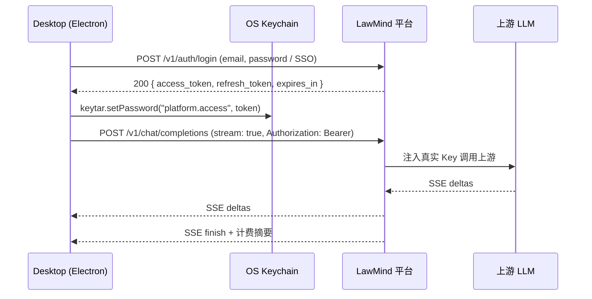
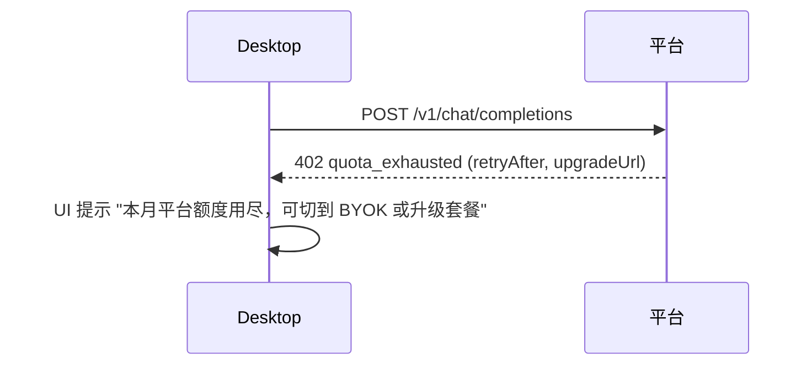

# LawMind 平台代理协议（草案 v1）

> 状态：**Draft**（仅协议，桌面端已接入 env 探测，服务端实现另议）
> 受众：LawMind 平台后端、桌面客户端、自部署运维

LawMind 桌面端支持两种工作方式：

1. **BYOK（自带 Key）**：客户端在本机加密保存各服务商 Key（macOS Keychain / Windows Credential Manager / libsecret）。
2. **平台模型（SaaS 代理）**：客户端只持有一个**短期 access token**，所有 LLM 调用走 `LAWMIND_PLATFORM_PROXY_URL`。真正的 LLM API Key **只存在于平台后端**，永远不下发到桌面进程内存或磁盘。

本文档定义平台代理的 HTTP 契约、鉴权、计费、错误码与桌面接入。

## 1. 威胁模型与设计目标

| 威胁                                               | 缓解                                                                   |
| -------------------------------------------------- | ---------------------------------------------------------------------- |
| 用户从 `models.json` / `.env.lawmind` 读出 LLM Key | 平台模式下桌面端**无** LLM Key（只有平台 access token）                |
| access token 泄漏被他人滥用                        | 短期（≤ 60 分钟），可单端撤销；按租户做配额                            |
| 中间代理服务器被脱库                               | LLM Key 仅在后端 KMS / Secret Manager；不入审计 / 日志                 |
| 调用被回放                                         | `X-LawMind-Request-Id` + `X-LawMind-Client-Version` + 服务器端窗口去重 |
| 大模型生成的 PII 被审计读取                        | 审计仅记录 prompt **哈希**与 token 用量，不存全文（详见 §6）           |

设计原则：

- **OpenAI 兼容**：`POST /v1/chat/completions` 严格遵循 OpenAI Chat Completions（含 SSE `stream: true`），桌面端可直接复用现有 `callModelOnce`。
- **零下发原则**：平台 LLM Key 永不出现在任何向桌面的响应里。
- **可降级**：桌面端 `LAWMIND_PLATFORM_PROXY_URL` 与 BYOK 共存，缺一不可用时另一个继续工作。

## 2. 总览（mermaid 时序）

### 2.1 登录 + 流式聊天



### 2.2 配额耗尽（402）



## 3. 端点契约

所有路径以 `LAWMIND_PLATFORM_PROXY_URL` 为前缀（建议 `https://platform.lawmind.example/v1`）。

### 3.1 鉴权

| 端点               | 方法 | 说明                                          |
| ------------------ | ---- | --------------------------------------------- |
| `/v1/auth/login`   | POST | 邮箱 + 密码 / SSO 登录，返回 access + refresh |
| `/v1/auth/refresh` | POST | 用 refresh_token 续期 access_token            |
| `/v1/auth/logout`  | POST | 撤销当前 access_token + refresh_token         |

请求示例：

```http
POST /v1/auth/login
Content-Type: application/json

{ "email": "alice@firm.com", "password": "***" }
```

响应：

```json
{
  "access_token": "eyJhbGciOiJI...",
  "refresh_token": "rfk_2f...",
  "expires_in": 3600,
  "tenant_id": "tnt_abc",
  "scopes": ["chat", "embeddings"]
}
```

所有后续请求带 `Authorization: Bearer <access_token>` 与下列必选头：

| Header                     | 必填 | 说明                              |
| -------------------------- | ---- | --------------------------------- |
| `X-LawMind-Client-Version` | 是   | 桌面客户端语义版本，便于运维灰度  |
| `X-LawMind-Tenant`         | 是   | 与 access_token 内 tenant_id 一致 |
| `X-LawMind-Request-Id`     | 否   | UUID，用于日志关联                |

### 3.2 模型目录

```http
GET /v1/models
Authorization: Bearer ...
```

返回桌面端 popover 直接渲染所需的字段：

```json
{
  "ok": true,
  "models": [
    {
      "id": "qwen-plus",
      "label": "通义千问 Plus（平台）",
      "provider": "dashscope",
      "contextTokens": 32768,
      "supportsStream": true,
      "pricePerMTokens": { "in": 0.8, "out": 2.4, "currency": "CNY" },
      "entitled": true
    }
  ]
}
```

`entitled: false` 表示当前租户未购买该模型；桌面端应灰显并提示「升级套餐」。

### 3.3 聊天（OpenAI 兼容）

```http
POST /v1/chat/completions
Authorization: Bearer ...
Content-Type: application/json
Accept: text/event-stream    # 可选，开启 SSE

{
  "model": "qwen-plus",
  "messages": [...],
  "tools": [...],
  "stream": true,
  "temperature": 0.3
}
```

- 流式格式与 OpenAI `chat/completions` 完全一致（`data: {...}` + `[DONE]`）。
- 平台在最终 `[DONE]` 前可附 LawMind 扩展事件 `event: lawmind_usage`，载荷如下：

```json
{
  "usage": { "prompt_tokens": 812, "completion_tokens": 215, "total_tokens": 1027 },
  "estimated_cost": { "amount": 0.0023, "currency": "CNY" },
  "round_id": "rnd_2f5..."
}
```

桌面端在 `chat shell` 中可选择展示「本轮约 0.0023 元」。

### 3.4 配额与用量

| 端点                      | 说明                                                 |
| ------------------------- | ---------------------------------------------------- |
| `GET /v1/quota`           | 返回本期 token / cost 已用与上限，`resetAt` ISO 时间 |
| `GET /v1/usage?from=&to=` | 历史用量明细，可按模型聚合                           |

## 4. 错误码

| HTTP | code                   | 含义                      | 桌面 UI 提示（建议）                     |
| ---- | ---------------------- | ------------------------- | ---------------------------------------- |
| 401  | `invalid_token`        | access_token 过期或被撤销 | 自动 refresh；连续失败则要求重登         |
| 402  | `quota_exhausted`      | 本期 token / 金额已用尽   | 弹窗：升级套餐 / 切回 BYOK               |
| 403  | `model_not_entitled`   | 当前套餐不含此模型        | 灰显该模型 + 解锁提示                    |
| 429  | `rate_limited`         | 频控；返回 `Retry-After`  | 退避重试，最大 3 次                      |
| 502  | `upstream_failure`     | 平台访问上游 LLM 失败     | 「平台模型暂时不可用，建议改用本地 Key」 |
| 503  | `platform_unavailable` | 平台维护                  | 同上                                     |

所有错误体统一格式：

```json
{
  "ok": false,
  "code": "quota_exhausted",
  "message": "本月平台额度已用尽。",
  "retryAfter": 3600,
  "upgradeUrl": "https://lawmind.example/billing"
}
```

## 5. 桌面端接入

### 5.1 环境变量

| 变量                            | 说明                                                                       |
| ------------------------------- | -------------------------------------------------------------------------- |
| `LAWMIND_PLATFORM_PROXY_URL`    | 启用 SaaS 代理（如 `https://platform.lawmind.example`）；缺省则走 BYOK     |
| `LAWMIND_PLATFORM_ACCESS_TOKEN` | 由桌面登录流程写入 OS Keychain 后**注入子进程 env**；不写入 `.env.lawmind` |

### 5.2 资源解析顺序（`resolvePlatformToAgentModel`）

1. 若存在 proxy URL 且有 access token → `baseUrl = ${proxy}/v1`，`apiKey = access_token`。
2. 否则尝试 `LAWMIND_PLATFORM_<PROVIDER>_API_KEY`（运维直接注入 LLM Key 的私部署场景）。
3. 都没有 → 返回 `missing_platform_api_key`，UI 提示「平台模型未开通」。

桌面侧 IPC：

| IPC 通道                                  | 说明                                                             |
| ----------------------------------------- | ---------------------------------------------------------------- |
| `lawmind:platform-login(email, password)` | 走 Electron main，凭据通过 `https.request` 上行，token 落 keytar |
| `lawmind:platform-logout()`               | 清空 keytar 中的 `platform.access` 与 `platform.refresh`         |
| `lawmind:platform-status()`               | 返回是否已登录、剩余配额（缓存的 `/v1/quota` 结果）              |

### 5.3 BYOK 与平台模型共存

`buildModelCatalog` 会在 UI 中同时显示：

- **平台模型组**（来自 `LAWMIND_PLATFORM_MODELS`，`provider: "platform"`）
- **当前配置组**（向导写入的 `env:current`）
- **服务商内置组**（用户自备 Key 的 `builtin:*`）
- **自定义模型**（`custom:*`）

优先级表（同 `id` 冲突时）：

| 场景                                             | 选择                                                            |
| ------------------------------------------------ | --------------------------------------------------------------- |
| 用户显式选中 `platform:*`                        | 走代理                                                          |
| 用户显式选中 `builtin:*` 且对应 provider 有 BYOK | 走 BYOK                                                         |
| 默认（无显式选择）                               | 优先 `env:current` → 然后 `platform:*` → 然后第一个已配置的内置 |

## 6. 审计与合规

平台日志最低字段：

| 字段                       | 内容                        | 备注           |
| -------------------------- | --------------------------- | -------------- |
| `request_id`               | `X-LawMind-Request-Id` 透传 | 用于桌面端联调 |
| `tenant_id` / `user_id`    | 来自 access_token           | 不写邮箱       |
| `model`                    | `qwen-plus` 等              |                |
| `prompt_hash`              | sha256(prompt 前 64KB)      | **不**保存全文 |
| `tokens_in` / `tokens_out` | 计费用                      |                |
| `latency_ms`               | 含上游耗时                  |                |
| `client_version`           | `X-LawMind-Client-Version`  |                |
| `error_code`               | 失败时填                    |                |

`prompt_hash` 的设计要求：

- 用平台密钥（HMAC）盐化，使日志被脱库后**无法**与已知文档对应。
- 不参与跨租户匹配；只用于同一租户内的回放排查。

## 7. 相关代码

- 桌面端解析：`src/lawmind/models/platform-providers.ts`、`src/lawmind/models/platform-catalog.ts`、`src/lawmind/models/resolve.ts:resolvePlatformToAgentModel`
- 桌面端 UI：`apps/lawmind-desktop/src/renderer/LawmindSettingsModelRetrieval.tsx`（已显示平台模型分组与开通状态）
- 错误码映射：`apps/lawmind-desktop/server/lawmind-server-helpers.ts`、`apps/lawmind-desktop/src/renderer/api-client.ts`（`missing_platform_api_key`）

## 8. 未决问题

- [ ] 服务端 SDK / 参考实现仓库
- [ ] WebSocket vs SSE：当前协议只规定 SSE，企业内网建议优先 SSE 以兼容反代
- [ ] 工具调用 tokens 的计费规则（按 prompt+输出累加 vs 单独标价）
- [ ] 多模态（图片输入）下的计费维度

> 下一步：在 `apps/lawmind-desktop/server/` 增加 `lawmind-server-route-platform-auth.ts` 桥接登录流，桌面端落 keytar 后通过 main 进程注入子进程 env。
